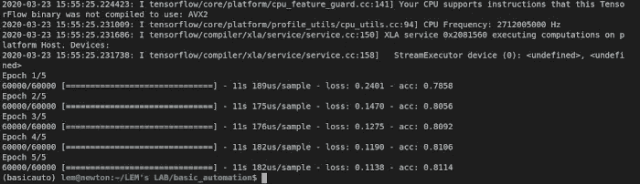

# 使用 Fabric 2 的非常基本的机器学习自动化

> 原文：<https://medium.com/analytics-vidhya/very-basic-machine-learning-automation-using-fabric-2-4549665f611b?source=collection_archive---------14----------------------->


如果通过自动化的魔力，您只需键入三两个命令行，就可以在远程服务器上运行您的机器学习培训或预测，而无需连接到您的虚拟机、配置您的 Python 环境、上传您的数据以及一次又一次地执行所有这些重复的任务，会怎么样？对于所有现有的云平台，如 GCP、AWS 或 Azure，他们提供的各种现有解决方案可以很好地处理这种使用案例，也就是说，如果你是团队中唯一的“数据人”，预算非常非常有限，而你的老板只允许你使用一个 GCP 虚拟机，并且你对数据工程又爱又恨，这种情况并不总是适合你，你知道，这是“常见情况”。

Fabric 2 非常适合这项任务。你会问 Fabric 2 是什么，它是一个 Python 库，让你可以通过 SSH 在远程机器上运行 shell 命令。因此，通过使用 Fabric 2，我可以在远程服务器上训练一个模型，这是我以前从未配置过的，只需在本地 shell 上键入以下三个命令:

```
fab2 prepare-os
fab2 prepare-menv
fab2 train-model --dataset=<link_to_train_data> --epochs=50
```

第一个命令将在远程服务器上安装所有需要的包(比如安装 Python 本身)，第二个命令将上传培训所需的资产，并使用所需的库创建 Python 虚拟环境，最后一个命令将进行适当的培训，并在本地下载最终模型的副本。

正如您在第三个命令中看到的，我们可以添加参数来定制我们的函数，并使其尽可能具有适应性，例如指定训练数据集和我们需要多少个历元的参数。

```
fab2 train-model --dataset=<link_to_train_data> --epochs=50
```

我将向你展示这一切是如何工作的，你可以通过改编我在这个 [github repo](https://github.com/aminelemaizi/fabric2-ml-automation) 上写的代码来自己使用它。

# 用例场景

我的用例场景是 MNIST 自动编码器的设计，我将使用它来生成自动编码的图像。我将自动完成这个过程，这样我就可以在任何 Ubuntu 服务器(18.04 LTS)上运行训练，获取模型并生成自动编码的图像，以便检索到我的本地机器上。

# 安装织物 2

要安装 Fabric 2，您可以使用`**pip**`来完成:

```
pip install fabric2
```

# 资产和项目布局

项目根将包含三个主要元素:

*   `**fabfile.py**`:这个文件包含了我们工作流程自动化的所有任务。拥有这个名字是很重要的，所以当在项目根运行 fab2 时，它将识别哪个文件包含任务列表。
*   `**assets**`:这个目录包含与远程服务器认证相关的元素和信息，或者任何用于远程机器的相关数据，如加密密钥、密码、主机名或用户名。
*   `**ml_assets**`:这是包含我们与机器学习模型相关的资产的目录，如模型本身、安装到虚拟机中的需求或训练数据。这是唯一上传到远程服务器的文件夹。

这是我为这个项目采用的布局，请随意调整它以更好地满足您的需求:

```
.
├── fabfile.py
├── assets
│   ├── secrets.json
│   └── server_ssh_key
└── ml_assets
    ├── mnist_train.csv
    ├── model.py
    └── Requirements.txt
```

在讨论在 fabfile.py 中创建任务之前，我们将首先处理 assets 文件夹、assets 和 ml_assets 的内容。

## `assets`文件夹

```
├── assets
│   ├── secrets.json
│   └── server_ssh_key
```

第一个文件是 secrets.json，顾名思义，它包含了我们的小“秘密”,主要是会话密码、SSH 密钥密码以及任何您认为敏感的、不需要在代码中显示的内容。

```
{    
    "password" : "<password>",
    "passphrase" : "<passphrase>"
}
```

该文件夹还包含加密密钥，因此如果需要，您可以安全地访问您的远程服务器。对于这个问题，您必须确保您没有在 git 中跟踪这个文件夹，并且它很好地包含在您的`**.gitignore**`中。

## `ml_assets`文件夹

```
└── ml_assets
    ├── mnist_train.csv
    ├── model.py
    └── Requirements.txt
```

`**Requirements.txt**`非常重要:除了列出所需的库之外，它还有助于指定您想要用于不同 Python 库的确切版本，因此不会出现意外行为。自动化需要一种可预测性。在我们的使用案例中，我们专注于以下版本:

```
pandas==1.0.2
tensorflow==1.13.1
matplotlib==3.1.3
```

我们还必须将我们的训练数据集`**mnist_train.csv**`放在这个文件夹中。我在这里的逻辑是，数据训练集是定义你的模型的一部分，因此它必须是机器学习资产的一部分。

最后一个元素是我们的模型脚本`**model.py**`，它包含两个主要函数`**train**`和`**predict**`。该脚本根据我们传递给它的 shell 条目参数来决定使用这两个函数中的哪一个，如 main。

# 使用 Fabric 2 创建任务

现在我们将攻击所有魔法发生的`**fabfile.py**`文件。为此，我将一段一段地解释这个文件中包含的代码，这样您就可以了解它背后的逻辑以及如何使用 Fabric 2。

在这一部分中，我们导入了主要的 Fabric 2 工具，它们是连接到我们的远程服务器的`**Connection**`类，定义一些与认证相关的配置的`**Config**`类，以及一个函数装饰器`**task**`，它使得 Fabric 2 函数(称为任务)在 shell 上执行时可以被识别，就像`**fab2 fab-task**`。我们将为用户名、远程服务器 ip 地址、加密密钥的位置和我们的“秘密”(口令和密码短语)定义四个全局变量。

这里我们定义了一个函数来连接我们的远程服务器，正如你所看到的，它指定了使用`**sudo**`命令时使用的密码。

该任务定义了我们的远程服务器的信息，因此当使用之前没有建立连接的`**connect_to_host**`时，它将拥有连接所需的信息。

对于这一个，我们只是简单地更新我们的操作系统包列表，然后安装所有需要的包(像 Python 3 ),这样我们就可以有一个正常工作的操作系统。正如您所注意到的，我们将 shell 命令作为字符串运行，并且我们提到它必须通过使用`**conn.sudo("...")**`作为 sudo 运行。用文字来定义这一部分的步骤，它是这样做的:

*   定义远程主机的信息。
*   连接到远程主机。
*   将包列表更新为 sudo。
*   作为 sudo 安装所需的包。
*   紧密连接。

需要提到的是，所有用下划线定义的任务在 shell 中调用执行时都会得到一个连字符，所以任务`**prepare_os**`在调用时会写成`**prepare-os**`。

现在，我们需要一个任务来上传我们的机器学习资产，并创建一个包含所有必需库的 Python 虚拟环境。Fabric 2 不提供文件夹上传，所以为了解决这个问题，我们将把我们的`**ml_assets**`文件夹压缩成一个文件，然后上传到远程服务器解压缩。这里的 shell 命令不需要作为 sudo 运行，这就是我们使用`**conn.run(...)**`的原因，对于在本地机器而不是远程服务器上运行命令，我们使用`**conn.local(...)**`。

此任务执行以下操作:

*   定义远程主机的信息。
*   连接到远程主机。
*   压缩`**ml_assets**`文件夹。
*   使用`**conn.put(<local_file>, <remote_folder>)**`上传压缩文件。
*   在远程服务器中解压缩文件。
*   本地和远程删除压缩文件。
*   创建一个叫做`**modelenv**`的 Python 虚拟环境。
*   在`**modelenv**`内部升级`**pip**`。
*   安装`**Requirements.txt**`中包含的所需 Python 库。
*   显示已安装 Python 库的列表。
*   紧密连接。

我们有合适的操作系统和 Python 环境，现在需要的是我们的主执行。该任务通过调用我们的 Python 脚本`**model.py**`来进行训练，并定义预期的参数来通知它我们正在请求训练，定义要训练的数据集和历元数。在学习阶段之后，我们将使用`**conn.get(<remote_file>, <local_file>)**`将模型的副本下载到我们的本地机器中。

该任务可以被称为如下:

```
fab2 train-model --dataset=<link_to_train_data> --epochs=50
```

最后一部分是预测，它包含以下操作:

*   定义远程主机的信息。
*   连接到远程主机。
*   将用于预测的数据集上载到远程服务器。
*   将训练好的模型的副本上传到远程服务器。
*   创建一个名为`**autoencoded**`的文件夹，我们将在其中保存我们的自动编码图像。
*   运行预测。
*   压缩`**autoencoded**`文件夹。
*   下载压缩文件。
*   删除远程服务器中的模型副本、预测数据集、`**autoencoded**`文件夹及其压缩文件。
*   在本地解压缩`**autoencoded.zip**`文件。
*   删除压缩文件。
*   紧密连接。

需要指出的是，我们区分了训练和预测。我的意思是，这两个进程可以在两个不同的服务器上运行。重要的是，在预测期间，我们的模型副本存在于机器学习资产中，如果我们至少运行过一次训练任务，就会出现这种情况。

# 自动化在行动

现在让我们通过运行每个任务来看看这个函数实际上是如何工作的，并观察输出是什么！

## 准备我们的远程主机操作系统(Ubuntu 18.04 LTS 版)

```
fab2 prepare-os
```


## 上传资产和准备 Python 虚拟环境

```
fab2 prepare-menv
```


## 训练自动编码器

```
fab2 train-model --dataset=./ml_assets/mnist_train.csv --epochs=5
```



此后，模型的副本在本地创建:


## 创建自动编码图像

```
fab2 predict-data --dataset=./ml_assets/mnist_predict.csv
```

这段代码将在本地创建自动编码的图像，如下所示，瞧！


这都是乡亲们！

您可以在 [Twitter](https://twitter.com/ALemaizi) 、[脸书](https://www.facebook.com/lemsodyssey/)或 [Medium](/@amine.lemaizi) 上关注我，有新帖子发布时会通知您！

登月小艇出去！！！