# 使用 Express.js 的非常简单的 REST API

> 原文：<https://medium.com/analytics-vidhya/very-simple-rest-api-using-express-js-5e4ebfad0af2?source=collection_archive---------9----------------------->

[由 slidesgo / Freepik 设计](http://www.freepik.com)

# **什么是 REST Api？**

简单来说，REST Api 是后端的一个 Api，你从前端/客户端调用它，告诉它你想要什么，它就返回你的数据。

# **API 示例**

一个非常简单的例子如下:假设您有一个数据库，其中有一堆产品数据。您想要一份价格低于 200 美元的产品列表。您从前端调用 API。API 查询数据库并返回价格低于 200 美元的产品列表。很简单对！您可以创建非常复杂的 API，但是大多数时候您只需要一个非常简单的 API。它最常用于从数据库中查询和返回数据。

***只是总结一下，步骤有:***

1.  *你调用 API，告诉它你想要什么。*
2.  *API 接收调用，处理或获取您想要的数据。*
3.  *将数据发回给您。*

# **用 Express.js 构建 REST API**

***只是在我们开始之前很快。什么是 Express.js？***

Express 是 Node.js 的一个后端 web 框架，你可以用它轻松地创建一个 API

# **入门**

你需要的东西:

1.  [节点 JS](https://nodejs.org/en/)
2.  NodeJS 包管理器。我将使用 [NPM](https://www.npmjs.com/) ，它是一个非常流行的 NodeJS 包管理器。
3.  代码编辑器。我将使用 [Visual Studio 代码](https://code.visualstudio.com/)

安装了 NodeJS 和 NPM 之后，确保安装正确。这个很简单:

1.  打开新的终端窗口
2.  类型 ***节点-v*** & ***节点-v***

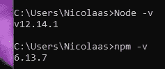

显示节点和 NPM 版本的 CMD 窗口

现在您可以看到您的节点和 NPM 版本，您可以放心，它已经安装，并跳转到下一个 thep。如果您没有看到版本，请尝试重新启动您的电脑或重新安装 Node 或 NPM。

# **设置项目**

在安装 express 之前，首先我们需要创建我们的项目。

1.  创建一个新的空文件夹，并用 Visual Studio 代码打开它
2.  一旦在 Visual studio 代码中打开，在 **VS 代码**中打开终端

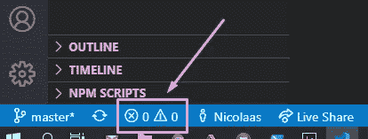

单击打开 VS 代码中的终端

3)现在我们想**将**您的项目初始化为 **NPM 项目**。这将允许我们使用 NPM。NPM 所做的基本上是下载和安装我们可以使用的库/扩展/插件。

我们通过在终端中键入 ***npm init*** 来做到这一点:

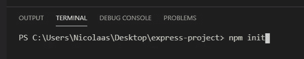

如何初始化一个 NPM 项目，这样你就可以使我们成为 NPM

一旦你按下回车键，它会问你一堆问题，你不必担心开始时。从所有的门进去，让它们保持原样。

太好了！您现在已经初始化了一个 NPM 项目，现在可以利用 NPM 来安装诸如 Express 和 Nodemon 之类的包。

# 安装 Express 和 Nodemon

为此，您只需在终端中键入以下内容:

***npm 快速安装*** & ***npm 安装节点***

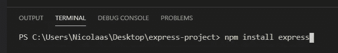

一旦你按下回车键，NPM 将为你安装软件包和使用这些软件包所需的一切。这些包被称为依赖项，存储在一个新创建的名为 **node_modules** 的文件夹中，您可以忽略它。

# 什么是 Nodemon，我们为什么需要它？

我们将使用 Nodemon 在我们对任何文件进行任何更改后立即自动重启应用程序，以便应用程序的最新版本始终运行。

我们不需要 Nodemon，但是我们需要在每次修改后手动重启程序，这样会非常低效。

到现在为止，你已经完成了很多工作，可能想要快速休息一下。从现在开始，我们将进入一些实际的编程。

> “休息一下可以带来突破。”
> ― **拉塞尔·埃里克·多巴**

# **使用 Express 创建 API**

我们现在已经安装了我们需要的所有东西，可以开始设置我们的后端 API 了。

我们首先创建一个名为 **server.js** 的文件。这将是我们的主要应用文件。想象一个游戏的 exe 文件。它是您用来启动项目的文件。您可以将它命名为任何名称，但是 server.js 是常用的，也是有意义的，因为我们的 API 将在后端服务器上运行，这个文件将用于启动后端应用程序。

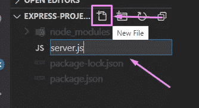

在主目录的 VS 代码中创建一个新文件

现在打开新创建的 server.js 文件。让我们快速思考一下我们需要遵循的步骤:

1.  进口快递
2.  初始化我们的快速应用程序
3.  设置我们的快速路线
4.  设置我们的快速监听器

这可能看起来有很多步骤，目前你可能不明白这些步骤是什么意思，但不要担心，过一会儿一切都会变得更有意义。

# 进口快递

要使用 express，我们首先需要将其导入到我们的程序中。这是有道理的，对不对？谢天谢地，导入包非常容易。请参见下面的代码示例:

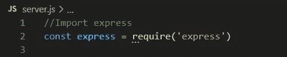

下面一行代码导入了 express 包

非常快速和简单的权利！我们现在可以开始使用快递。

# 初始化快速应用程序

我们现在可以使用 express 的特性，但是如果我们不首先初始化我们的 express 应用程序，它就不能正常工作。对我们来说幸运的是，这非常快速简单:

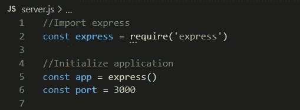

这段代码初始化一个 express 应用程序

## 说明

**第 5 行:**这里我们都创建了一个名为 **app** 的**常量变量**，并设置它**等于**一个 **express 应用程序。**

它是一个常量变量，因为它永远不会改变。Express()初始化了一个 express 应用程序，我们希望将该应用程序存储在某个地方，以便我们可以正确地使用它。这就是为什么我们把它存储在一个名为 app 的变量中。不用担心理解太多，你只需要记住这一步就可以了。

**第 6 行:**这里我们创建一个名为 port 的变量，并将其设置为一个 3000 的整数值。当在浏览器中查看我们的应用程序时，将使用此端口来访问它。它可以是从 0 到 65535 的任何 4 位数值。你不需要担心这一点，因为当我们在最后一步使用这个变量时，我们会更好地解释这一点。

# 设置快捷路线

快速路由是我们可以打电话到的特定位置。让我们假设它是一个数字。每条路线都是一个企业，每个企业都有自己唯一的编号。我们可以用这个号码给企业打电话，从他们那里得到具体的信息。让我们看看代码，这样更有意义。

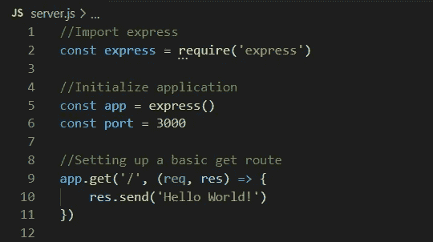

这段代码创建了一条路线，一旦应用程序运行，我们现在就可以在浏览器中访问这条路线

## 说明

**第 9 行:**这里我们使用 app 变量，它是一个 express 应用程序。我们调用 get 过程，这意味着我们只是调用路由/业务来获取信息。第一个参数 ***'/'*** 是我们正在呼叫的位置/号码。第二个参数是匿名函数，有两个参数，即 req(请求)和 res(响应)。这些参数变量可以被称为任何名称，但目前的名称更有意义。

**第 10 行:**在匿名函数内部，我们用 **res.send()发送一个响应。** res 代表响应，我们发送它。到目前为止都说得通。在 send()过程中，我们传递我们想要发回的信息。在这里，我们只是发送回一些文本，上面写着“Hello World！”当客户端在“/”路由(也是基本路径)上发出呼叫时。

第 11 行:我们简单地关闭 get 过程。

在匿名函数内部，我们可以进行计算，进行函数调用等等。然后将这些计算结果或函数返回值作为响应发送出去。一旦应用程序建立并运行，我们将做一个例子。

# 设置我们的快速监听器

这是我们开始应用程序之前需要做的最后一步。我们基本上需要告诉我们的应用程序在哪个端口监听调用。这将使用我们在应用程序开始时创建的端口变量。

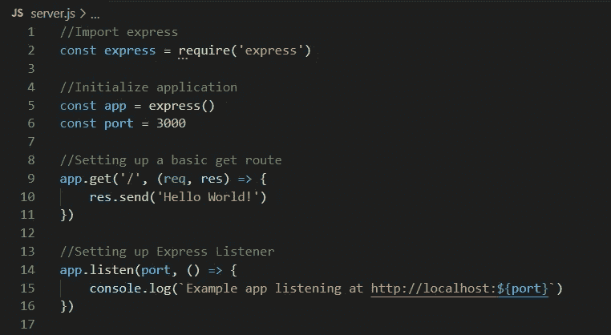

这段代码告诉 express 应用程序监听端口 3000 上的任何呼叫

## 说明

**第 14 行:**这里我们使用我们的 express 应用程序的 listen 过程，带有两个参数。第一个是应用程序应该监听的端口变量。第二个参数是一个匿名回调函数，它在应用程序开始监听该端口时运行。

**第 15 行:**在这里，我们只放入应用程序开始监听指定端口时应该运行的代码。我们只是将一个字符串记录到控制台，该字符串说明了我们可以用来发出 API 请求的位置。

# 启动我们的 Express API 应用程序

为了启动应用程序，我们将使用 nodemon 和 VS 代码终端。这很容易。您只需输入 ***nodemon <插入主文件名>*** 就可以用 nodemon 启动您的应用程序。

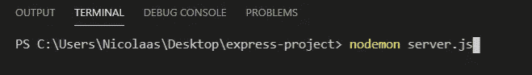

这个终端代码将使用 nodemon 启动应用程序

一旦你在你的终端上看到下面的文本，你就成功地用 Express 创建了你的第一个 API。

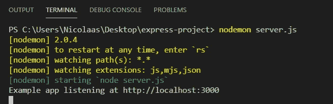

我们现在可以使用浏览器进行 API 调用。为此，请打开您的浏览器并访问以下 URL:[***http://localhost:3000/***](http://localhost:3000/)

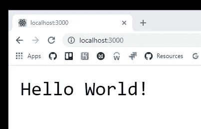

# **牛逼！**

这里你可以看到我们的 API 正在工作。我们访问的网址:[***http://localhost:3000***](http://localhost:3000)***/****基本和访问'/'路由一样。*

请注意，从现在开始，当您对应用程序进行额外的更改时，您不需要再次启动应用程序，除非您关闭了 VS 代码。这就是我们安装 Nodemon 的原因。当我在未来做出改变时，Nodemon 将会监视我们所有的文件，当我们对它们做出改变时，它将会自动为我们重启程序。然后，您将在终端中看到以下文本。

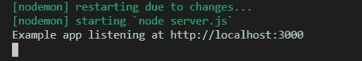

Nodemon 在文件改变时自动重启我们的应用程序

# 让我们制定一些更有用的路线。

我们可以保留'/'的基本路线，这样我们就可以很容易地检查我们的程序是否还在工作，但是让我们来做一些更有趣的事情。

# 创建另一条路线

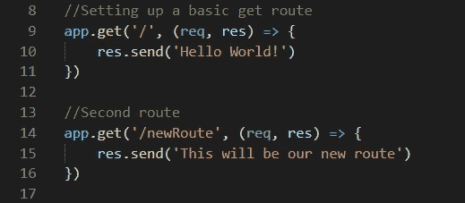

这将是我们的第二条路线

就在第一条路由下面，我们可以创建另一条路径为“/newRoute”的路由。该路径可以是任何路径，并且可以在 [***访问 http://localhost:3000/new route***](http://localhost:3000/newRoute)

现在，我们只是简单地将一个基本字符串发送回客户端

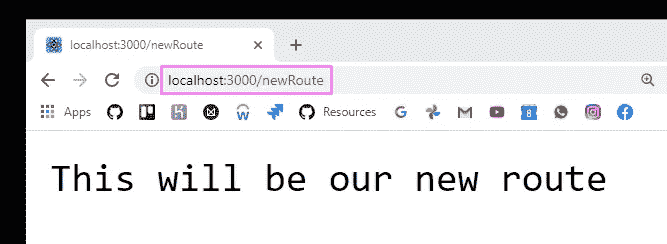

当访问[***http://localhost:3000/new route***](http://localhost:3000/newRoute)*时，我们将收到新创建的响应*

*现在让我们做一些更有趣的事情。让我们创建一个食物名称列表。然后，我们将设置一条路径，返回一个随机的食物名称。你可以把它想象成一个随机的食物选择器或者一个每日特色食物。*

*让我们改变刚刚创建的路线。首先我们将改变路径，然后创建一个包含食物字符串的简单变量。*

*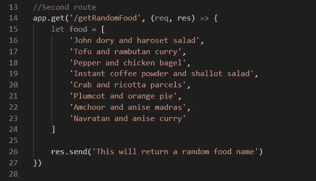*

*将返回随机食物名称的新路径*

*我们现在想从食物数组中获取一个随机项，并将其作为对 API 调用的响应发送出去。*

*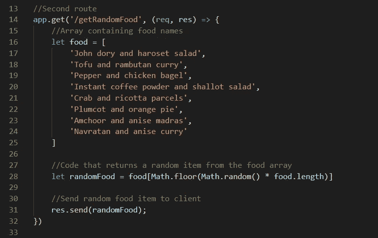*

*这个 API 路径现在可以运行了，我们可以*

*如您所见，这一次我们在将响应/数据发送回客户端之前先做了一些计算。像上面的例子一样，您可以在 API 调用中运行任何其他 javascript 代码，然后返回一个包含生成的数据的响应。你也可以返回变量(就像我们上面做的)，javascript 数组，JSON 等等。*

*让我们来看看它的实际应用:*

*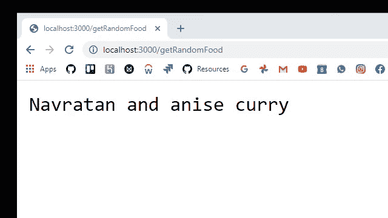*

*每次刷新 API 都会返回一个响应，其中包含一个带有随机食物名称的字符串*

# *如何在现实生活项目中使用它的例子*

**

*API 用法的真实演示示例*

*上面的 gif 是一个实际应用程序演示的预览，展示了如何使用这个 API。在视频中，它被用在一个全是食谱的公司网站上。他们用它为用户生成一些非常酷和随机的食谱。它为网站增加了更多的功能，使其更具互动性和动态性，从而能够从竞争对手中脱颖而出。*

*请关注我的 Medium profile，在以后的文章中，我们将更深入地学习一些其他的 Express 特性，这样我们就可以将 API 提升到一个新的水平。*

# *感谢阅读。*