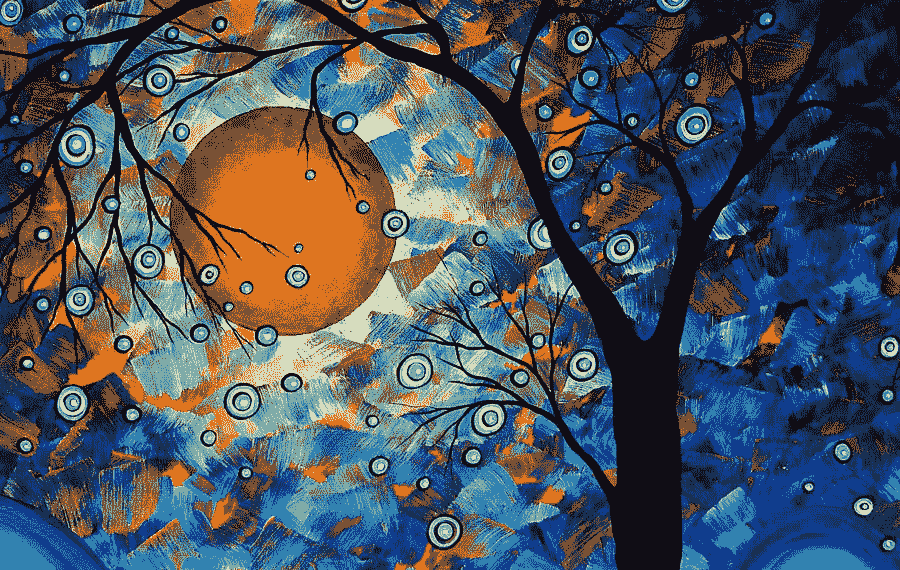

# 通过 TensorFlow 创作视频艺术

> 原文：<https://medium.com/analytics-vidhya/video-art-via-tensorflow-and-transfer-learning-1b2b0344b1ee?source=collection_archive---------12----------------------->

你今早醒来时有没有渴望把你的 YouTube 视频变成动画古典绘画？还是变得更狂野？如果是这样，你来对地方了。在这个简短的教程中，我将演示如何将一个视频转换成你选择的动画艺术。

例如，这里有一些现代艺术:



使用它作为我们想要的基础风格，让我们来改造一个公园瀑布。这个视频的前半部分是原创，后半部分是风格化版本。

这是另一个例子，这次是一个更加城市化的场景。我用莫奈的画和埃舍尔的版画设计了这个视频。

这些渲染背后的一般技术是*迁移学习*。迁移学习允许我们利用预先训练的神经网络来完成完全不同的任务。这里，我们重新调整了 vgg19 网络的用途。这个网络被训练来将数百万张图像分类到 1000 个类别中的一个。我们对这些分类不感兴趣，但我们感兴趣的是网络在隐藏层中学习了什么。这些隐藏层在不断增加的抽象层次上对图像知识(边缘、颜色、风格等的感知)进行编码。样式算法的任务是在生成新图像时重用该信息。

阅读[这篇](https://www.tensorflow.org/tutorials/generative/style_transfer)来了解这个想法的介绍。

本文中的实现需要相当多的工作。然而，我们在 Google 的朋友为我们简化了事情，创建了一个 Tensorflow Hub 模块来封装这种逻辑。你可以在这里找到这个模块。给定这个样式模块，我们需要做的就是加载我们的原始图像和目标样式图像，然后通过 hub 运行它们。结果是由给定样式转换的图像。

在我们的例子中，我们感兴趣的是视频而不是图像。因此，我们需要首先将我们的视频转换成图像序列，通过中枢样式化模型对这些图像进行样式化，然后从得到的样式化帧中重建视频。

让我们看一下代码。

主要功能如下。流程是这样的:我们将原始视频和想要用作样式的图像(如莫奈或埃舍尔 jpeg)作为输入。然后，我们从输入的视频中提取音轨，然后将视频解压缩为一系列图像。在进行过程中，我们还对每张图片运行样式模块。结果是一个样式化图像的目录。最后，我们将这些图像重新组合成一个视频文件，并重新连接音频轨道。

```
if len(sys.argv) != 3:
    print('usage: video.py video style')
    exit()name_original = sys.argv[1]
name_style = sys.argv[2]# load and cache the styling dnn
hub_module = hub.load(HUB_URL)# extract audio from the video
extract_mp3(PATH_VIDEOS + name_original)# extract all frames from the video, style them
# and put results into tmp
generate_frames(PATH_VIDEOS + name_original, 
    PATH_STYLES + name_style)# regenerate the video from the styled frames
output_name = os.path.splitext(name_original)[0] 
    + '.' + os.path.splitext(name_style)[0] + '.mp4'
generate_video(PATH_OUTPUTS + output_name)# recombine the extracted audio into the newly-styled video
input_name = output_name
output_name = os.path.splitext(name_original)[0] 
    + '.' + os.path.splitext(name_style)[0] + '.audio.mp4'add_mp3(PATH_OUTPUTS + input_name, PATH_OUTPUTS + output_name)
```

现在我们来看看底层函数。

首先，这里是提取 mp3 的方法。我们通过子进程直接使用 ffmpeg 来完成这项工作，因为没有好的 python 绑定。结果就是一个 mp3，我们储存起来以后用。

```
def extract_mp3(path_video): print('Extracting audio: ', path_video, PATH_TMP_MP3) command = 'ffmpeg -i {0} -f mp3 -ab 192000 
        -vn {1}'.format(path_video, PATH_TMP_MP3) subprocess.call(command, shell=True)
```

我使用 OpenCV 包从视频中提取所有图像。我们捕获视频，然后将每个图像解压到工作目录中。当我们这样做的时候，我们将样式中枢应用到每张图片上。结果是一个包含视频的原始图像帧以及样式帧的目录。

```
def generate_frames(path_input_video, path_image_style): video_capture = cv2.VideoCapture(path_input_video)
    image_style = load_image(path_image_style); for count in range(MAX_FRAMES): success, image = video_capture.read()
        if success == False: break path_frame = PATH_TMP + (str(count).zfill(5)) + '.jpg'
        path_converted_frame = PATH_TMP + 
            'x' + (str(count).zfill(5)) + '.jpg' cv2.imwrite(path_frame, image) image = load_image(path_frame)
        results = hub_module(tf.constant(image), 
                tf.constant(image_style))
        image = tf.squeeze(results[0], axis=0)
        mpl.image.imsave(path_converted_frame, image)
        print(count, path_frame, path_converted_frame)
```

现在我们有了视频的所有样式的图像。下一步是遍历这些样式化的图像，并将它们转换回视频。这是按如下方式完成的:

```
def generate_video(path_output_video): image_list = []
    count = 0
    path_converted_frame = PATH_TMP + 'x' + 
        (str(count).zfill(5)) + '.jpg' image = cv2.imread(path_converted_frame)
    height, width, layers = image.shape
    size = (width,height)
    print('size: ', size) converted_files = [file_name for file_name in 
        os.listdir(PATH_TMP) if 'x' in file_name]
    converted_files.sort() for file_name in converted_files: path_converted_frame = PATH_TMP + file_name
        image = cv2.imread(path_converted_frame)
        print(path_converted_frame)
        image_list.append(image) video_writer = cv2.VideoWriter(path_output_video, 
        cv2.VideoWriter_fourcc(*'mp4v'), VIDEO_FPS, size) for i in range(len(image_list)):
        video_writer.write(image_list[i]) video_writer.release()
    print('video generated: ', path_output_video)
```

现在我们有了一个风格化的视频。最后一步是重新连接音轨。我们再次将 ffmpeg 应用于此任务:

```
def add_mp3(path_input_video, path_output_video): print('Adding audio: ', PATH_TMP_MP3, 
        path_input_video, 
        path_output_video) command = 'ffmpeg -i {0} -i {1} -c:v copy -c:a 
        aac -strict experimental {2} '.
        format(path_input_video, 
            PATH_TMP_MP3, 
            path_output_video) subprocess.call(command, shell=True)
```

就是这样！你可以在这里看到完整的代码清单。如果你想看看其他的人工智能项目，可以看看我的[网站](https://www.christopherminson.com/)。

与大多数 ML 项目相比，这段代码相对较快。即使在运行缓慢的机器上，你也可以做有用的事情。例如，我在低端市场 t2.large ec2 实例上生成了这些视频。没有 GPU，没有 TPU，什么都没有。在那种环境下，一个 15 秒的视频通常不到一个小时就可以渲染出来。考虑到所涉及的处理量，令人印象深刻。更快的机器当然会超过这个基准。

我发现有些风格比其他风格更好。颜色、笔触风格和阴影转移得相当好，而较大规模的结构被最小化或丢失。因此，像莫奈的画这样的东西会翻译得相当好。相比之下，毕加索或埃舍尔的作品会因其不同寻常的几何形状而失去个性。那对你来说可能重要也可能不重要。此外，将样式图像保持在合理的分辨率也很重要。对于我的测试用例，我发现 512x512 左右的任何东西都足够好。您的里程可能会有所不同。

最后，值得停下来欣赏一下迁移学习的总体酷劲。这是一种强大的技术，应用广泛，有时并不明显。考虑一下:我们只是采用了一个经过训练的深度神经网络来对图像进行分类，然后使用该网络来创建风格化的视频。这是一个很大的飞跃。我希望随着时间的推移，这种技术会变得更加强大和普及。