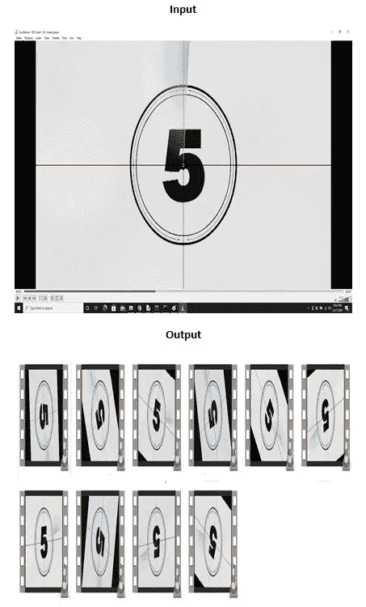
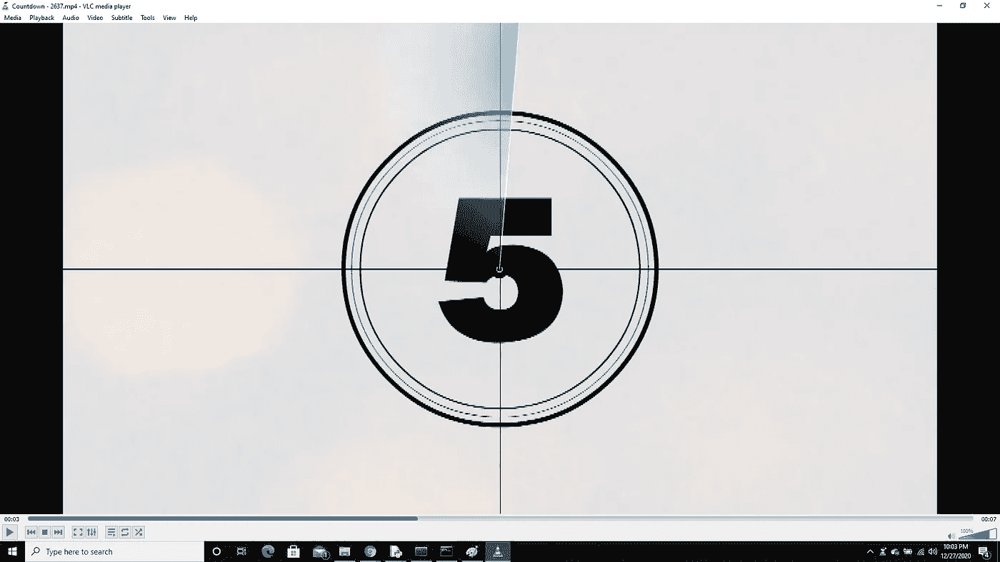
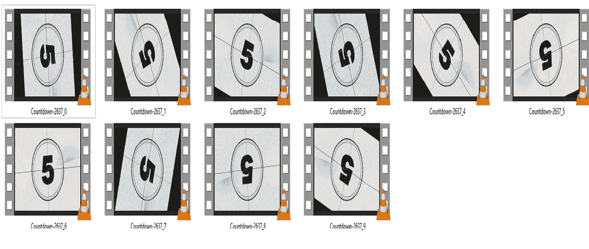

# 使用多线程的用于机器学习的视频增强

> 原文：<https://medium.com/analytics-vidhya/video-augmentation-for-machine-learning-5e1c720e95ad?source=collection_archive---------8----------------------->

在本文中，解释了快速视频增强的简单实现，以增加用于机器学习训练任务的视频数量。

# 简介:

在机器学习中，很多时候我们必须处理不足以训练模型正常工作的数据。对于基于图像处理的任务，我们通过使用不同的技术(如旋转、添加噪声、裁剪、改变亮度等)来增加数据，从而解决这个问题。因此，我们的模型可以很好地推广到所有类型的输入数据，并能够做出正确的决策。

对于基于图像的任务，我们可以使用任何数量的增强方法。Keras 库提供了 ImageDataGenerator 函数，然后 Pytorch 提供了一些函数，还有一个名为“imgaug”的库，它也允许使用不同的规范进行增强。在这个任务中，我使用了“imgaug”来增强视频。

要增强视频，过程与图像增强基本相同，因为视频实际上是以每秒帧数(FPS)的速度在屏幕上快速运行的图片(帧)的集合，因此它是一个视频。

# 流程:

简而言之，我们将获取输入视频的每一帧，找到 FPS，使用 imageio 对它们进行增强，并使用 OpenCV 创建具有原始 FPS 的增强视频。整个过程是使用 ThreadPoolExecutor 来完成的，通过在单独的线程中执行增强来加速该过程。

# 先决条件:

对视频增强有用的库如下:

1.  Opencv —获取输入视频 FPS(可以使用 pip 安装 opencv-python)
2.  imgaug —用于图像增强(可使用 pip install imgaug 安装)
3.  imageio —用于视频读取和图像写入(可使用 pip install imageio 安装)
4.  imageio-ffmpeg —用于从图像创建视频(可以使用 pip install imageio-ffmpeg 安装)

其余的是基本库 os、shutil(用于创建/删除文件夹)、random(用于生成随机数)和 argparse(用于获取命令行参数)。

# **链接到代码:**

视频增强代码可在 Github 上获得，网址为:

https://github.com/shayanalibhatti/Video-Augmentation-Code

# 结果:

对于视频的增强，我使用了一个随机数发生器来旋转输出视频一个角度，并为视频添加了加性高斯噪声。这是代码的结果，(不幸的是)每个剪辑的旋转和噪声添加快照，因为视频不能上传到这里。这只是为了展示增强是如何工作的。请随意尝试您自己的剪辑来观看增强视频。以下用于输入的视频来自[皮克斯拜](https://pixabay.com/?utm_source=link-attribution&utm_medium=referral&utm_campaign=image&utm_content=2637)(【https://pixabay.com/videos/countdown-10-seconds-film-2637/】T4)的[尼古拉斯·布拉德](https://pixabay.com/users/2322922-2322922/?utm_source=link-attribution&utm_medium=referral&utm_campaign=image&utm_content=2637)

## 输入视频快照:

## 输出视频快照:

下图显示了旋转和添加噪声、增强的. mp4 视频剪辑。尝试代码以查看结果。

# 结论:

希望这篇文章和代码链接可以用来让机器学习爱好者更容易地增加他们的视频，以提出健壮的模型来解决现实世界的问题。您可以随意试验代码，并根据自己的喜好进行调整。如果代码有帮助，请鼓掌:)