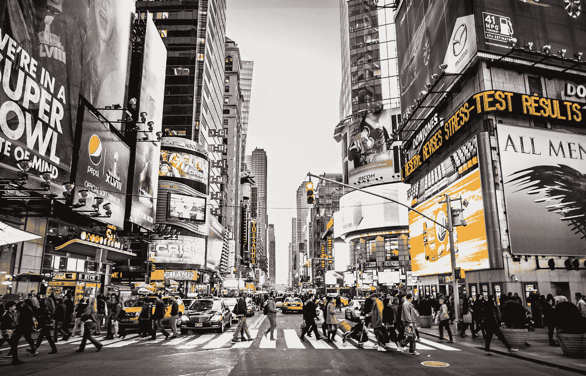

# 基于视频内容的文本分类广告推荐

> 原文：<https://medium.com/analytics-vidhya/video-content-based-advertisement-recommendation-using-nlp-4512430c169e?source=collection_archive---------4----------------------->



亚伦·塞巴斯蒂安在 [Unsplash](https://unsplash.com?utm_source=medium&utm_medium=referral) 上拍摄的照片

## 为什么是广告推荐系统？：

*   广告是一种营销传播形式，用于鼓励或操纵受众继续或采取一些新的行动。
*   我们每天看到多少广告？几十个？几百个？或者几千个？
*   一天结束时我们还记得多少？
*   现代人平均每天接触大约 5000 个广告。(扬凯洛维奇公司— 2007 年)

让我们从理解术语开始

## 概述:

今天，每个人都可以在他们的手机、笔记本电脑上轻松访问流媒体内容，视频已经成为互联网上非常重要和流行的内容。如今，人们制作自己的内容并上传到流媒体平台上，因此与文本、音频和图像数据集相比，视频数据集的规模变得非常庞大。根据许多用户的说法，他们对在线流媒体播放时显示的无关广告感到恼火，所以他们不得不等到视频结束后才能避免这些广告。因此，我们的目标是显示与视频内容相关的广告。我们可以通过准确的在线广告来推动业务，这些广告通过检测视频的主题与内容相关。例如，我们可以将一些提供虚拟主机的公司放在网站开发教程视频上，而不是任何随机的视频上。因此，客户可以更有目的和更准确地向该主题发布广告，同时，用户不会被广告打扰，同时，他们可以观看整个视频或访问客户的网站以获得更多信息，这将吸引更多的客户。

## 文本分类:

自然语言处理所要解决的一个经典问题就是分析原始文本的内容并确定其所属的类别。文本分类有着广泛的应用，如情感分析、主题标注、垃圾邮件检测和意图检测。

## 推荐系统:

推荐/推荐系统的一个流行技术是**基于内容的过滤。**这里的内容是指视频的内容或属性。因此，基于内容的过滤的思想是使用某些关键字标记视频，在数据库中查找这些关键字，并推荐与该视频内容相关的广告。

# 收集数据:

我的目标是 Youtube 上可用的视频数据。收集的数据分为六大类:旅游博客、科技、食品、制造、历史、艺术和音乐。当处理像这样的定制机器学习问题时，我发现收集我的数据非常有用，如果不是简单地令人满意的话。对于这个问题，我需要一些关于属于不同类别的视频的元数据。在这里，我们将创建两个数据集，一个是视频数据，另一个是广告数据。

1.  **视频数据:**

我将使用 **Youtube API v3** 。它是由谷歌自己创建的，通过一段专门为我们这样的程序员编写的代码与 Youtube 进行交互。前往 [Google 开发者控制台](https://console.developers.google.com/)，创建一个示例项目并开始。我选择这样做的原因是，我需要收集成千上万的样本，我发现使用任何其他技术都不可能做到这一点。API 的文档非常简单，在使用了超过 8 个电子邮件帐户来补偿所需的配额后，我收集了以下数据并将其存储在一个. csv 文件中。如果您希望将该数据集用于您的项目，您可以在此处下载它 [**。**](https://github.com/rishikonapure/Advertisement-Recommendation/blob/master/Videos_data.csv)

**2。广告数据:**

我已经收集了来自 www.adforum.com 的广告数据。它建立了一个广告公司简介和广告的数据库。根据网站上的信息，它目前提供超过 20，000 家机构的简介，以及来自世界各地 110 个国家的超过 90，000 种不同广告的可搜索图书馆。我通过网络抓取收集了这些广告数据。您可以通过此 [**链接遵循程序。**](https://www.pmg.com/blog/tutorial-crawl-youtube-channel/) 或者直接从我的 GitHub repo [**这里下载。**](https://github.com/rishikonapure/Advertisement-Recommendation)

# 导入数据:

*   首先，让我们导入必要的库。

```
import pandas as pd
import nltk
#nltk.download()
from nltk.corpus import stopwords
import re
import string
from nltk.tokenize import word_tokenize
from nltk.corpus import stopwords
from nltk.stem.wordnet import WordNetLemmatize
```

*   接下来，我们将 CSV 文件中的数据加载到 pandas 数据帧中

```
# Import Data
vdata = pd.read_csv(‘Videos_data.csv’)
vdata = data.iloc[:, 1:] # Remove extra un-named column
vdata.head(10)#import data
adata = pd.read_csv(‘collected_sports_data.csv’ )
adata.head(10)
```

# 数据预处理和清理:

我的数据预处理过程的第一步是处理丢失的数据。因为丢失的值应该是文本数据，所以没有办法估算它们，因此唯一的选择是删除它们。接下来，我们将对剩余数据执行自然语言处理文本清理技术，以获得干净和所需的数据。这种方法分为以下几个步骤:

***转换成小写:*** 让所有文本保持相同的格式是一个好习惯，但是，将大写单词转换成小写不会改变单词的意思，例如，“足球”和“橄榄球”在语义上是相同的。

***删除数值和标点:*** 数值和标点中使用的特殊字符($，！等等。)无助于确定正确的类别。

***去除多余的空格:*** 这样每个单词都用一个空格隔开，否则在分词过程中可能会出现问题。

***记号化成单词:*** 这是指将一个文本串拆分成一个‘记号’列表，其中每个记号就是一个单词。例如，句子“他坐在一棵树下”将被转换为['他'，'坐'，'下'，'一'，'树']。

***去除非字母词和停用词:*** 停用词是指像 and、the、is 等词。，这是学习如何造句时的重要词汇，但对我们的预测分析没有用处。

***词汇化:*** 在词汇化中，我们把一个词转换成它的基本意思。例如，单词“正在播放”和“已播放”将被转换为它们的基本格式“播放”。

```
# Change to lowercase
vdata[‘Title’] = vdata[‘Title’].map(lambda x: x.lower())
vdata[‘Description’] = vdata[‘Description’].map(lambda x: x.lower())# Remove numbers
vdata[‘Title’] = vdata[‘Title’].map(lambda x: re.sub(r’\d+’, ‘’, x))
vdata[‘Description’] = vdata[‘Description’].map(lambda x: re.sub(r’\d+’, ‘’, x))# Remove Punctuation
vdata[‘Title’] = vdata[‘Title’].map(lambda x: x.translate(x.maketrans(‘’, ‘’, string.punctuation)))
vdata[‘Description’] = vdata[‘Description’].map(lambda x: x.translate(x.maketrans(‘’, ‘’, string.punctuation)))# Remove white spaces
vdata[‘Title’] = vdata[‘Title’].map(lambda x: x.strip())
vdata[‘Description’] = vdata[‘Description’].map(lambda x: x.strip())# Tokenize into words
vdata[‘Title’] = vdata[‘Title’].map(lambda x: word_tokenize(x))
vdata[‘Description’] = vdata[‘Description’].map(lambda x: word_tokenize(x))

# Remove non alphabetic tokens
vdata[‘Title’] = vdata[‘Title’].map(lambda x: [word for word in x if word.isalpha()])
vdata[‘Description’] = vdata[‘Description’].map(lambda x: [word for word in x if word.isalpha()])# filter out stop words
stop_words = set(stopwords.words(‘english’))
vdata[‘Title’] = vdata[‘Title’].map(lambda x: [w for w in x if not w in stop_words])
vdata[‘Description’] = vdata[‘Description’].map(lambda x: [w for w in x if not w in stop_words])# Word Lemmatization
lem = WordNetLemmatizer()
vdata[‘Title’] = vdata[‘Title’].map(lambda x: [lem.lemmatize(word,”v”) for word in x])
vdata[‘Description’] = vdata[‘Description’].map(lambda x: [lem.lemmatize(word,”v”) for word in x])# Turn lists back to string
vdata[‘Title’] = vdata[‘Title’].map(lambda x: ‘ ‘.join(x))
vdata[‘Description’] = vdata[‘Description’].map(lambda x: ‘ ‘.join(x))
```

为了从文本中提取数据作为特征并以数字格式表示它们，一种非常常见的方法是**对它们进行矢量化**。Scikit-learn 库包含用于此目的的“TF-IDF 矢量器”。 **TF-IDF** (词频-逆文档频率)计算每个词在多个文档内部和跨文档的频率，以识别每个词的重要性。

```
# TF-IDF
from sklearn.feature_extraction.text import TfidfVectorizer
tfidf_title = TfidfVectorizer(sublinear_tf=True, min_df=5, norm=’l2', encoding=’latin-1', ngram_range=(1, 2), stop_words=’english’)
tfidf_desc = TfidfVectorizer(sublinear_tf=True, min_df=5, norm=’l2', encoding=’latin-1', ngram_range=(1, 2), stop_words=’english’)
labels = vdata.Category
features_title = tfidf_title.fit_transform(vdata.Title).toarray()
features_description = tfidf_desc.fit_transform(vdata.Description).toarray()
print(‘Title Features Shape: ‘ + str(features_title.shape))
print(‘Description Features Shape: ‘ + str(features_description.shape))Title Features Shape: (9999, 2637)
Description Features Shape: (9999, 4858)
```

# 数据分析和特征探索:

我已经决定显示类的分布，所以检查不平衡的样本数量。

```
# Plotting class distribution
vdata[‘Category’].value_counts().sort_values(ascending=False).plot(kind=’bar’, y=’Number of Samples’, 
 title=’Number of samples for each class’)
```


每类的样本数量

现在，我们将使用标题和描述特性为每个类找到最相关的单词和双词。我们将使用这些单字和双字作为关键词，从广告数据集中提取数据。

*   使用标题功能的每个类别的最佳 5 个关键字

```
# Best 5 keywords for each class using Title Feaures
from sklearn.feature_selection import chi2
import numpy as np
N = 10
for current_class in list(le.classes_):
 current_class_id = le.transform([current_class])[0]
 features_chi2 = chi2(features_title, labels == current_class_id)
 indices = np.argsort(features_chi2[0])
 feature_names = np.array(tfidf_title.get_feature_names())[indices]
 unigrams = [v for v in feature_names if len(v.split(‘ ‘)) == 1]
 bigrams = [v for v in feature_names if len(v.split(‘ ‘)) == 2]
 print(“# ‘{}’:”.format(current_class))
 print(“Most correlated unigrams:”)
 print(‘-’ *30)
 print(‘. {}’.format(‘\n. ‘.join(unigrams[-N:])))
 print(“Most correlated bigrams:”)
 print(‘-’ *30)
 print(‘. {}’.format(‘\n. ‘.join(bigrams[-N:])))
 print(“\n”)
```

输出:

```
# 'art and music':
Most correlated unigrams:
------------------------------
. musical
. live
. travel
. arts
. video
. paint
. official
. music
. art
. theatre
Most correlated bigrams:
------------------------------
. art challenge
. avengers endgame
. theatre company
. theatre official
. theatre congolais
. capitol theatre
. musical theatre
. work theatre
. official music
. music video # 'food':
Most correlated unigrams:
------------------------------
. street
. recipe
. taste
. healthy
. try
. foods
. eat
. snack
. cook
. food
Most correlated bigrams:
------------------------------
. cook guy
. sam cook
. try hiho
. eat snack
. emmy eat
. healthy snack
. snack amp
. taste test
. kid try
. street food # 'history':
Most correlated unigrams:
------------------------------
. archaeologist
. rap
. anthropologist
. anthropological
. archaeologists
. discoveries
. archaeological
. archaeology
. history
. anthropology
Most correlated bigrams:
------------------------------
. cultural anthropology
. history documentary
. concepts anthropology
. world history
. forensic anthropology
. history channel
. rap battle
. epic rap
. battle history
. archaeological discoveries # 'manufacturing':
Most correlated unigrams:
------------------------------
. additive
. lean
. production
. factory
. manufacturer
. business
. printer
. process
. print
. manufacture
Most correlated bigrams:
------------------------------
. manufacture industry
. manufacture tour
. manufacture engineer
. future manufacture
. advance manufacture
. manufacture plant
. lean manufacture
. additive manufacture
. manufacture business
. manufacture process # 'science and technology':
Most correlated unigrams:
------------------------------
. robots
. primitive
. technologies
. quantum
. robotics
. compute
. computers
. science
. computer
. technology
Most correlated bigrams:
------------------------------
. course computer
. quantum computers
. future technology
. university science
. quantum compute
. science amp
. amp technology
. primitive technology
. computer science
. science technology # 'travel':
Most correlated unigrams:
------------------------------
. viewfinder
. manufacture
. tip
. expedia
. trip
. blogger
. vlog
. travellers
. blog
. travel
Most correlated bigrams:
------------------------------
. start travel
. travel light
. travel salesman
. travel guide
. expedia viewfinder
. viewfinder travel
. travel blogger
. tip travel
. travel vlog
. travel blog
```

*   使用描述功能的每个类别的最佳 5 个关键字

```
# Best 5 keywords for each class using Description Features
from sklearn.feature_selection import chi2
import numpy as np
N = 10
for current_class in list(le.classes_):
 current_class_id = le.transform([current_class])[0]
 features_chi2 = chi2(features_description, labels == current_class_id)
 indices = np.argsort(features_chi2[0])
 feature_names = np.array(tfidf_desc.get_feature_names())[indices]
 unigrams = [v for v in feature_names if len(v.split(‘ ‘)) == 1]
 bigrams = [v for v in feature_names if len(v.split(‘ ‘)) == 2]
 print(“# ‘{}’:”.format(current_class))
 print(“Most correlated unigrams:”)
 print(‘-’ *30)
 print(‘. {}’.format(‘\n. ‘.join(unigrams[-N:])))
 print(“Most correlated bigrams:”)
 print(‘-’ *30)
 print(‘. {}’.format(‘\n. ‘.join(bigrams[-N:])))
 print(“\n”)
```

输出:

```
# 'art and music':
Most correlated unigrams:
------------------------------
. spotify
. album
. draw
. listen
. arts
. official
. paint
. music
. art
. theatre
Most correlated bigrams:
------------------------------
. work theatre
. official video
. live capitol
. theatre passaic
. passaic nj
. capitol theatre
. click listen
. production connexion
. official music
. music video # 'food':
Most correlated unigrams:
------------------------------
. delicious
. recipes
. taste
. healthy
. recipe
. foods
. eat
. snack
. cook
. food
Most correlated bigrams:
------------------------------
. httpbitlyznbqjw come
. httpbitlycomhihofans update
. sign httpbitlycomhihofans
. series httpbitlyznbqjw
. update hiho
. special offer
. hiho special
. come play
. sponsor series
. street food # 'history':
Most correlated unigrams:
------------------------------
. rap
. anthropologist
. ancient
. archaeologist
. archaeologists
. discoveries
. archaeological
. history
. archaeology
. anthropology
Most correlated bigrams:
------------------------------
. begin april
. season begin
. decide erb
. erb season
. history decide
. episode epic
. epic rap
. battle history
. rap battle
. archaeological discoveries # 'manufacturing':
Most correlated unigrams:
------------------------------
. machine
. plant
. manufacturers
. manufacturer
. printers
. factory
. printer
. process
. print
. manufacture
Most correlated bigrams:
------------------------------
. manufacture facility
. manufacture industry
. manufacture company
. manufacture unit
. advance manufacture
. process make
. lean manufacture
. additive manufacture
. manufacture business
. manufacture process # 'science and technology':
Most correlated unigrams:
------------------------------
. technologies
. future
. robots
. robotics
. compute
. quantum
. computers
. science
. computer
. technology
Most correlated bigrams:
------------------------------
. new technology
. artificial intelligence
. cloud compute
. future technology
. university science
. quantum computers
. primitive technology
. quantum compute
. computer science
. science technology # 'travel':
Most correlated unigrams:
------------------------------
. stay
. expedia
. tip
. adventure
. blogger
. vlog
. travellers
. trip
. blog
. travel
Most correlated bigrams:
------------------------------
. becomingfilipino travel
. instagram taesungsayshi
. travel video
. travel world
. travel vlog
. tip travel
. start travel
. expedia viewfinder
. travel blogger
. travel blog
```

# 建模和培训:

数据建模用于定义和分析支持机器学习模型所需的数据，并将其存储到数据库中，以对其执行所需的操作。

提取**标题**和**描述**的特征，然后连接以构建最终的特征矩阵

```
from sklearn.model_selection import train_test_split
from sklearn.naive_bayes import MultinomialNB
from sklearn import linear_model
from sklearn.ensemble import AdaBoostClassifierX_train, X_test, y_train, y_test = train_test_split(vdata.iloc[:, 1:3], vdata[‘Category’], random_state = 0)
X_train_title_features = tfidf_title.transform(X_train[‘Title’]).toarray()
X_train_desc_features = tfidf_desc.transform(X_train[‘Description’]).toarray()
features = np.concatenate([X_train_title_features, X_train_desc_features], axis=1)
```


X_train.head()

# 绩效评估:

(详细代码请参考本项目的 GitHub 链接。)

```
precision    recall  f1-score   support art and music       0.92      0.95      0.94       415
                  food       0.97      0.95      0.96       449
               history       0.97      0.95      0.96       418
         manufacturing       0.95      0.99      0.97       398
science and technology       0.95      0.94      0.94       414
                travel       0.97      0.95      0.96       406 accuracy                           0.96      2500
             macro avg       0.96      0.96      0.96      2500
          weighted avg       0.96      0.96      0.96      2500
```

# 提出建议:

现在我们终于可以看到我们的推荐系统在运行了。

```
def find(dec,k):
 r=[]
 for i in dec.index:
 if k in dec[‘Meta Description 1’][i]:
 r.append(dec[‘Original Url’][i])
 return radata=adata[[‘Original Url’, ‘Meta Description 1’]]#Search unigram keyword which is extracted from videos data.result=find(adata, “travel”) 
for i in result:
 print(“ Url Link “,i)
```

在这里，我们只需输入一个与视频相关的 unigram(关键字),瞧！我们的函数收集与之对应的`results[]` ，在屏幕上得到我们的广告推荐。

输出中的以下链接重定向到广告视频。

```
Url Link  [https://www.adforum.com/creative-work/ad/player/34458334/time-travel/directv](https://www.adforum.com/creative-work/ad/player/34458334/time-travel/directv)
 Url Link  [https://www.adforum.com/creative-work/ad/player/34465481/rugby-world/gullivers-sports-travel](https://www.adforum.com/creative-work/ad/player/34465481/rugby-world/gullivers-sports-travel)
 Url Link  [https://www.adforum.com/creative-work/ad/player/34485545/travel/ole](https://www.adforum.com/creative-work/ad/player/34485545/travel/ole)
 Url Link  [https://www.adforum.com/creative-work/ad/player/34488240/new-zealand/expedia-com](https://www.adforum.com/creative-work/ad/player/34488240/new-zealand/expedia-com)
 Url Link  [https://www.adforum.com/creative-work/ad/player/34485545/travel/ole](https://www.adforum.com/creative-work/ad/player/34485545/travel/ole)
 Url Link  [https://www.adforum.com/creative-work/ad/player/34488240/new-zealand/expedia-com](https://www.adforum.com/creative-work/ad/player/34488240/new-zealand/expedia-com)
 Url Link  [https://www.adforum.com/creative-work/ad/player/34517107/leave-your-mark/under-armour](https://www.adforum.com/creative-work/ad/player/34517107/leave-your-mark/under-armour)
```

# 结论:

所提出的系统从视频中提取特征，如标题、描述和标签。基于这些提取的特征，我们打算使用分类模型产生分类标签。分析产生的关于广告数据集的标签我们打算在视频上提供与视频主题相关的广告。

# 进一步改进:

*   因为我们不能肯定地说我们从视频中提取的元数据是正确的。我们也找不到一些视频的描述或标题与视频中显示的一致。在这种情况下，我们的系统无法显示相关广告。
*   我们可以通过从实际视频中提取特征来克服这个缺点，比如文本、运动等。并且使用这些特征来识别视频的内容。我将很快发布这个教程。

我希望这对你和对我一样有益。完整的代码可以在我的 Github 上找到。

GitHub 项目的 [**链接**](https://github.com/rishikonapure/Advertisement-Recommendation) 。LinkedIn [**简介**](https://www.linkedin.com/in/rushikesh-konapure/) 。

希望你喜欢这个教程。感谢阅读..！