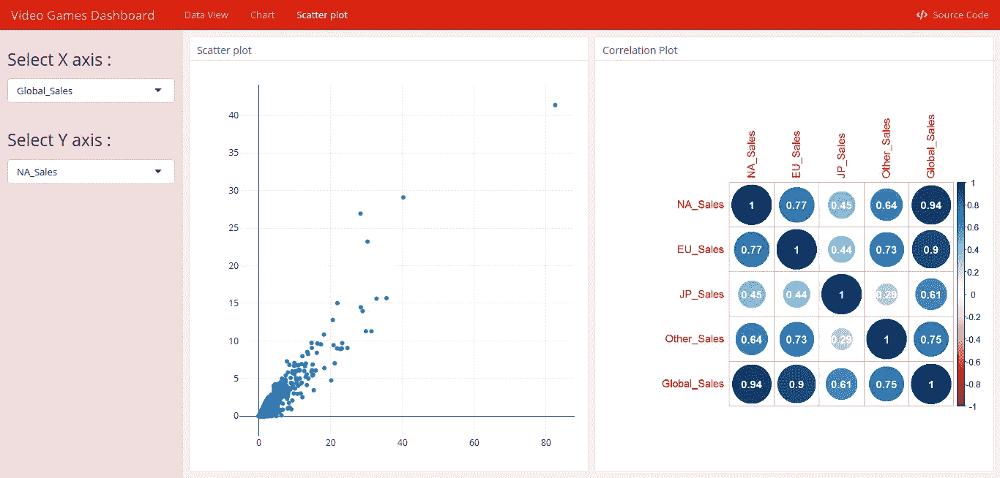

# 视频游戏销售仪表板使用 R

> 原文：<https://medium.com/analytics-vidhya/video-game-sales-dashboar-using-r-c32cc5c5ef0?source=collection_archive---------13----------------------->


在 [Unsplash](https://unsplash.com?utm_source=medium&utm_medium=referral) 上由 [Franck V.](https://unsplash.com/@franckinjapan?utm_source=medium&utm_medium=referral) 拍摄的照片

大家好。在这篇文章中，我想第一次展示我的仪表盘。我使用 R Studio 在几个软件包的帮助下制作了这个仪表板，包括 flexdashboard、dplyr、shiny 和 plotly。

我很自豪已经完成了我的第一个仪表板，我意识到这个仪表板并不完美。

# 什么是仪表板？。

在管理信息系统中，仪表板是一种工具，用于读取实时用户界面，显示当前状态的图形表示(快照)。在制作仪表板时，需要的主要能力是数据可视化。

我使用 plotly 包，因为 plotly 能够显示良好的数据可视化，并以交互方式呈现。Plotly 是一家技术计算公司，总部位于魁北克省蒙特利尔市，开发在线数据分析和可视化工具。Plotly 为个人和协作提供在线绘图、分析和统计工具，以及用于 Python、R、MATLAB、Perl、Julia、Arduino 和 REST 的科学绘图库。

我制作的仪表板视图如下图所示。


第 1 页


第 2 页



第 3 页

很简单对吧。写代码，我用 rmarkdown。代码如下所示。

```
---
title: "Video Games Dashboard"
resource_files:
- Video_Game_Sales_as_of_Jan_2017.csv
runtime: shiny
output:
  flexdashboard::flex_dashboard:
    orientation: rows
    source_code: embed
    theme: simplex
---```{r setup, include=FALSE}
library(flexdashboard)
library(dplyr)
library(plotly)
library(shiny)
library(shinydashboard)
``````{r global, include=FALSE}
data <- read.csv("../AMRI/R/dash-vidgame/dahsboard/Video_Game_Sales_as_of_Jan_2017.csv",
                 stringsAsFactors=FALSE)```Data View
===
Column {.sidebar}
---
```{r}
selectInput("GENREVIEW", h3("Genre Filter :"), 
            choices = c(as.character(unique(data$Genre))),
            selected = "Action")
selectInput("PLATFORMVIEW", h3("Platform Filter :"), 
            choices = c(as.character(unique(data$Platform))),
            selected = "NES")
```
Introduction.This dataset contains a list of video games with sales greater than 100,000 copies. It was generated by a scrape of vgchartz.com.Dashboard by Amri Rohman.
Sidoarjo, 1 September 2019.Row
---
### Number of Video Games
```{r}
valueBox(dim(data)[1], icon = "fa-comments")
```### Number of Features
```{r}
valueBox(dim(data)[2], icon = "fa-comments")
```### Number of Genre
```{r}
valueBox(unique(data$Genre)%>%length(), icon = "fa-user")
```### Number of Platform
```{r}
valueBox(unique(data$Platform)%>%length(), icon = "fa-user")
```Row
---
### Data View
```{r}
renderTable({
  data[,c(1:10)] %>%
    filter(Genre==input$GENREVIEW) %>% 
    filter(Platform==input$PLATFORMVIEW) %>%
    head(20)
  })
```Chart
===
Column {.sidebar}
---
```{r}
selectInput("GENRE", h3("Genre Filter :"), 
            choices = c(as.character(unique(data$Genre))),
            selected = "Action")
```Row
---
### Total Global Sales Line Plot by Genre
```{r}
renderPlotly({
data %>%
  group_by(Year_of_Release, Genre) %>%
  summarise(Total_Global_Sales = sum(Global_Sales)) %>%
  filter(Genre==input$GENRE) %>%
  data.frame() %>%
  plot_ly(x = ~Year_of_Release, 
          y = ~Total_Global_Sales,
          type = "scatter",
          mode = "lines+markers")
})
```### Count Video Games Genre
```{r}
data %>%
  group_by(Genre) %>%
  summarise(Count = n()) %>%
  plot_ly(x = ~Genre,
          y = ~Count,
          type = "bar")
```Scatter plot
===
Column {.sidebar}
---
```{r}
selectInput("XA", h3("Select X axis :"), 
            choices = c("NA_Sales", "EU_Sales", "JP_Sales", "Other_Sales", "Global_Sales"),
            selected = "NA_Sales")
selectInput("YA", h3("Select Y axis :"),
            choices = c("NA_Sales", "EU_Sales", "JP_Sales", "Other_Sales", "Global_Sales"),
            selected = "NA_Sales")
```Row
---
### Scatter plot
```{r}
renderPlotly({
  data %>%
  plot_ly(x = data[,c(input$XA)],
          y = data[,c(input$YA)])
  })
```### Correlation Plot
```{r}
data[, c("NA_Sales", "EU_Sales", "JP_Sales", "Other_Sales", "Global_Sales")] %>%
  cor(method = "pearson") %>%
  corrplot::corrplot(addCoef.col = "white")
```
```

# 谢谢你。

阿姆里·罗曼。
西多阿茹，东爪哇，身份证。