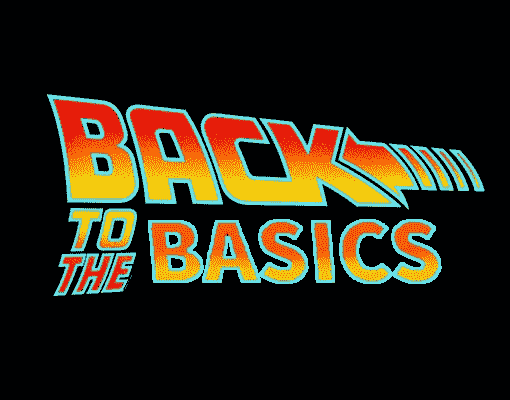

# 面向开发人员的 Vim:第 1 部分—基础知识

> 原文：<https://medium.com/analytics-vidhya/vim-for-developers-part-1-the-basics-663619ca122a?source=collection_archive---------4----------------------->



> 如果你还没有看过这个系列的第 0 部分，请查看一下！它会告诉你可以从这些帖子中得到什么。
> 
> TL；DR——如果你对 NeoVim/Vim 有点熟悉，并且你只是在寻找一个很棒的配置，你可以在这里查看我的点文件[。](https://github.com/d-ondrich/dotfiles/tree/master)

## 基础知识

这篇文章将带您了解 Vim 最基本的功能。这些是基础，在进入更复杂的用例之前掌握它们是很重要的。

## 安装 NeoVim

安装 NeoVim 非常简单，并且有很好的文档记录。您可以通过操作系统[在这里](https://github.com/neovim/neovim/wiki/Installing-Neovim)找到详细信息。我是一名 Mac 用户，安装它非常简单:

```
brew install neovim
```

瞧啊。我们做到了！

## 模式

在我们继续打开 Vim 的处女航之前，我们必须谈谈模式。在我看来，模式是 Vim 真正的天才之处，尤其是对于编码而言。Vim 中有许多模式，但我将在下面重点介绍最重要的模式(您 99.9%的时间都会用到它们)。

众所周知，代码被阅读的次数比它被编写和/或修改的次数多。那么，为什么大多数 ide 总是处于“编辑”模式呢？也就是说，当你在键盘上输入字母时，无论光标在哪里，字母都会被吐出来。

不在维姆。在 Vim 中，当你启动它时，你会发现自己处于正常模式。

## 自然振荡

这是你大部分时间要待的地方。这是您阅读代码和导航文件的地方。因为在正常模式下你不编辑文本，我们现在可以自由地使用键盘上的所有键来导航文本。这是维姆的秘制酱。关于下面导航的更多信息。

## 插入模式

当您准备好编辑文本时，就会进入插入模式。有几种方法可以进入插入模式，我们将在这篇文章的后面介绍。要记住的主要一点是，只有当你想改变文本时，你才会想进入插入模式，当你完成编辑后，你就会想离开插入模式。这是因为在插入模式下，您失去了有效导航的能力。

## 视觉模式

视觉模式可能比前面提到的两种模式用得少一点，但仍然非常有用。它主要用于高亮显示文本块，然后对整个文本块执行命令。例如，你可能会突出显示一个块并缩进整个块。

## 命令模式

命令对于 Vim 来说是必不可少的，并且会被大量使用，尤其是当我们使用插件的时候。我们将看到，命令使 Vim *做*一些事情。要输入命令，您只需在正常模式下键入`:`，然后输入命令。

## 打开新 Vim

安装好 NeoVim 后，您可以通过键入以下命令来启动它:

```
nvim
```

我已经在我的终端里别名了(我用 iTerm2 和 Z shell btw):

```
alias n="nvim"
```

然后，您只需在终端中输入`n`就可以启动 NeoVim。想象一下。？一个角色和 *BOOM* 你的(即将出现的)IDE 就可以开始了。你会注意到 Vim 几乎是瞬间启动的。这是 IntelliJ 无法比拟的用户体验，甚至是比 IntelliJ 更轻更快的 VS 代码也无法比拟的。

要在 Vim 中打开一个文件，只需在命令后面加上文件名(或文件路径)即可。例如:

```
nvim my_file.txt
```

如果你忽略了一个文件名，Vim 将在你当前的工作目录中打开，但是你还看不到任何东西。

## 关闭 Vim

有一句古老的谚语:

> 你如何制作一个随机字符串生成器？
> 打开 Vim 并要求非 Vim 用户关闭它。

或者类似的东西。不过这是真的，Vim 不像大多数程序那样关闭，因为它在你的终端内运行。您不希望只是为了退出 Vim 而关闭终端。那么你是怎么做到的呢？简单地输入…

```
:q
```

简单确定，但还是有点奇怪。我们来分解一下。

```
:
```

使用 Vim 时，冒号会变得非常熟悉。键入`:`会让你从正常模式进入命令模式，正如我们在上面学到的。总是键入`:`可能有点麻烦，因为你必须 Shift+；但是我们稍后会找到解决方法。

```
q
```

这是你记忆术的第一课。你可以记住`q: quit`然后…

## 记忆术

记忆是学习 Vim 语法的关键。从外表上看，知道 Vim 就像记住一堆热键。*没有*。它实际上是在说热键语言，使用记忆术。在下一节中，您将看到几乎所有的命令都有助记符，这使它们更容易记住。

## 导航命令

这些命令都将在正常模式下使用，以帮助您有效地浏览文件。它们需要练习，但很快你会发现自己喜欢它们，当你没有活力的时候会想念它们。

```
h - cursor left 1 character
j - cursor down 1 line
k - cursor up 1 line
l - cursor right 1 character
```

这些正是 Vim 的基础。再见了箭头键，更重要的是再见了鼠标。Vim 最天才的特性是你不需要将手从主要的打字位置移开来导航。这占了 Vim 速度的 50%。练习，练习，练习它们。真的。不要碰那些箭头键(有些人甚至禁用它们，我们会覆盖它)，而且绝对不要伸手拿你的鼠标。

现在让我们看一下整个字母表。其中一些我用得比其他人多。你会发现哪些和你有共鸣。

`a — append` —将您从正常模式切换到插入模式，并将光标置于当前所在的字符之后。

`A — append at end EOL` —从正常模式进入插入模式*，但*将光标置于当前行的*末端*。

`b — back` —将光标向后移动一个单词。

`c — change`——change 经常与其他命令配对，我们将在稍后的帖子中讨论配对。

`d — delete`——顾名思义，然而这也和`c`一样，需要配对。例如:`dd` —删除您当前所在的整行。

`e — end (of word)` —将光标跳转到当前/下一个单词的最后一个字符。

`f — find` —与一个字符成对出现，并将光标跳转到当前行中该字符的下一个实例。比如:`fa`会跳转到该行的下一个`a`。如果没有这样的字符，光标将不会移动。

`g — go` —另一个配对命令。两个常见且有用的例子是:
`gg` —将光标跳转到当前文件的第一个顶部。
`G` —将光标跳转到文件底部。

`i — insert` —进入插入模式的最常见方式。当光标在时，它直接进入。
`I — insert at end of line` —在当前行的开头进入插入模式。

`m — mark` —标记是 Vim 中非常有用的技巧。我将在下一篇关于配对命令的文章中讨论它们。

`n — next (occurrence of a search-term)` —当搜索文件时，如果有多个匹配项，这将带您进入下一个匹配项(并在它们之间循环)。

`o — open` —在当前行下创建一个空白的新行，进入插入模式，并将光标放在新行的开头。

`p — put or paste` —粘贴剪贴板中的任何内容。

`q — honestly idk a good mnemonic for this` —如何记录宏，这些宏非常有用。我们将在下一篇文章中讨论它们。

`r — replace` —该命令与一个字母成对出现，并用该字母替换您当前所在的字符。例如，输入`rb`会用一个`b`替换当前字符。

`s — substitute` —删除光标当前所在的字符，进入插入模式。

`t — to or towards` —与字母组合的 t 会将光标直接放在该行中下一个字母的前面。如果没有这样的字符，光标将不会移动。

`u — undo` —不执行最后一个命令。

`v — visual` —进入视觉模式。

`w — word` —将光标向前移动整个单词。

`x — cross-out` —删除光标当前所在的字符，但保持正常模式。

`y — yank` —本质上，这是复制命令

`z — fold`——糟糕的记忆术，我们稍后会谈到折叠，现在还不知道它们的重要性。

呜呜呜。现在你知道了维姆-公元前的，你准备好征服世界。我只想再谈一些不属于字母表的东西。

又是糟糕的记忆术，我道歉。但是，这个命令会将光标跳到当前行的最开始。

`^ — just remember this` —将光标跳转到该行的第一个字符。我发现我用这个比用`0`多，但是他们都有他们的时刻。

`$ — also remember this` —将光标跳转到行尾。

`/ — search within a file` —键入正斜杠加上您的搜索词，然后按`enter/return`将在文件内搜索。如果出现多次，您可以通过点击`n — next`在它们之间循环

`esc — escape insert mode` —将您从插入模式带入正常模式。

`ctrl + [` —也将您从插入模式切换到正常模式。

## 实践

一下子做了很多，唯一能把它做好的方法就是练习。我的建议是从小处着手。不要试图在工作中一次性使用 Vim。但是也许你有一个需要小的重构的快速任务，比如重命名一些变量或函数。对于一些真正的文本编辑任务来说，这是一个很好的开始。

## Vimtutor

如果你真的想最大化你的 Vim-ninja 技能，我建议你去看看导师。您可以使用命令`:Tutor`在 NeoVim 中访问它，也可以通过简单地输入`vimtutor`从您的终端访问 Vim 版本。导师会打开一个文本文件，里面有*吨*关于命令的信息，以及一系列的挑战，即转到 X 行并删除单词 y。看看吧！

## 放弃

Vim 有无穷无尽的功能，而这只是皮毛。这是一个起点。如果你遇到清单上没有的你认为你需要的东西，给我留言，我会帮你解决的！

# **系列中的下一个:**

[面向开发者的 Vim:第 2 部分——高级基础](/@dbo1093/vim-for-developers-part-2-advanced-basics-857c0dbda905)