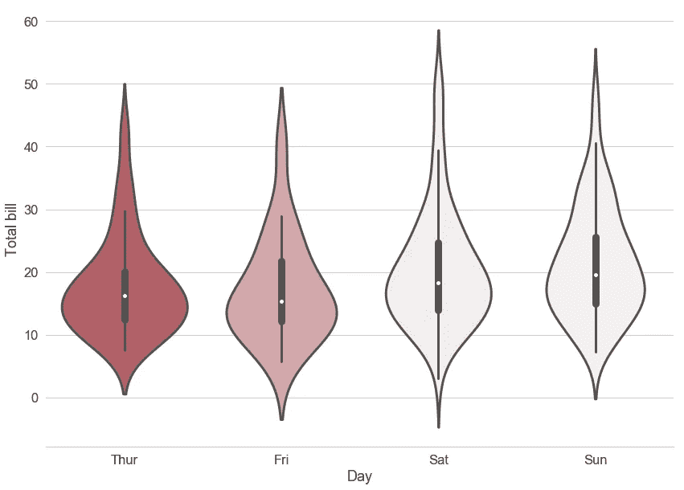
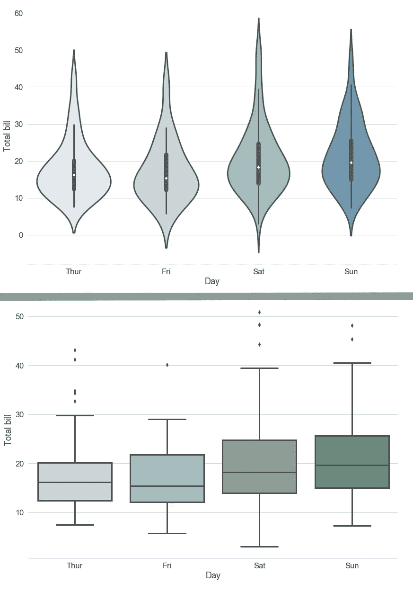

# 简而言之小提琴情节

> 原文：<https://medium.com/analytics-vidhya/violin-plot-in-a-nutshell-ecd5ed0abcff?source=collection_archive---------12----------------------->


克莱门斯·范·雷趴在[的 Unsplash](https://unsplash.com?utm_source=medium&utm_medium=referral) 上

*   描述
*   小提琴 vs 盒子
*   Python 代码示例

T4:你曾经想过要掌握小提琴吗？现在是学习如何做的时候了。我将把 **violin plot** 描述为现有的最漂亮的数据可视化方法之一。它为您提供了在一个图形上可视化数字数据分布及其密度概率的能力！

那么小提琴情节到底是怎么回事呢？让我们更深入地了解细节。

## **描述**

violin 图是两种众所周知的数据可视化方法的共生现象:[盒图](https://towardsdatascience.com/understanding-boxplots-5e2df7bcbd51)和[密度图](/@analyttica/density-plots-8b2600b87db1)。更具体地说，我将参考下面提到的例子。

假设我们在一家餐馆收集账单支付数据，营销部门的负责人要求我们可视化数据并以数学方式描述获得的结果。


照片由[亚历克斯·琼斯](https://unsplash.com/@alexjones?utm_source=medium&utm_medium=referral)在 [Unsplash](https://unsplash.com?utm_source=medium&utm_medium=referral) 上拍摄

我们决定用小提琴的情节。

*如果你不熟悉 Python——就跳过这个“编码”模块，去看看获得的魔图。*

```
#importing libraries
import seaborn as sns
import matplotlib.pyplot as plt#importing dataset 
tips = sns.load_dataset(“tips”)#violine plot and settings for even more beautiful visualization
f, ax = plt.subplots(figsize=(14, 10))
sns.set(font_scale=1.5, style=”whitegrid”)
ax = sns.violinplot(x=”day”, y=”total_bill”, data=tips, scale = ‘area’,palette = sns.color_palette(“husl”,4),saturation = 0.5, linewidth = 3)
ax.set(xlabel=’Day’, ylabel=’Total bill’)
sns.despine(left=True)
```

生成的图表如下图所示。



账单支付数据

那么，“白点、黑条和窄条是什么意思？”你可能会问。好了，我们终于可以谈谈了！

创建此图表是为了显示数据的分布及其形状。每把小提琴中间的白色圆点是中间值。小提琴中间的黑条代表[四分位区间](http://sphweb.bumc.bu.edu/otlt/mph-modules/bs/bs704_summarizingdata/bs704_summarizingdata7.html)。从条形延伸出来的黑线代表我们得到的数据中的最大和最小(上下)相邻值。

你可能会说“嗯，看起来很像方框图”。但是为什么它有如此美丽的形状呢？这个形状实际上展示了什么？答案很简单:

*这个小提琴形状显示了数据的全部分布。*

## 小提琴 vs 盒子



小提琴图(上图)与盒子图(下图)

作为一种显示统计数据的经典但不自然的方法，箱线图并没有显示重要的信息成分——数据中的值是如何分布的。

再深入一点细节:使用盒状图你不能检查[双峰和多峰](https://en.wikipedia.org/wiki/Multimodal_distribution)的分布。

## Python 代码示例

你需要知道的关于如何用 Python 实现 violin plot 的每一件事都存储在这里:[链接](https://seaborn.pydata.org/generated/seaborn.violinplot.html)。

## 编后记

如果我做得很好，并且你理解小提琴的基本情节，那么你为什么不试着深入一点，弄清楚[的数学](https://www.tandfonline.com/doi/abs/10.1080/00031305.1998.10480559)是如何工作的？

祝你好运！