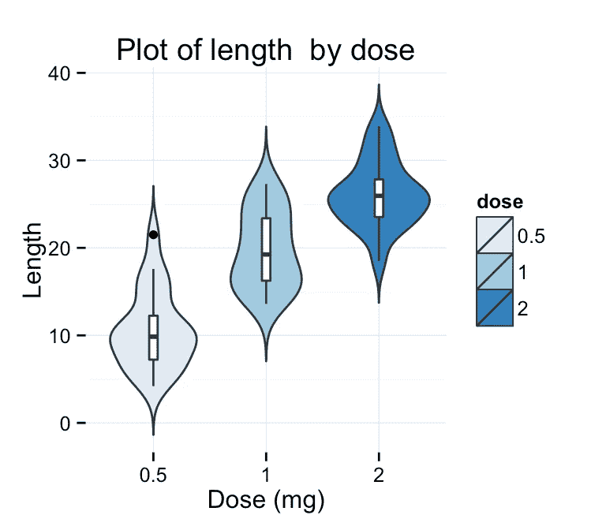
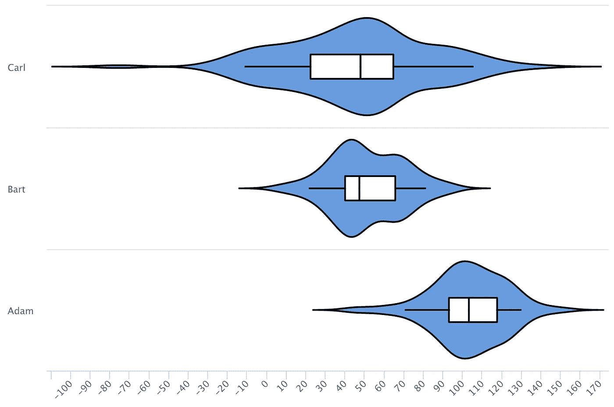

# 降 R 大调小提琴曲

> 原文：<https://medium.com/analytics-vidhya/violin-plots-in-r-with-highcharter-1e434b99e8c6?source=collection_archive---------0----------------------->

[Highcharts.js](https://www.highcharts.com) 的一个已知缺点是无法制作小提琴剧情。

Violin 图是箱线图的一种流行形式，**通过数据集分布的双侧可视化来增强**。

这里有一个小提琴情节的例子:

()来源:[http://www . sth da . com/English/wiki/gg plot 2-violin-plot-quick-start-guide-r-software-and-data-visualization](http://www.sthda.com/english/wiki/ggplot2-violin-plot-quick-start-guide-r-software-and-data-visualization)

尽管在纯 JavaScript 中实现这一点相对来说比较棘手(例如，当使用像 python-highcharts 这样的包装器库时，实际上非常容易)。对于前者，请看这里的。这个回购实际上是这篇文章的灵感来源！

在本文中，我们将深入研究后者。

# 准备数据

我们只取几个随机数，假装它们代表了亚当、巴特和卡尔的某些特征。

请注意，这个实现假设数据是一个列表，其名称是系列标签，元素是我们感兴趣的分布的数字数组！

确保你同时导入了 magrittr 和 highcharter，这篇文章中的代码才能正常工作！

# 准备密度图

这是解决方案的核心:将数字数组转化为分布。

这可以通过使用 [R 的内置密度()函数](https://www.rdocumentation.org/packages/stats/versions/3.6.0/topics/density)来实现:

# 即用型功能

我们的 violin 情节严重依赖于 Highcharts 的内置图表类型**areasplinerage**。

我们用它来绘制小提琴图和它前面的盒子图*！*

使用普通线图绘制连接 5%和 95%百分点的线。

## 笔记

使用 delta 参数控制盒状图的高度。

# 结果呢

这就是我们小提琴的情节:

与 ggplot2 版本不同，这个图表是可悬浮的，因此我们可以用工具提示之类的东西来丰富它！