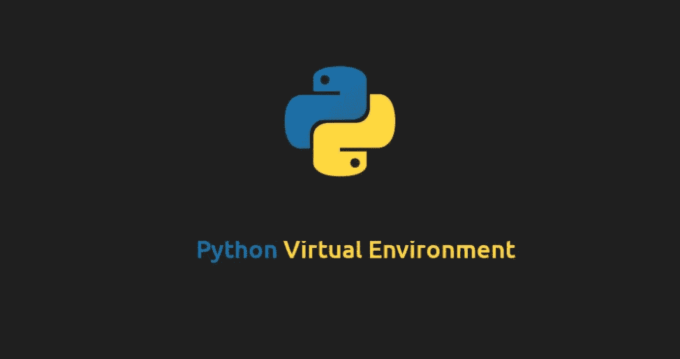

# 虚拟环境:避免混乱

> 原文：<https://medium.com/analytics-vidhya/virtual-environment-avoid-chaos-89158f7d552e?source=collection_archive---------22----------------------->

第 11 天，共 100 天代码



[图像来源](https://linuxize.com/post/how-to-create-python-virtual-environments-on-ubuntu-18-04/featured.jpg)

您可能听说过虚拟环境，如果您没有听说过，请不要担心。在这篇文章中，我不仅会向你展示如何使用它，还会激励你把它添加到你的工作流程中。

虚拟环境的概念非常简单。我们为项目创建一个不同的环境，并且只在其中安装与项目相关的库。不同的项目需要不同版本的库。虚拟环境省了很多乱。虚拟环境是避免依赖性问题的好方法。例如，你正在进行两个深度学习项目，在一个项目中，你希望 GPU 支持，而在另一个项目中，你不希望。所以你需要 TensorFlow 和 TensorFlow-GPU 两个库。没有虚拟环境，要做到这一点是非常困难的。难道你不认为为一个项目创建一个虚拟环境并为其安装特定版本的所需库会很棒吗？

使用虚拟环境有很多好处。我鼓励你尝试一次。此外，它的使用和工作非常简单。这大大提高了你的工作效率。

我们来看看如何安装和使用。

# 装置

首先，如果没有安装 pip，就安装它。

```
wget [https://bootstrap.pypa.io/get-pip.py](https://bootstrap.pypa.io/get-pip.py)
sudo python3 get-pip.py
```

现在安装 virtualenv 并删除 pip 文件，如果你是用上述方法安装的。

```
sudo pip install virtualenv virtualenvwrapper
sudo rm -rf ~/get-pip.py ~/.cache/pip
```

现在，将下面的代码添加到。bashrc 文件。这些定义了我们在虚拟环境中工作所需的一些设置。

```
export WORKON_HOME=$HOME/.virtualenvs
export VIRTUALENVWRAPPER_PYTHON=/usr/bin/python3
source /usr/local/bin/virtualenvwrapper.sh
```

在那次重装之后。bashrc 文件:

```
source ~/.bashrc
```

## 创造新环境

要创建新环境，我们使用以下命令:

```
mkvirtualenv <environment name>
```

## 列出所有环境

要列出所有创建的环境，我们使用以下命令:

```
lsvirtualenv
```

## 移除环境

要删除环境，我们使用以下命令:

```
rmvirtualenv <environment name>
```

## 激活或使用环境

要激活或使用环境，我们使用以下命令:

```
workon <environment name>
```

一旦某个环境被激活，您将要安装的每个库都将仅限于该环境。

## 退出环境

要停用或退出环境，我们使用以下命令:

```
deactivate
```

祝你快乐学习！！！