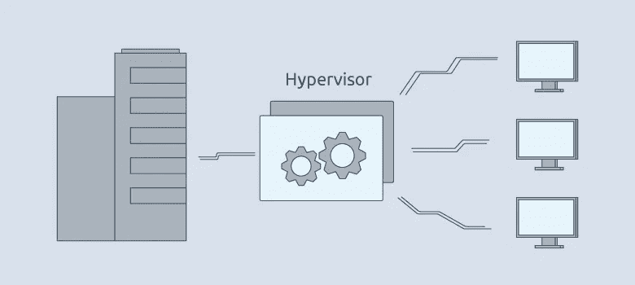
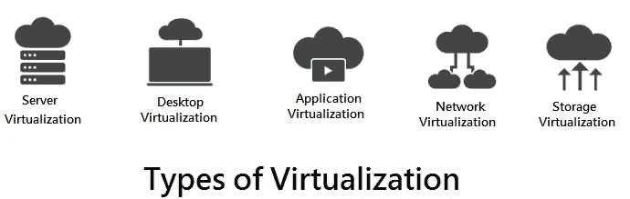
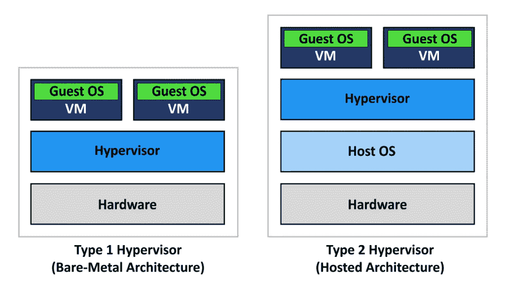
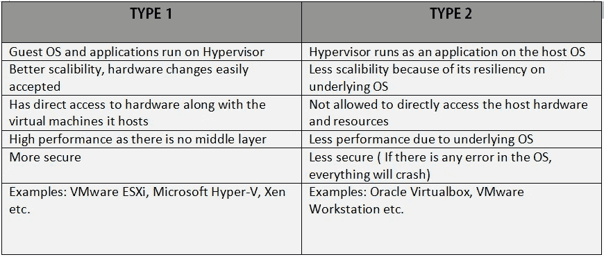

# 虚拟化和虚拟机管理程序

> 原文：<https://medium.com/analytics-vidhya/virtualization-and-hypervisors-73f5453db376?source=collection_archive---------21----------------------->

如果你现在想不出来也不用担心！

> ***到底什么是虚拟化？***

让我们看看虚拟化出现之前的场景。

*   在独立系统上运行的独立应用程序。会有很多服务器。谈论挑战:

🌟仅使用有限的容量(在少量工作负载的情况下)。其余的资源会被浪费掉。

🌟应用程序在不同的操作系统中以不同的方式运行。假设我想在 Windows 和 Linux 中运行我的应用程序。然后，我将不得不购买另一台服务器和另一个操作系统。

*   另一方面，虚拟化使我们能够拥有一台服务器，并在此基础上拥有多个操作系统。还有各种其他类型的虚拟化。

因此，虚拟化只不过是创建设备或资源(如服务器、存储、网络或操作系统)虚拟版本的一种手段，其中框架将资源划分到一个或多个执行环境中。设备、应用程序和人能够与虚拟资源交互，就好像它是单个逻辑资源一样。

> ***虚拟机监控程序的作用***

*   简而言之，它带来了虚拟化。创建和运行[虚拟机](https://en.wikipedia.org/wiki/Virtual_machine)的是计算机软件、固件或硬件。
*   它可以分为两种:

**→类型 1、本机或裸机虚拟机管理程序**

**→类型 2 或托管的虚拟机管理程序**

虚拟机管理程序的类型

*   **类型 1** 虚拟机管理程序直接在硬件(裸机)上运行。它们不需要底层操作系统。他们可以直接访问主机硬件和资源，并相应地进行分发。类型 1 虚拟机管理程序的示例有 **VMware ESXi、Microsoft Hyper-V、Xen** 等。
*   **类型 2** 虚拟机管理程序需要底层操作系统。它们运行在操作系统之上，为我们提供了运行其他操作系统和应用程序的环境。他们不能直接访问主机硬件和资源。第二类虚拟机管理程序的示例有 **Oracle Virtualbox、VMware Workstation** 等。

> ***两种类型的用例***

类型 1 用于公司和所有繁重的工作。我们不需要担心任何 OS，我们只需要硬件。缩放变得更加容易。重要数据更加安全，因为操作系统不会崩溃。另一方面， **Type-2** 主要用于基本/个人需求，如学习和测试，因为从长期角度来看这并不好

**谢谢！希望你有一个精彩的阅读。**

如有任何疑问，请通过 [**联系我**](https://www.linkedin.com/in/megha-bansal-8aa76996/) **。**