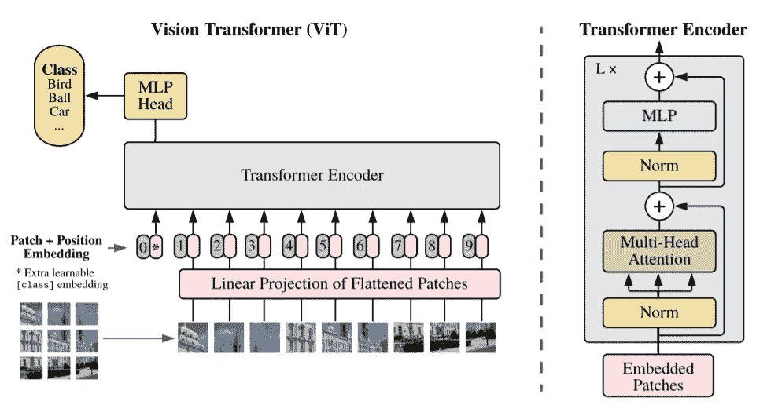
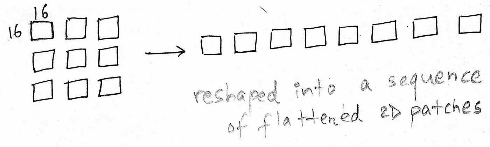
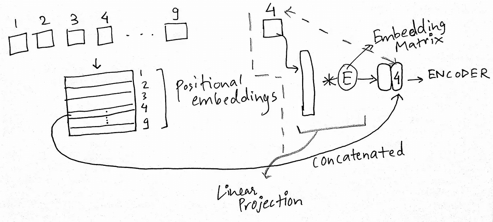
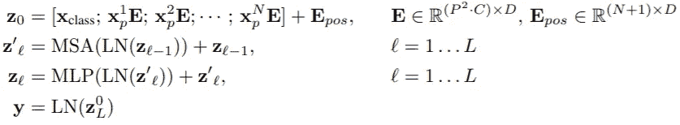
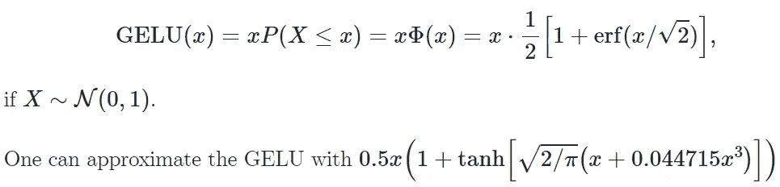
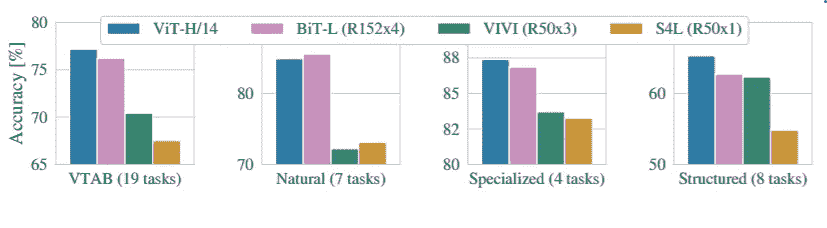

# 论文解释-视觉变形金刚(拜拜卷积？)

> 原文：<https://medium.com/analytics-vidhya/vision-transformers-bye-bye-convolutions-e929d022e4ab?source=collection_archive---------1----------------------->

模型概述。图片摘自[论文。](https://openreview.net/pdf?id=YicbFdNTTy)

# **变形金刚对图像的限制**

变压器对于 NLP 来说工作得非常非常好，但是它们受到编码器模块中**昂贵的二次注意力计算的内存和计算要求的限制。因此，图像对于变形金刚来说要困难得多，因为图像是像素的光栅，一个图像有许多许多像素。即使对于卷积神经网络，图像的光栅化本身也是一个问题。**将一幅图像输入一个转换器**每一个像素都必须关注其他每一个像素(就像注意力机制一样)，图像本身有 255 倍大，所以对一幅图像的注意力会让你付出 255⁴的代价，这在当前的硬件中几乎是不可能的。因此，人们求助于其他技术，比如进行局部关注，甚至是全球关注。**本文作者采用全球关注的改编方式。****

# **视觉变压器架构**

## **补丁嵌入**

标准转换器接收作为 1D 令牌嵌入序列的输入。为了处理 2D 图像，我们将图像 x∈R^{H×W×C}整形为一系列展平的 2D 片。

其中，(H，W)是原始图像的分辨率，而(P，P)是每个图像块的分辨率。N = HW/P 则为变压器的有效序列长度。图像被分割成固定大小的小块，在下图中，小块大小取为 16×16。因此图像的尺寸将是 48×48。

> ***注意:图像尺寸必须能被补丁尺寸整除。***

重塑补丁嵌入的基本直觉

## **展平补片的线性投影**

在将补片传递到变压器模块之前，[论文的作者](https://openreview.net/pdf?id=YicbFdNTTy)发现首先将补片通过线性投影是有帮助的。所以有一个单一的矩阵，它被称为 E，在这种情况下，“嵌入”，哈哈。他们将一个补丁展开成一个大向量，然后乘以嵌入矩阵，形成补丁嵌入，这就是与位置嵌入一起进入转换器的内容。

编码器进给前线性投影块的直观性

## **位置嵌入**

位置嵌入被添加到修补嵌入中，以保留位置信息。我们探索了位置嵌入的不同 2D 感知变体，而没有比标准的 1D 位置嵌入有任何显著的增益。**关节嵌入作为变压器编码器的输入**。

每个展开的面片(线性投影前)都有一个与之相关的数字序列，本文作者选择它为 1，2，3，4…补丁数量。这些数字只不过是可学习的向量。每个向量都被参数化，并按行进行**堆叠，以形成一个可学习的位置嵌入表。**

类似于 BERT 的**【class】**令牌，我们将一个可学习的嵌入添加到嵌入的补丁序列中，其在变换编码器(zₗ⁰)输出端的状态作为图像表示 y。在预训练和微调期间，分类头都连接到 zₗ⁰.

最后，从表中提取与修补嵌入相关联的行号(最初的顺序号)(作为位置嵌入),连接，并馈送到变换器编码器块。

又名视觉模块，在编码器模块之前完成机械装置。

## **变压器编码器模块**

变压器编码器由 M 个 [**多头自锁**](https://paperswithcode.com/method/graph-self-attention) 和 **MLP 块**的**交替层组成。[图层规格化](https://paperswithcode.com/method/layer-normalization) ( **图层规格化**)在每个块之前应用，在每个块之后应用剩余连接。**

编码器模块。图片摘自[论文。](https://openreview.net/pdf?id=YicbFdNTTy)

# 混合架构(类似的方法)

作为将图像分成小块的替代方案，输入序列可以由 ResNet 的中间特征图形成。在这个混合模型中，面片嵌入投影 E 由 ResNet 的早期阶段代替。ResNet 的一个中间 2D 特征映射被展平成一个序列，投影到 Transformer 维度，然后作为输入序列提供给 Transformer。

# 培训和微调

作者使用β1 = 0.9，β2 = 0.999，批量大小为 4096 的 **Adam** 训练所有模型，包括 ResNets，并应用 0.1 的**高权重衰减**，他们发现这对于所有模型的转移都是有用的。作者使用了线性学习率——热身和衰退。为了进行微调，作者对所有模型使用了**带动量**的 SGD，批量为 512。

# 多层感知器头

输出端的全连接 MLP 头提供所需的类别预测。主模型可以在大型图像数据集上进行预训练，然后最终的 MLP 头部可以通过标准的迁移学习方法针对特定的任务进行微调。**【MLP】包含两层带** [**葛鲁非线性**](https://paperswithcode.com/method/gelu) **。**

PyTorch 的精确实现足够快，因此这些近似可能是不必要的。图片摘自[带代码的论文。](https://paperswithcode.com/method/gelu)

# 与 SOTA 的比较

VTAB 在自然、专业和结构化任务组中的表现细分。图片摘自[论文。](https://openreview.net/pdf?id=YicbFdNTTy)

**如果你喜欢这篇文章并获得了真知灼见，可以考虑** [**请我喝杯咖啡** ☕️ **点击这里**](https://www.buymeacoffee.com/nakshatrasinghh) **:)**

# 参考

1.  [一幅图像相当于 16x16 个字:大规模图像识别的变形金刚](https://openreview.net/pdf?id=YicbFdNTTy)，ICLR 2021。
2.  [视觉变形金刚](https://arxiv.org/pdf/2006.03677.pdf)。
3.  你所需要的只是注意力。

如果你喜欢这个帖子，请一定要鼓掌👏。💬连接？让我们来看看社会:[**http://myurls.co/nakshatrasinghh**](http://myurls.co/nakshatrasinghh)**。**