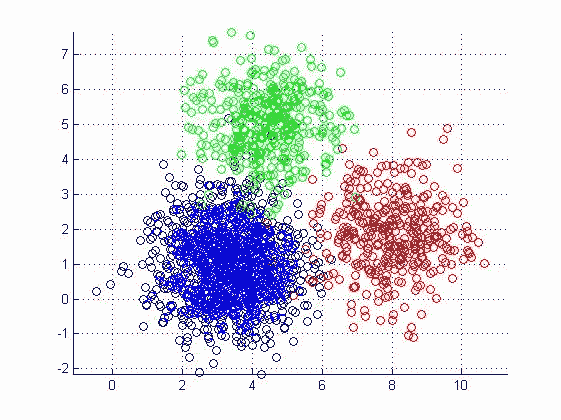
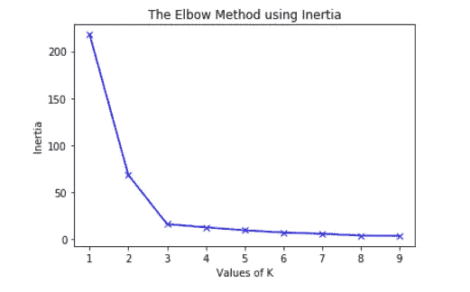

# 基于 K-均值聚类的访问者细分

> 原文：<https://medium.com/analytics-vidhya/visitor-segmentation-using-k-means-clustering-c874dcd41785?source=collection_archive---------4----------------------->

客户细分或聚类在许多方面都很有用。它可以用于有针对性的营销。有时，在构建预测模型时，对数据进行聚类并为每个聚类构建单独的预测模型会更有效。在本文中，我将解释如何使用部署在 Flask 中的 k-means 模型来创建集群。



# k-均值算法

AndreyBu 拥有超过 5 年的机器学习经验，目前正在向人们传授他的技能，他说“K-means 的目标很简单:将相似的数据点组合在一起，并发现潜在的模式。为了实现这个目标，K-means 在数据集中寻找固定数量( *k* )的聚类

让我们看看 K-means 机器学习算法如何使用 Python 编程语言工作的步骤。我们将使用 Scikit-learn 库和一些随机数据来说明 K-means 聚类的简单解释。

**第一步:导入库**

```
import pandas as pdimport numpy as np from sklearn import preprocessingimport matplotlib.pyplot as pltfrom sklearn.cluster import KMeansimport Flask, request, jsonify, render_template
```

从上面的代码中可以看出，我们将在项目中导入以下库:

*   熊猫用于阅读和书写电子表格
*   用于执行有效计算的数字
*   用于数据可视化的 Matplotlib
*   Python 编程语言的 Sklearn
*   展开用烧瓶

**第二步:数据预处理**

它是一种将原始数据转换成可理解格式的数据挖掘技术。原始数据(真实世界的数据)总是不完整的，并且这些数据不能通过模型发送。这将导致某些错误。这就是为什么我们需要在通过模型发送之前预处理数据。

以下是我遵循的步骤:

1.  **删除重复行**
2.  **用特征的平均值、中值或众数替换缺失值**
3.  **使用标签编码器将分类变量转换成数字数据**
4.  **使用特征缩放限制变量的范围**

```
def Preproceesing(): d.drop_duplicates(keep='first')
    d.x1.fillna(d.x1.mean(), inplace=True) # x1 example 
    le = preprocessing.LabelEncoder() #label encoder
    le.fit(d.x1)
    d.x1=le.transform(d.x1)
    in_max_scaler = preprocessing.MinMaxScaler() #feature scaling
    scaled_array = min_max_scaler.fit_transform(d)  
    d = pd.DataFrame(scaled_array,columns=d.columns)
    return d
```

**步骤 3:用于数据可视化的 PCA**

对于许多机器学习应用程序来说，能够可视化您的数据很有帮助。您可以使用 PCA 将 4 维数据缩减为 2 维或 3 维，以便您可以绘制数据，并有望更好地理解数据。

```
def PCA(d):
    pca = PCA()
    pca.fit(d)
    pca_samples = pca.transform(d)
    return pca_samples
```

**第四步:建模**

下面是训练 k-means 和寻找质心的代码:

```
clusterer = KMeans(n_clusters=4,random_state=42,n_init=10).fit(d)
       centers = clusterer.cluster_centers_
       labels= clusterer.predict(d)
```

> 为了确定 k-均值的最佳聚类数，肘方法是确定 k 的最佳值的最流行的方法之一



我们必须选择“弯头”处的 k 值，即在该点之后，失真/惯性开始以线性方式减小。

## 我们怎么能说聚类质量度量是好的呢？

轮廓值是对象与其自己的簇(内聚)相比与其他簇(分离)相似程度的度量。轮廓的范围从 1 到+1，其中高值表示对象与其自己的簇匹配良好，而与相邻簇匹配较差。如果大多数对象都有较高的值，那么集群配置是合适的。如果许多点具有低值或负值，则聚类配置可能具有太多或太少的聚类。

```
from sklearn.metrics import silhouette_scoresilhouette_score(d,labels)
```

## 步骤 4:部署

对于我们的应用程序，我们将定义一个 route @**app . route('/clustering ')，【T1]来调用我们的模型，如下面的代码所示:**

```
app = Flask(__name__)
app.config["DEBUG"] = True@app.route('/clustering')
def predict():
    data= pd.read_csv('dataset.csv')
    data=prepross(data)
    data=pca(data)
    clusterer = KMeans(n_clusters=4,random_state=42,n_init=10).fit(d)
    centers = clusterer.cluster_centers_
    labels= clusterer.predict(d)
    return jsonify(labels) if __name__ == '__main__':
      app.run(debug='true' )
```

为了测试它，保存你的文件为 *app.py* 并执行它。默认情况下，API 将在端口 5000 上运行。然后使用 Postman 或在终端上键入以下命令:

```
C:\Users\USER\Desktop\media\heroku> python app.py
```

这很容易理解，尤其是如果你使用 [K-means 聚类教程](https://www.liveedu.tv/guides/artificial-intelligence/)来加速你的学习。，它可以快速提供培训结果。因此，您可以通过使用 k-means 聚类来生成客户聚类，从而获得有意义的见解和建议。

如果你想玩我的**源码**，可以在这里找到 [*。*](https://github.com/ChaimaaMafroudd/Visitor-Segmentation-using-K-means-Clustering)