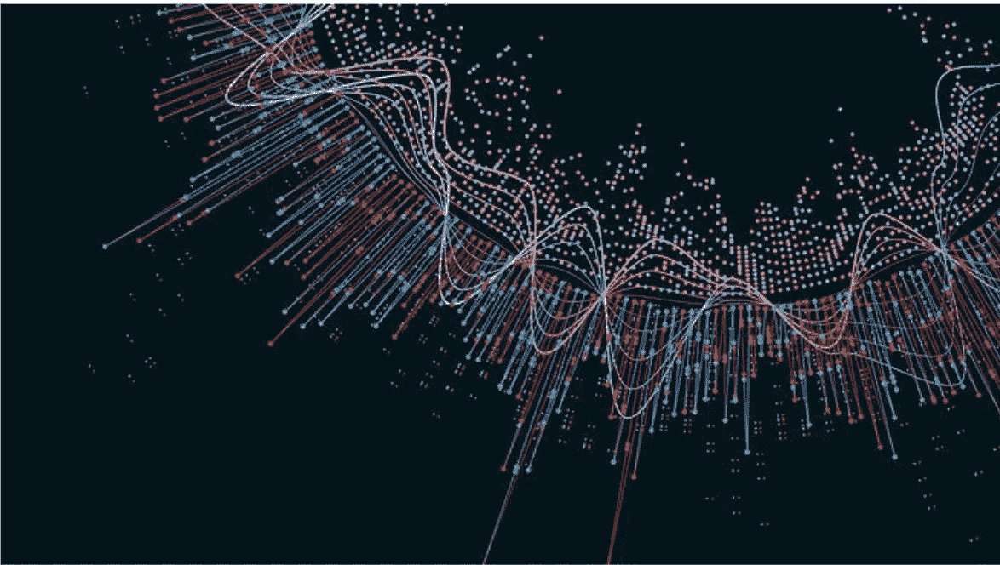
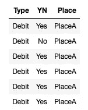
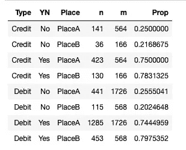
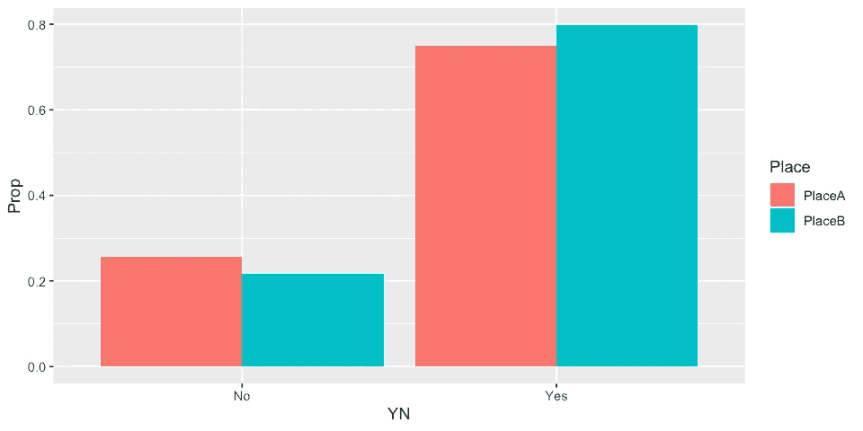
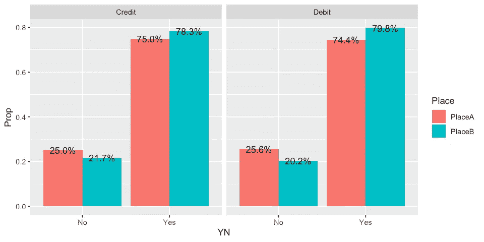
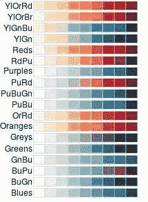
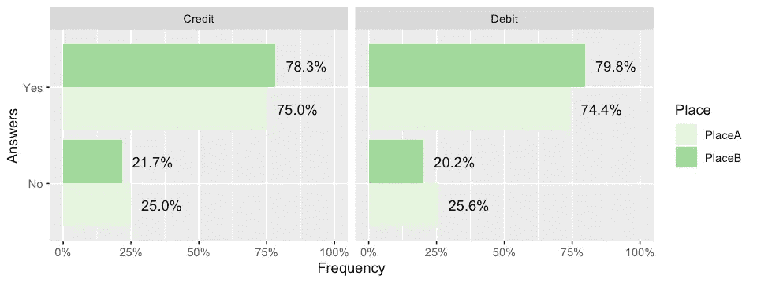
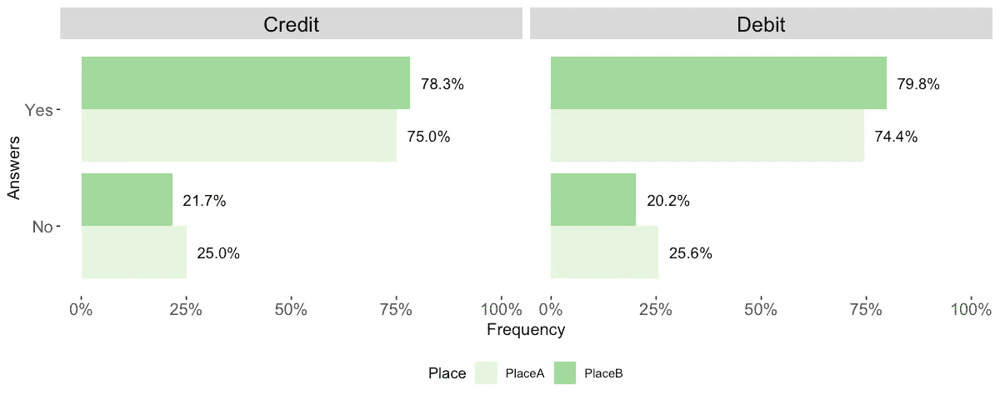

# R 中的视觉输出——一个有分类变量的例子

> 原文：<https://medium.com/analytics-vidhya/visual-outputs-in-r-example-1-d71cb4be50eb?source=collection_archive---------11----------------------->



在 R 中有多种创建图形的方法，提供示例有助于让其他人熟悉一些片段，这些片段可以改善可视化输出并增加分析层。本博客中的示例是 ggplot 中的一个输出，它以百分比值和分组因子的比例显示标签。想法是输出一个描述 a %的标签值，并且与每个子组成比例(在本例中是地点 A 和地点 B)。一些额外的美学考虑也提出来分享你的视觉输出可能的轮廓想法。

# 步骤 1:上传相关库

```
library(dplyr)
library(ggplot2)
```

dplyr 是一种数据操作语法，提供了一组一致的动词，帮助您解决最常见的数据操作挑战。更常见的命令有:

> `*filter()*` *根据值选择案例。* `*arrange()*` *对病例进行重新排序。* `*select()*` *和* `*rename()*` *根据名称选择变量。* `*mutate()*` *和* `*transmute()*` *添加新变量，即现有变量的函数。* `*summarise()*` *将多个值浓缩为一个值。* `*sample_n()*`*`*sample_frac()*`*随机抽取样本。**

*ggplot2 是一个基于[图形](http://amzn.to/2ef1eWp)语法的声明式创建图形的系统。您提供数据，告诉 ggplot2 如何将变量映射到美学，使用什么图形原语，它负责处理细节*

# *步骤 2:创建数据集*

*除非已经提供了数据集，否则可以通过随机化一些变量的分布来创建数据集，在这种情况下，我们可以命名为:类别类型(例如，借方、贷方)、二元变量(是、否)和另一个分类变量，例如位置。在这个模拟中，我们还设置了每个属性出现在每个变量中的概率。*

```
*set.seed(1234)
Random <- data.frame(replicate(3,sample(0:3, 3024, rep=TRUE)))Random$Type<- sample(c(“Debit”, “Credit”),size = nrow(Random), prob = c(0.76, 0.24), replace = TRUE)Random$YN <- sample(c(“Yes”, “No”), size = nrow(Random), prob = c(0.76, 0.24), replace = TRUE)Random$Place <- sample(c(“PlaceA”, “PlaceB”), size = nrow(Random), prob = c(0.76, 0.24), replace = TRUE)*
```

*初始数据集的输出如下所示。这只是第一个条目，但行数可能会更多。*

**

# *步骤 3:测量变量间的分布*

*这是继续进行可视化输出的关键步骤，该可视化输出表示各种变量之间的每种组合的频率。在这种情况下，left_join 函数特别有助于以表格形式描述 t*

```
*Random %>% 
count(Type, YN, Place) %>% 
left_join(Random %>% 
count(Type, Place, name = "m"), by = c("Type", "Place")) %>%
mutate(Prop = n/m)* 
```

*输出将类似于。n 列描述了每种组合的出现，而 m 代表比例*

**

# *步骤 4:绘制频率的总体分布图*

*考虑到表格形式的结果，可以执行库 ggplot 以通过聚集形式的图形显示先前的分布。*

```
*%>% ggplot(aes(x = YN, y = Prop, fill = Place)) +
geom_col(position = position_dodge())*
```

**

*从图表中可以看出，没有按类型进行分类，而只是按地方进行分类:每个地方回答“是”和“否”的比例。*

# *步骤 5:按类别分解图表*

*按类型分解图形的下一步是由命令 facet_wrap 提供的，它使用户能够表示频率分布的附加层。*

```
*facet_wrap(~ Type, scales = "free_x", ncol = 2) +*
```

**

# *第 6 步:显示百分比值*

*该代码的一个主要目的是以表格的形式表示之前确定的百分比值的分解。包比例(已经嵌入在 R 中)允许比例值显示在可视输出中*

```
*geom_text(aes(label = scales::percent(Prop)), position = position_dodge(0.9),hjust = -0.25) +*
```

**

# *第 7 步:显示百分比值*

*一旦最终产品提供了预期的分析输出，视觉的美学部分也是另一个重要的考虑因素。Ggplot 嵌入了特定的函数来实现这一点。选择颜色模式的是 scale_fill_brewer，沿 y 轴建立%值的是 scale_y_continuous。见下面一些例子和调色板和剪贴产品一个更有吸引力的图表。*

**

```
*scale_fill_brewer(palette = "Greens") +
scale_y_continuous(limits = c(0, 1), labels = scales::percent)+
xlab("Answers") +
ylab("Frequency") +
coord_flip()*
```

**

*视觉输出现在显示两层分解和相应的%值。第一层是按地点分解，第二层是按分类变量分解(在本例中为信用和借贷)。*

# *第八步:最后润色*

*在发布视觉输出之前，最后的润色也很重要。set_plot_dimension 函数有助于建立最终输出大小的标准。*

```
*set_plot_dimensions <- function(width_choice, height_choice) 
{options(repr.plot.width = width_choice, repr.plot.height = height_choice)}set_plot_dimensions(10,4)*
```

*在经过一些尝试和错误以获得最优维度之后，主题函数中建立了一系列其他参数。例如，element_rect 有助于定义背景颜色，而对于文本大小，调整以下元素无疑是有帮助的:strip.text、plot.title、axis.text 和 axis.title*

```
*theme(panel.background = element_rect(fill = "white"),
        legend.position = "bottom",
        strip.text.x = element_text(size = 15, colour = "black"),
        plot.title = element_text(size = 16, face = "bold"),
        axis.text = element_text(size = 12),
        axis.title = element_text(size = 12))*
```

**

*瞧，最终的视觉输出现在显示了百分比和不同的分解层次*