# 具有各种特征组合的视觉问题回答

> 原文：<https://medium.com/analytics-vidhya/visual-question-answering-with-various-feature-combinations-extensions-of-visual-question-940edbd84d82?source=collection_archive---------5----------------------->

## 视觉问答的扩展

乔恩·泰森在 [Unsplash](https://unsplash.com?utm_source=medium&utm_medium=referral) 上的照片

我目前的工作包括使用 NLP 进行语言建模、分段和分解。考虑到语义和意义在理解语言中的重要作用，我想重温一下这个领域以前的一些工作，特别是像视觉问答(VQA)这样有趣的工作，它结合了计算机视觉、自然语言理解和深度学习。本文概述了 VQA 模型及其扩展。有关实现和结果的更详细的阅读，请参考此处的论文[和此处的代码](http://courses.cs.vt.edu/cs5824/Fall15/project_reports/choi_narayanan.pdf)。VQA 团队还维护着一个全面的信息、资源和软件来源，包括最新的演讲和论文。

在人工智能的众多问题中，结合了计算机视觉、自然语言处理、知识表示和推理的图像/视频字幕已经被许多研究小组所解决。然而，与人类相比，在图像的评估质量方面仍然存在显著的差距。VQA 已经成为一个有趣的领域，它位于这些问题领域的交汇处。给定一幅图像，视觉问答算法帮助机器回答关于该图像的自由形式、开放式、自然语言的问题。这是通过基于微软的[深度多模态相似性模型(DMSM)【1】](http://openaccess.thecvf.com/content_cvpr_2015/html/Fang_From_Captions_to_2015_CVPR_paper.html)在两种模态(文本和图像)之间的语义空间中测量相似性来实现的。虽然基本的 VQA 模型本身有许多潜在的真实世界用例，如大型图像集中的自动标记、图像检索系统、集成到巨大的社交媒体和电子商务数据库中，但作为弗吉尼亚理工大学视觉实验室的研究生， [Jinwoo Choi](https://scholar.google.com/citations?user=WcCMuIEAAAAJ&hl=en) 和我还想尝试将[VQA【2】](https://arxiv.org/abs/1505.00468)的基本模型扩展到其他输入组合。

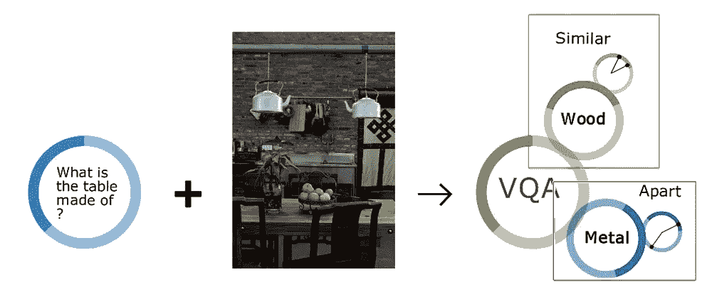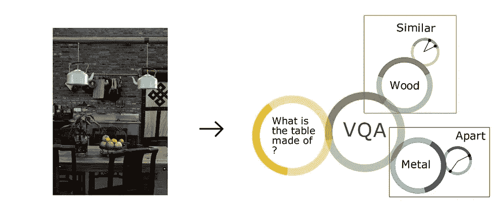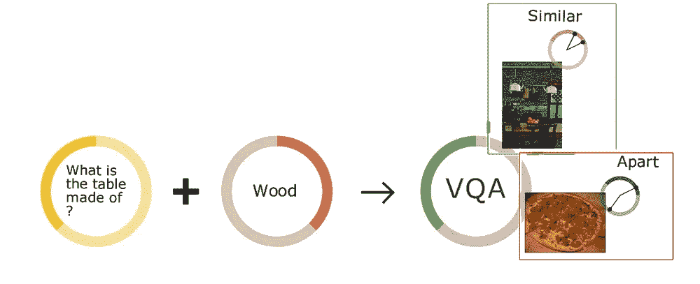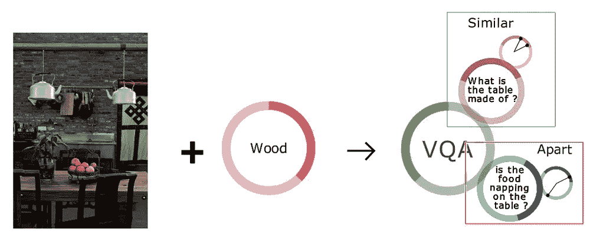

图 1:这里展示了四个模型。第一个模型是基本的 VQA 模型。给定一幅图像，问一个关于它的问题，并找到关于该图像的问题的正确答案。在第二个模型中，给定一个图像，我们检索相应的问题和答案对。第三个模型是具有输入问答对的图像检索模型。给定一个问题和答案对，我们检索与查询问题和答案对最相关的图像。最后一个模型是危险模型。给定一幅图像和一个答案，这个模型试图找到关于它们的问题。

为了执行任何 VQA 任务，我们测量输入模态(图像&句子)或(图像+句子&句子)之间的相似性。DMSM 帮助我们将输入向量映射到公共语义空间，并测量嵌入向量之间的余弦相似性。DMSM 是单峰深度结构化语义模型(DSSM)的多峰扩展，它测量文本查询和文档之间的相似性，并且也使用一对类似于 DSSM 的神经网络。

基本 VQA 模型使用从图像中提取的特征，并与问题特征连接以生成(图像+问题)特征。然后，通过 DMSM 的一个网络输入这些信息，并通过另一个网络输入答案特征来训练模型。

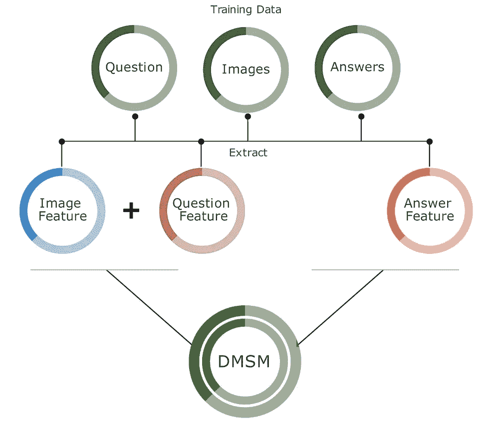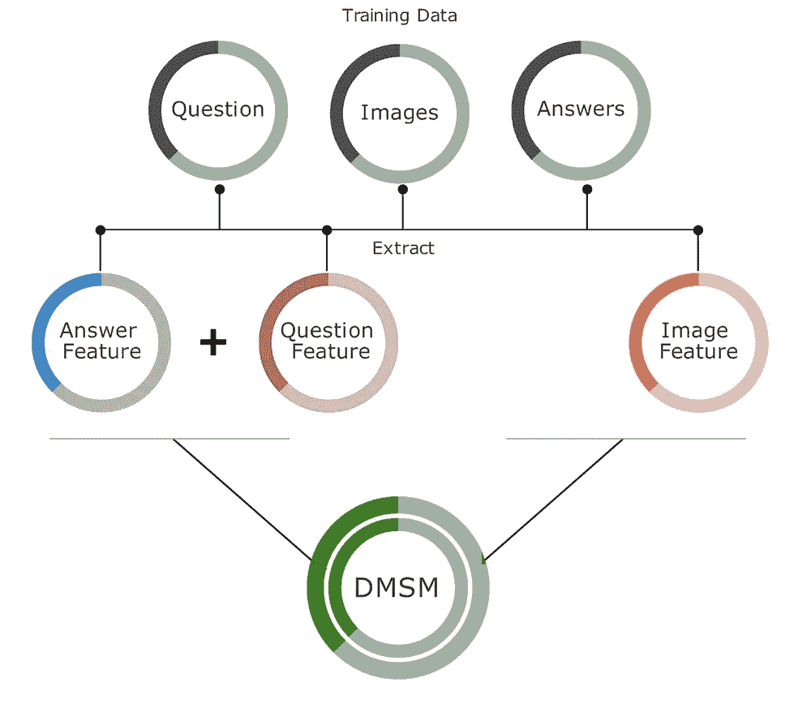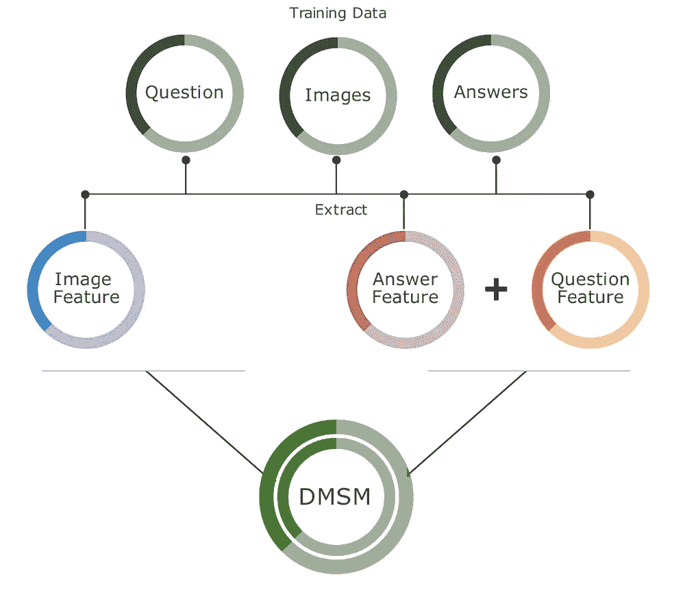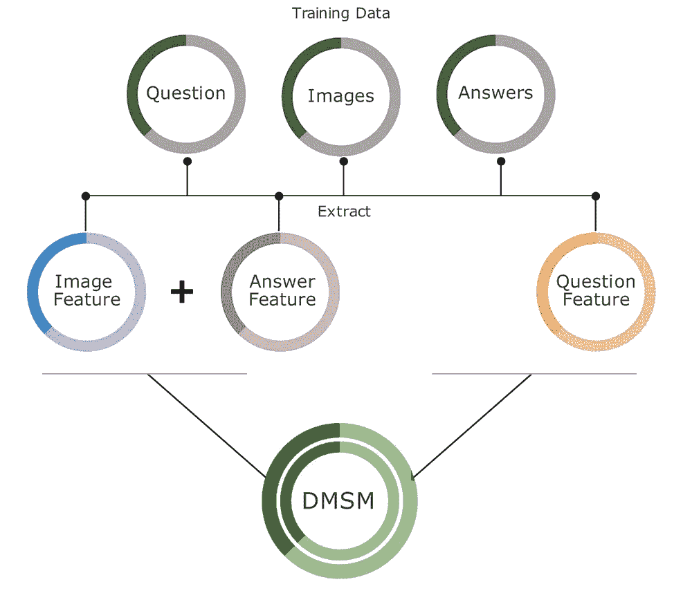

图 2:对于 QA 检索模型，提取的图像特征被输入一个网络，连接的(问题+答案)特征被输入另一个网络。对于图像检索模型，连接的(问题+答案)特征被馈送到一个网络，而提取的图像特征被馈送到 DMSM 的另一个网络。对于危险模型，我们将图像特征与答案特征连接起来。级联的(图像+答案)特征被馈送到一个网络，而问题特征被馈送到另一个网络。

DMSM 的预测返回输入 1(图像+问题特征)和输入 2(候选答案特征)之间的余弦相似性得分，范围从-1 到 1。我们的数据集每个问题有 18 个多项选择，从中选择得分最高的答案。为此，我们按降序排列分数，并选择前 K 个最相似的结果。

这项工作中使用的数据集是原始的 [VQA 数据集【2】](https://arxiv.org/abs/1505.00468)。在我们模型的开发过程中，该数据集包含来自[微软 COCO 数据集【3】](https://arxiv.org/abs/1504.00325)的 82，783 幅训练图像和 40，504 幅验证图像。此外，VQA 数据集包含每个训练/验证图像大约 3 个基本事实问答对。VQA 数据集提供了两种回答问题的方式:(1)开放式回答和(2)多项选择。在这项工作中，只有多项选择答案被用于 VQA 模型。请注意， [VQA 团队](https://visualqa.org/)已经发布了新的数据集，所以在你开始开发自己的模型之前，请务必检查它们。

# **实施总结**

我们使用训练图像和相应的训练问题和答案来训练我们的模型。我们使用验证图像和相应的验证问题和答案来获得预测和计算准确性。

1.  我们首先生成所需组合的特征集，将它们对齐并连接起来以获得稀疏向量表示。
2.  Caffe 用于从 [VGGNET](https://arxiv.org/abs/1409.1556) 中提取激活的图像特征，对于问答特征，使用字母三元组计数向量的词袋表示。
3.  馈入两个特征以训练 DMSM 并更新权重矩阵。

使用 Torch 很慢，每个时期大约需要 2-3 个小时，因此我们的实现使用了 DMSM C#参考代码，每个时期大约需要 70-100 分钟。因此，对于 100 个时期，我们需要大约 5-7 天来训练一个模型。

为了测试，我们通过它们的嵌入向量之间的余弦相似性来测量两个输入之间的相似性。例如，我们计算给定图像的嵌入，并使用多模态余弦相似性分数来寻找图像的最近的问题+答案嵌入。这展示了询问关于图像的什么问题的能力，以及获得自动生成的问题的答案的能力。

# **结果**

实验显示了 VQA 扩展模型的有希望的结果。原始 VQA 模型的一些示例结果如图 3 所示。

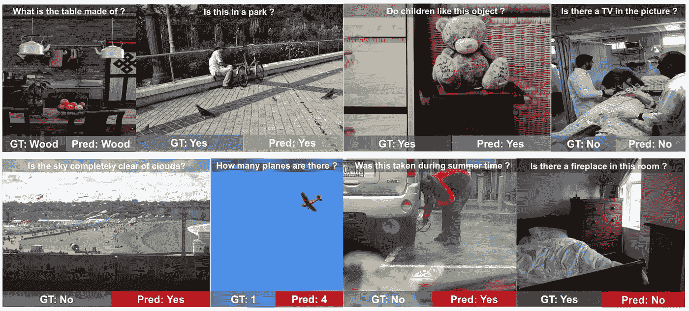

图 3: VQA 模型示例结果:顶行显示成功案例，底行显示失败案例。如第一行所示，在某些情况下，机器可以正确回答给定图像的问题。机器可以回答抽象的概念问题(第三个例子)以及简单的问题(第四个例子)。

QA 对检索示例结果如图 4 所示。给定一个查询图像，机器检索相应的 QA 对，并根据相似性得分以降序对这些对进行重新排序。即使正确答案排名不是很高，检索到的答案也与查询图像相关。在第一个示例中，所有排名前 3 的 QA 对都包含查询图像中包含的“table”和“fruit”。在第三个示例中，排名前三的 QA 对中有两个包含“猫”，而另一个将图像中的猫误分类为狗。

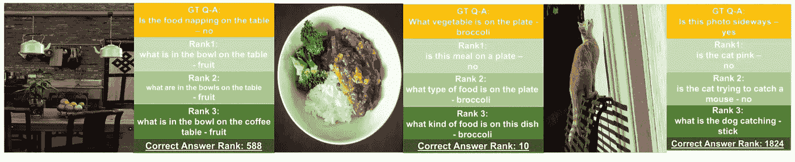

图 4: QA 对检索模型示例结果。

图像检索结果的例子如图 5 所示。给定一个查询 QA 对，机器检索相应的图像，并根据相似性得分对图像重新排序。类似于 QA 检索结果，前 3 个检索到的图像与查询 QA 对相当相关。例如，图 5 中的第二行将“大象在游泳吗”和“不”作为问答配对。所有前 3 名的检索图像都包含大象，而且它们没有游泳。图 5 中的第三行有“这个人在哪里做饭”和“烤箱”作为 QA 对。所有前 3 名检索到的图像都包含烹饪场景。其中两个装有烤箱。

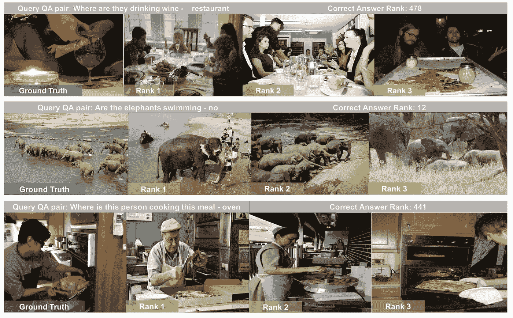

图 5:图像检索模型示例结果。

危险模型示例结果如图 6 所示。给定一幅图像和一个答案，机器试图找出问题所在。该模型还合理地检索了相关问题。在第一个例子中，查询图像是洗手间图像，而查询答案是“瓷砖”。所有前 3 个检索到的问题都包含“下限”或“上限”。在第三个示例中，查询图像包含关于一个男人正在玩滑板的场景，答案是“滑板”。所有前 3 个检索到的问题都有一个“某人在做什么”的形式。但是最重要的问题是“消防员在做什么”，这肯定是不正确的。这是因为图像的模糊部分。光线的模糊可能给图像特征提取模块带来混乱。

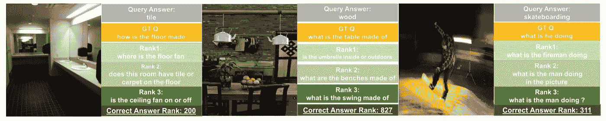

图 6:危险模型示例结果。

# 结论

VQA 扩展有助于探索新的潜在应用，如通用对象识别、整体场景理解、从图像中讲述信息和故事，或者开发提出有关图像问题的交互式教育应用。尽管目前的预测与人类决策相比表现不佳，但更新、更大的数据集以及更多平台和设备的采用将使计算机能够更直观地理解数据，并改变我们搜索数据和与数据互动的方式。在这项研究的范围内，一个有趣的下一步将是使用原始 VQA 模型的权重将迁移学习应用于三个扩展模型。迁移学习可以减少三个扩展模型的训练时间，提高模型精度。

# 参考

[1]方、郝、古普塔、索拉博、伊恩多拉、福里斯特、斯里瓦斯塔瓦、鲁佩斯、邓、李、杜大伟、皮奥特、高、何剑锋、何晓东、米切尔、玛格丽特、普拉特、约翰 c、劳伦斯兹尼克、c 和茨威格、杰弗里。从字幕到视觉概念，再到视觉概念。2015 年 6 月，IEEE 计算机视觉和模式识别大会(CVPR)。

[2]安托尔、、阿格拉瓦尔、艾什瓦尔亚、卢、、米切尔、玛格丽特、巴特拉、德茹夫、兹特尼克、c .劳伦斯和帕里克、德维。Vqa:视觉问答。2015 年国际计算机视觉会议(ICCV)

[3]陈、、方、郝、林、宗毅、韦丹丹、罗摩克里希纳、笈多、绍拉布、杜尔达、皮奥特和兹尼克、C .劳伦斯。微软 coco 说明:数据收集和评估服务器。arXiv 预印本 arXiv:1504.00325，2015。

[4] Simonyan，k .和 Zisserman，a .用于大规模图像识别的非常深的卷积网络。更正，abs/1409.1556，2014 年。