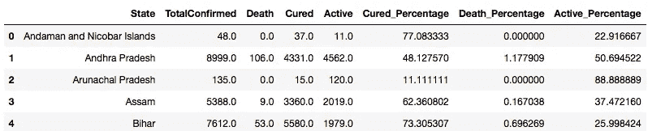

# 印度 COVID19 的可视化

> 原文：<https://medium.com/analytics-vidhya/visualisation-of-covid19-in-india-4121e64947f8?source=collection_archive---------21----------------------->

在这次封锁期间，数据科学家从上传到 Kaggle 上的各种数据集开始可视化 COVID19 的情况，所以我决定跟随潮流。我没有从世界各地获取数据，而是将我的分析指定给印度，因为我能够将结果与我在周围看到的联系起来。


使用来自 Kaggle 和 plotly 的[新冠肺炎](https://www.kaggle.com/sudalairajkumar/covid19-in-india?select=IndividualDetails.csv)数据集，这是我的可视化。

数据集包含 7 个文件，其中我使用了以下文件:

*   年龄组详细信息
*   新冠肺炎的细节

除此之外，我使用了[卫生和家庭福利部](https://www.mohfw.gov.in)(2020 年 6 月 23 日)上传的最新数据来进行全州范围的统计。

```
ag= pd.read_csv('AgeGroupDetails.csv')
sw = pd.read_csv("23.csv")
sw_date = pd.read_csv("covid_19_india.csv")
```

## 一段时间内记录的确诊、康复和死亡病例

2020 年 1 月 30 日，也就是疫情病毒在中国传播的消息传出后近一个月，印度出现了首例阳性病例。患者有武汉外游史，可以在下面的截图中注意到。

```
sw_date = pd.read_csv("covid_19_india.csv")
sw_date.head()
```


使用同一个 csv 文件，我删除了不需要的列，并合并了每个诊断日期的结果。

```
sw_date = sw_date.drop(columns = ['Sno','Time','State/UnionTerritory','ConfirmedIndianNational','ConfirmedForeignNational'])
sw_date["Date"] = pd.to_datetime(sw_date["Date"]).dt.strftime('%d-%m-%y')
sw_date["Date"] = pd.to_datetime(sw_date["Date"])
sw_date = sw_date.groupby('Date', as_index=False).sum()
sw_date
```


软件日期

然后，为了制作一个显示疾病进展的对比线图，我使用了以下代码

```
sw_date = sw_date.melt(id_vars='Date', 
                 value_vars=['Confirmed', 
                             'Cured', 
                             'Deaths'], 
                 var_name='Ratio', 
                 value_name='Value')fig = px.line(sw_date, x="Date", y="Value", color='Ratio')
fig.show()
```


COVID19 在印度的进展

从图表中可以看出，截至 2020 年 4 月，即全国范围封锁的第一阶段结束时，确诊病例数量急剧增加。在此之后，随着病例继续增加，某些州承诺进一步延长封锁期。尽管如此，可以注意到确诊病例曲线有一个巨大的陡坡，并且没有减缓的迹象。

治愈患者的曲线显示了类似的趋势。需要考虑的一件事是，在 5 月 29 日至 30 日之间，治愈病例的数量出现了急剧下降——11，264 个记录。

随着确诊病例的增加，死亡率也呈上升趋势。

## 状态数据

```
sw['Cured_Percentage'] = (sw['Cured']/sw['TotalConfirmed'])*100
sw['Death_Percentage'] = (sw['Death']/sw['TotalConfirmed'])*100
sw['Active_Percentage'] = (sw['Active']/sw['TotalConfirmed'])*100sw.head()
```



```
fig = px.treemap(sw, path=['State'], values='TotalConfirmed', height=600, width=1000, title = 'State Wise Display Based on Total Number of Positive Cases')
fig.update_layout(
    title_x = 0.5,
    geo=dict(
        showframe = True,
        showcoastlines = True,
    ))fig.show()
```


树形图是一种基于数据层次显示数据的好方法。该图中的矩形框根据记录的阳性病例数按降序排列。为了更清楚地了解相同条件下的前 10 个州，我使用了散点图。

```
fig = px.scatter(sw1, x="TotalConfirmed", y="Active", size="Active", color="State",
                 hover_name="State", log_x=True, size_max=60, title ="Top 10 States Based on Total Number of Positive Cases Recorded against Currently Active Cases")
fig.show()
```


可以看出，马哈拉施特拉邦记录的病例和样本总数最高，其次是德里。为了更清楚地了解总确诊病例数、死亡人数、活跃病例数之间的关系，我为相同的州创建了一个条形图。

```
x = sw1.State
y1 = sw1.TotalConfirmed
y2 = sw1.Active
y3 = sw1.Death
fig = go.Figure(data=[
    go.Bar(name='Total Positive Cases Reported', x=x, y=y1),
    go.Bar(name='Active', x=x, y=y2),
    go.Bar(name='Death', x=x, y=y3)
    ])
#Change the bar mode
fig.update_layout(barmode='group', title ="Top 10 States Based on Number of Positive Cases Recorded")
fig.show()
```


虽然这确实提供了充足的信息，但我想检查活动病例百分比与记录的死亡百分比之间的关系。

为了做到这一点，我必须根据死亡百分比的降序排列数据。

```
x = sw2.State
y2 = sw2.Active_Percentage
y3 = sw2.Death_Percentage
fig = go.Figure(data=[
    go.Bar(name='Active', x=x, y=y2),
    go.Bar(name='Death', x=x, y=y3)
    ])
#Change the bar mode
fig.update_layout(barmode='group', title ="Percentage of Active and Death Cases as of 23/06/2020")
ylable='Percentage'
fig.show()
```


这里可以看出，尽管马哈拉施特拉邦记录的活跃病例数量较高，但死亡百分比在古吉拉特邦更高。

## 受 COVID 影响的年龄组

```
ag= pd.read_csv('AgeGroupDetails.csv')
fig = px.pie(ag, values='TotalCases', names='AgeGroup', title ="Age Groups Affected by COVID19 in Percentage")
fig.show()
```


数据显示，被诊断患有该疾病的患者年龄在 20-39 岁之间，这与最初的说法相矛盾，即 COVID19 更容易影响新生儿或老年人。

## 结论

正如我的图表所示，COVID19 在印度的传播没有显示出放缓的迹象。现在封锁已经解除，确诊病例的数量呈指数增长，死亡率也在上升，因此采取必要的预防措施和保持社会距离至关重要。

*   *顶部显示的[地图](https://www.igismap.com/download-india-boundary-shapefile-free-states-boundary-assembly-constituencies-village-boundaries/)的代码*

```
map = gpd.read_file("Igismap/Indian_States.shp")
map.rename(columns = {"st_nm":"State"}, inplace = True)
map["State"] = map["State"].str.replace("&","and")
map["State"].replace("Arunanchal Pradesh",
                              "Arunanchal Pradesh", inplace = True)
map["State"].replace("Telangana", 
                              "Telangana", inplace = True)
map["State"].replace("Andaman and Nicobar Island", 
                              "Andaman and Nicobar Island", 
                               inplace = True)
map_data
```


```
sw["State"] = sw_state["State"].str.replace("&","and")
sw_top = pd.DataFrame({"State" : ["Dadara and Nagar Havelli"],"Pos":["0"], "Neg":["0"]})
sw = pd.concat([sw_top, sw_state]).reset_index(drop = True)
sw["State"].replace("Dadra and Nagar Haveli and Daman and Diu", 
                              "Daman & Diu", 
                               inplace = True)
sw = sw_state.groupby("State", as_index = False).sum()
sw.fillna(0, inplace = True)
sw.head()
```


```
merged_data = pd.merge(map, sw, 
                       how = "left", on = "State")
merged_data.fillna(0, inplace = True)
merged_data = merged_data.sort_values(by = ['Pos'],ascending= False)
merged_data.head()
```


```
fig, ax = plt.subplots(1, figsize=(20, 12))
ax.axis("off")
ax.set_title("Covid-19 Statewise Data — Percentage of Confirmed Cases", 
             fontdict =  {"fontsize": "25", "fontweight" : "3"})
merged_data.plot(column = "Pos", cmap="BuPu", 
                 linewidth=0.8, ax=ax, edgecolor="0.8", 
                 legend = True)
plt.show()
```

*瞧

这是我第一次做数据集的可视化，所以我真的很感谢任何反馈:)