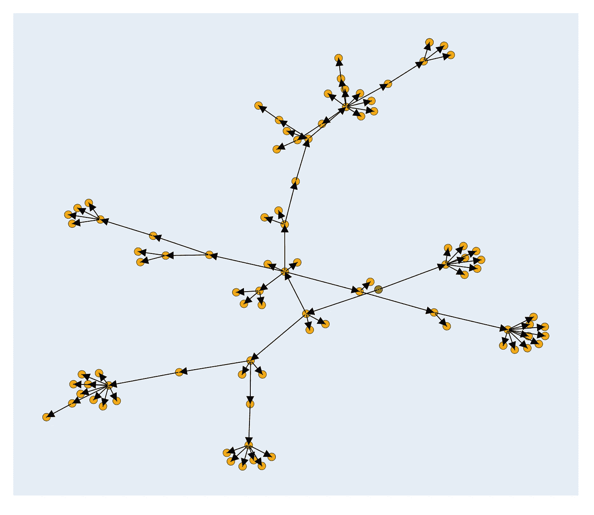
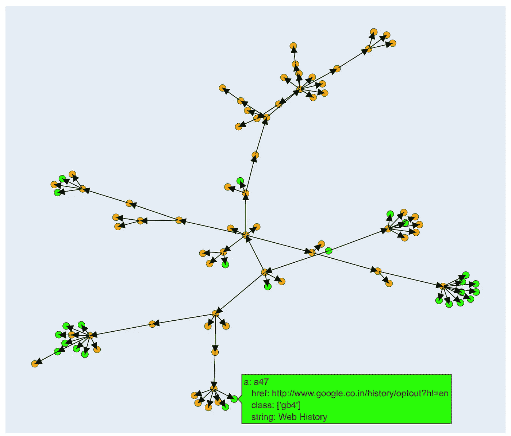
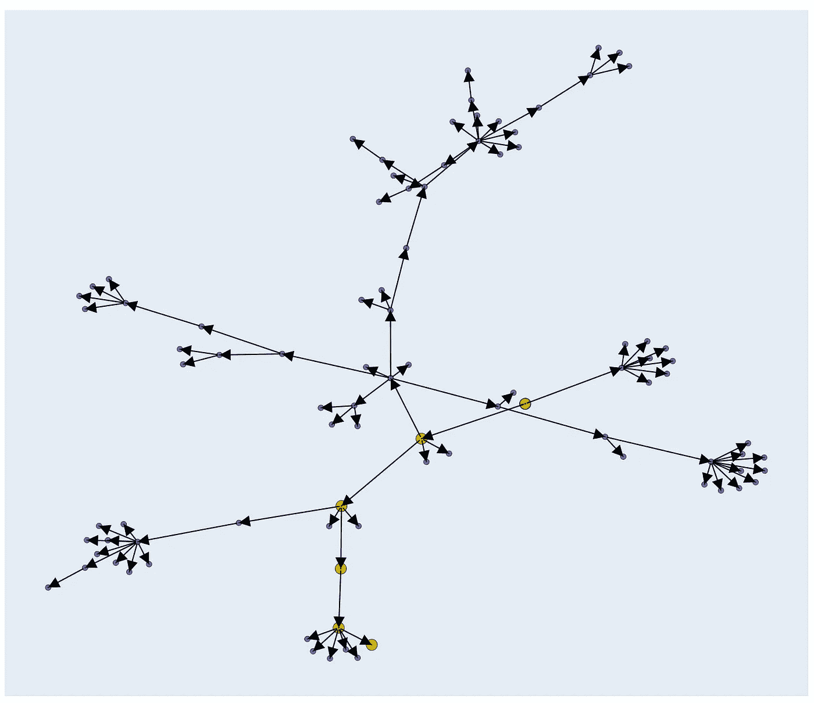
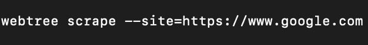

# 使用 WebTree 以前所未有的方式可视化网页！

> 原文：<https://medium.com/analytics-vidhya/visualise-webpages-like-never-before-with-webtree-739fa817fc94?source=collection_archive---------21----------------------->

# 动机

对于每个对数据分析感兴趣的人来说，免费提供的最大数据源是万维网，这是一个数百万页面的集合，也是一个不断增长的金矿，为每个人提供丰富的信息。

从网页中提取信息在形式上被称为**网络搜集**，是许多数据科学项目不可或缺的一部分。然而，对于许多不熟悉 HTML 语法的人来说，它也是一个困惑和担忧的来源，像我一样，刚刚开始作为数据科学家的旅程。

我觉得解决这个问题的最好方法是**将网页**可视化为它们的积木，**可视化为连接节点的图表**。这简化了搜索元素的过程，可以直观地突出显示元素，而不是翻遍数千行代码！

# 问题陈述

将网页表示为连接节点的有向图，其中每个节点表示一个 HTML 标签，每个边表示一种父子关系。

# 什么是 WebTree，它是如何工作的？

WebTree 是我和我的朋友兼同事[**aditya Viswanathan**](https://www.linkedin.com/in/adithya-v-bb704a91)**合作构建的一个 **python 包**。** WebTree 将网站的 url 作为输入，提取页面源，并使用它将网页显示为图形。

` https://www.google.com `表示为图形

这里用绿色突出显示的节点是 HTML 标签，它是任何网站的第一个标签。

# WebTree 提供的功能

*   **WebTree 允许用户在他们抓取的网页**中搜索特定的字符串，并返回包含该字符串的 HTML 标签列表。该字符串可以是标签的任何属性，如类、id、样式等。，或者它可能只是网页中的文本。

搜索关键词“谷歌”

*   **WebTree 还突出显示了从 HTML 标签**到图中任何节点的路径。如上图所示，如果我们想追踪从 *HTML* 节点到名为 *a47、*节点的路径，可以高亮显示它！

以黄色突出显示的路径

# **如何使用 WebTree？**

由于 WebTree 是一个 python 包，它非常容易设置和使用。

使用 pip install 命令安装它-

> ***pip 安装 webtree***

WebTree 是使用 python3 构建的，不能在同时使用 python3 和 python2 的环境中运行。所以建议你在安装 WebTree 之前先设置一个 **python3 虚拟环境！**

要在安装完成后使用 WebTree，只需运行以下命令

这将启动一个在 localhost 上运行的服务器，然后可以在浏览器窗口中打开它，该窗口将显示一个交互式图形。

# 结论

此处开发的软件包具有易于使用的界面和它提供的各种功能，一定会加快繁琐的网页抓取过程。

该包的代码位于:[https://github.com/abishekshyamsunder/webtree](https://github.com/abishekshyamsunder/webtree)

pypi 回购中的包位于:【https://pypi.org/project/webtree/ 