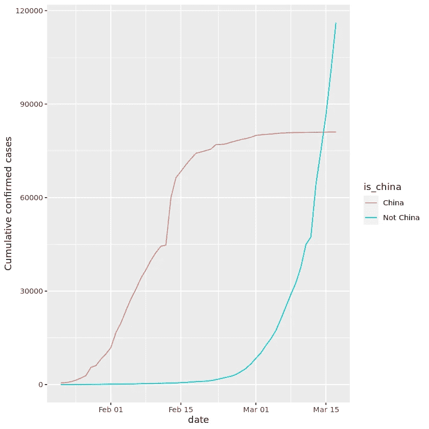

# 可视化 COVID19

> 原文：<https://medium.com/analytics-vidhya/visualising-covid19-d3577ebee496?source=collection_archive---------16----------------------->

## 疫情一起冠状病毒疫情分析

马库斯·斯皮斯克在 [Unsplash](https://unsplash.com?utm_source=medium&utm_medium=referral) 上的照片

C2019 年 12 月，中国武汉地区首次发现了冠状病毒，2020 年 3 月 11 日，世界卫生组织(世卫组织)将新冠肺炎疫情归类为疫情。在这之间的几个月里发生了很多事情，在伊朗、印度、美国、韩国、意大利和许多其他国家爆发了大规模疫情。

我们知道新冠肺炎通过呼吸道飞沫传播，如通过咳嗽、打喷嚏或说话。但这是一种可视化的方法，可以显示病毒在全球传播的速度有多快，以及它是如何从中国的爆发中以大规模疫情的形式出现的！

这是一个尝试，以可视化的新冠肺炎数据，从爆发的前几个星期，看看在什么时候，这种病毒成为一个全球性的疫情，并最终可视化其数字在一些严重受灾国家。

用于可视化的数据是从约翰·霍普金斯大学系统科学与工程中心创建的[公开数据库](https://github.com/RamiKrispin/coronavirus)中收集的。首先，我们使用截至 2020 年 3 月 17 日的数据，在疫情爆发的前几周，看看这种病毒在什么时候成为全球疫情。

**A .导入数据集和所需的库**

1.  在 r 中加载 readr、ggplot2 和 dplyr 包。
2.  使用 read_csv 函数从 datasets/confirmed _ cases _ world wide . CSV 中读取确诊病例的数据并进行分配。它以变量 confirmed_cases_worldwide。

**B .通过绘制全球确诊病例来浏览数据**

上述数据显示了迄今为止全球累计确诊的新冠肺炎病例。仅仅阅读表格中的数字很难了解疫情的规模和增长情况。因此，绘制一个线图来显示全球确诊病例。

1.  使用 confirmed_cases_worldwide，绘制美学累积案例(y 轴)对日期(x 轴)的 ggplot，并通过添加线几何确保它是一个线图。
2.  将 y 轴标签设置为“累计确诊病例”

**C .将中国与世界其他国家进行比较**

该图中的 y 轴表示非常陡峭的上升，到 2020 年 3 月 17 日，全球确诊病例总数达到约等于 200，000 例。

除此之外，还可以得出其他一些结论:在二月中旬有一个奇怪的上升，然后新病例的速度放缓一段时间，然后在三月再次加速。在疫情爆发初期，新冠肺炎病例主要集中在中国。因此，分别绘制中国和世界其他地区的新冠肺炎确诊病例，看看是否能给我们一些启示。

1.  从 datasets/confirmed_cases_china_vs_world . CSV 中读取中国和世界其他地区确诊病例的数据集，分配给 confirmed _ cases _ China _ vs _ world。
2.  用惊鸿一瞥()探索确诊病例 _ 中国 _ vs _ 世界的结构。
3.  画一个确诊病例中国 vs 世界的 ggplot，赋给 plt 累计确诊病例中国 vs 世界。
4.  添加线图层。在这个图层内添加美学:x 轴上是 date，y 轴上是 cum_cases，然后用 is_china 对线条进行分组和着色。

**D .注释**

我们可以观察到这两条线有非常不同的形状。2 月份，大多数病例发生在中国。这种情况在 3 月份发生了变化，当时它真正成为了一场全球疫情:大约在 3 月 14 日，中国境外的病例总数超过了中国境内的病例。这是世卫组织宣布疫情的几天后。

在疫情爆发期间，还发生了几起具有里程碑意义的事件。例如，2020 年 2 月 13 日中国线的巨大跳跃，不仅仅是疾病爆发的糟糕一天；中国当天改变了报告数据的方式(CT 扫描被接受为新冠肺炎的证据，而不仅仅是实验室测试)。

通过像这样注释事件，我们可以更好地解释情节中的变化，因此修改 PLT _ cum _ confirmed _ cases _ China _ vs _ world 如下:

**E .为中国病例添加趋势线**

为了衡量中国病例数增长的速度，我们需要在中国病例图上添加一条趋势线。一个很好的起点是观察病例增长是比线性增长快还是慢。

我们可以看到，随着中国报告情况的变化，2020 年 2 月 13 日左右，病例明显激增。然而，几天后，中国的病例增长放缓，为了描述 2020 年 2 月 15 日后新冠肺炎在中国的增长，我们添加了这条趋势线。

1.  为日期大于或等于“2020–02–15”的中国观察筛选 confirmed_cases_china_vs_world 行，并将其分配给 china_after_feb15。
2.  使用 china_after_feb15，绘制累计案例与日期的线图。
3.  添加使用线性回归方法计算的平滑趋势线，不使用标准误差带。

**F .为世界其他地区的案例添加趋势线**

从上面的图来看，中国的增长率低于线性增长。这表明中国在 2 月底和 3 月初至少在一定程度上控制了病毒。现在，类似地比较全球病例的增长。

1.  为非中国的观察结果过滤 confirmed_cases_china_vs_world 行，并将它们分配给非中国。
2.  使用 not_china，绘制 cum_cases 对日期的折线图，并将其分配给 plt_not_china_trend_lin。
3.  添加使用线性回归方法计算的平滑趋势线，不使用标准误差带。

**G .为世界其他地区的趋势添加对数标度**

从上面的图中，我们可以看到一条直线根本不适合，世界上其他地方的病例增长比线性增长快得多。因此，尝试在 y 轴上添加一个对数标度来检查上升是否是指数的。

1.  修改 plt_not_china_trend_lin 图，以在 y 轴上使用对数刻度。

**H .中国以外受 COVID19** 影响最严重的国家

使用对数标度，我们可以更好地拟合数据。从数据科学的角度来看，一个好的契合是一个好消息。但不幸的是，从公共卫生的角度来看，这意味着世界其他地区的新冠肺炎病例以指数速度增长，这在今天非常明显。

并非所有国家都同样受到新冠肺炎的影响，了解世界上哪些地方的问题最严重将会有所帮助。因此，要找到中国以外在我们的数据集中确诊病例最多的国家；按国家输入了确诊病例的数据。中国的数据被排除在外，以关注世界其他地区。

1.  查看 glimpse()的输出以查看 confirmed_cases_by_country 的结构并使用 confirmed_cases_by_country，我们按国家分组。
2.  汇总以将 total_cases 计算为 cum_cases 的最大值。并按 total_cases 获取前七行。

**一、绘制截至 2020 年 3 月中旬的重灾区国家**

尽管疫情首次在中国发现，但上表中只有一个东亚国家(韩国)。列出的国家中有四个(法国、德国、意大利和西班牙)位于欧洲，拥有共同的边界。为了获得更多背景信息，我们可以绘制这些国家一段时间内的确诊病例。

1.  从 datasets/confirmed _ cases _ top 7 _ outside _ China . CSV 中读入中国和世界其他地区确诊病例的数据集，将其赋给 confirmed _ cases _ top 7 _ outside _ China，并使用 glimpse()浏览 confirmed _ cases _ top 7 _ outside _ China 的结构。
2.  使用 Confirmed _ Cases _ top 7 _ outside _ China，绘制 cum_cases 对日期的折线图，按国家分组和着色，并将 y 轴标签设置为“累计确诊病例”。

**J .绘制截至今日受灾最严重的国家**

现在为了分析受打击最严重的国家。从今天起，我们将不得不导入更新到今天(即 2020 年 6 月 28 日)的新数据，因此我们使用每天更新的 Github (Dev)版本的冠状病毒库。

> 结论

从上面的分析中，我们可以得出该病毒从中国武汉的一场流行病转变为疫情的一场世界危机的时间和转变。我们还可以观察到。中国病例的增加。2 月中旬后，由于测试的改进，也考虑将 CT 扫描作为冠状病毒的测试。此外，使用回归趋势，我们可以清楚地看到世界各地病例的指数增长，我们可以看到当今受到病毒严重打击的国家。这是一种通过使用 read、gig-lot 和 dplyr 库在 R 中可视化来研究世界各地尤其是中国病例数量增长的有效方法。

具体来看印度，它目前在确诊病例数中排名第四，可以非常正确地说，病例数每天都在增加，尽管政府疏忽大意并取消了封锁，但人们必须记住，病毒尚未根除，他/她应该极其重视个人卫生，以此来维持社会距离规范。