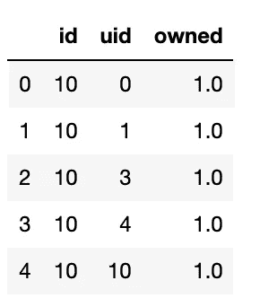
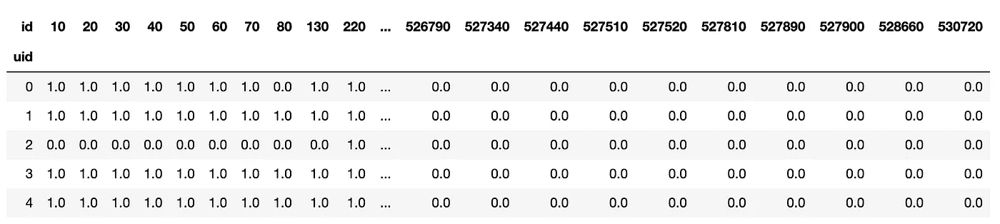
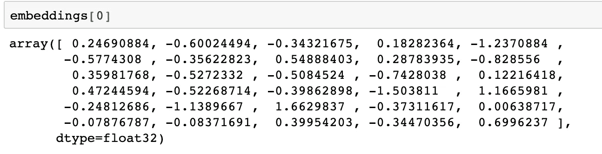
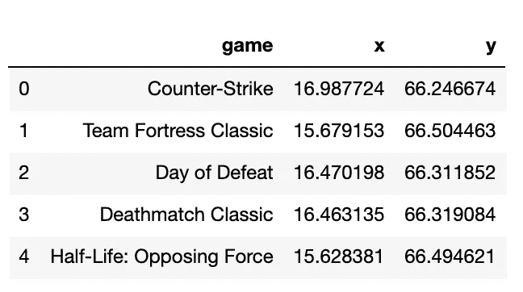
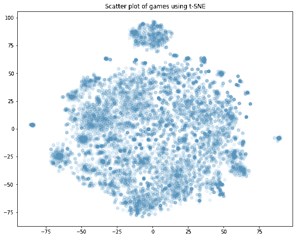
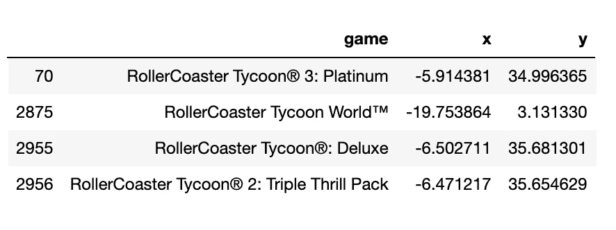
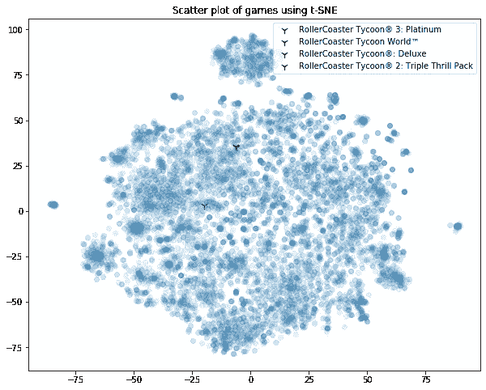

# 用 t-SNE 可视化嵌入

> 原文：<https://medium.com/analytics-vidhya/visualising-embeddings-with-t-sne-b54bf6b635f?source=collection_archive---------6----------------------->

在这篇博文中，我们将可视化视频游戏的嵌入(基于 Steam 的数据)。)


照片由 [Sean Do](https://unsplash.com/@everywheresean?utm_source=medium&utm_medium=referral) 在 [Unsplash](https://unsplash.com?utm_source=medium&utm_medium=referral) 上拍摄

我们将从以下与 Steam 电脑游戏相关的数据帧开始。这里,`uid`代表唯一的用户 id,`id`代表唯一的游戏 id。我们有超过 400 万行，每行代表一个`uid/id`关系(即拥有游戏`id`的用户`uid`)。要查看导致这一阶段的预处理步骤，请查看我的 GitHub 上的完整项目。



然后，我们转换这个数据帧，将每个游戏 id 作为一列，将用户作为行，创建一个交互矩阵，然后我们可以将它输入到模型中。



我们将使用 LightFM 库来生成推荐和检索嵌入。文档详细介绍了该模型的工作原理。我们可以选择模型应该学习的组件数量(即潜在空间的维度)。我们改变了这个超参数，发现它对整体模型性能几乎没有影响，因此将其保留在`30.`

然后我们提取嵌入，如下所示。

```
# Get embeddings
embeddings = mf_model.item_embeddings
```

让我们研究一个样本嵌入。



为了检索游戏的名称，我们首先使用交互矩阵查找游戏 id，然后使用我们之前创建的字典获取名称，该字典将 id 映射到标题名称。

```
firstgameid = interactions.columns[0]
games_dict[firstgameid]
```

我们现在将使用 t-SNE 算法来可视化嵌入，从 30 维空间(组件数量)到 2 维空间。t-SNE 用于降维，因为它学习从高维向量空间到较低维空间的映射，其中如果向量`u`和`v`彼此接近，则它们在较低维空间中的相应映射也将彼此接近。

我们导入 t-SNE 并实例化它。

```
from sklearn.manifold import TSNE# Instantialte tsne, specify cosine metric
tsne = TSNE(random_state = 0, n_iter = 1000, metric = 'cosine')
```

然后我们在嵌入矩阵上调用 fit 和 transform。

```
# Fit and transform
embeddings2d = tsne.fit_transform(embeddings)
```

最后，为了使绘图更容易，我们用结果构建了一个熊猫数据框架。

```
# Create DF
embeddingsdf = pd.DataFrame()# Add game names
embeddingsdf['game'] = gameslist# Add x coordinate
embeddingsdf['x'] = embeddings2d[:,0]# Add y coordinate
embeddingsdf['y'] = embeddings2d[:,1]# Check
embeddingsdf.head()
```



最后，我们绘制二维游戏空间。

```
# Set figsize
fig, ax = plt.subplots(figsize=(10,8))# Scatter points, set alpha low to make points translucent
ax.scatter(embeddingsdf.x, embeddingsdf.y, alpha=.1)plt.title('Scatter plot of games using t-SNE')plt.show()
```



我们可以通过查看我们认为相似的游戏在哪里来检查情节是否“起作用”。我们来看看`RollerCoaster Tycoon`游戏在剧情上的位置。

```
match = embeddingsdf[embeddingsdf.game.str.contains('RollerCoaster')]
```



正如我们所见,《过山车大亨世界》与其他游戏“不同”,因为用户对它的反应不同。

这是他们的计划:



这种见解对利益相关者很有用，因为如果没有数据和嵌入，人们会认为所有过山车大亨游戏都是相似的。

从额外的研究来看，很明显《过山车大亨世界》失败了，普通用户和评论家的评价都很差，他们抱怨图像和 bug。

有了这些知识，当向一个过山车大亨游戏推荐类似的物品时，我们会建议避免过山车大亨世界。

最后，我们注意到在顶部中间有一些游戏，这很有趣。这些游戏与众不同的地方在哪里？未完待续…