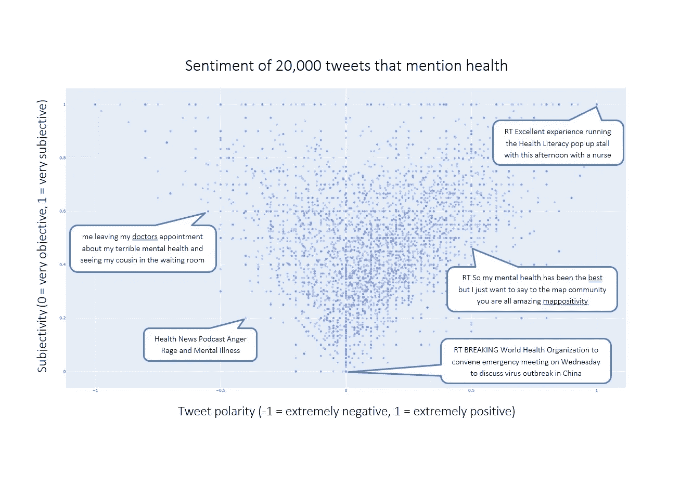

# 在网上对话中形象化情感

> 原文：<https://medium.com/analytics-vidhya/visualising-emotion-in-online-conversation-87bf752b3870?source=collection_archive---------17----------------------->

马丁·比约克在 [Unsplash](https://unsplash.com/s/photos/online-conversation-twitter?utm_source=unsplash&utm_medium=referral&utm_content=creditCopyText) 上的照片

我用 Python 的 Textblob 库对工作中的一些调查数据做了情绪分析。我在反馈极性和主观性的关系中发现了一些有趣的东西。看到是内部资料，显然我不能用在这篇文章上。但是，我一直对健康领域感兴趣。所以我想我会分析与健康相关的 Twitter 数据。如果你想继续的话，我已经加入了一个链接到[我的 Github 回购](https://github.com/natcoutts/health-Tweets)。

我从[这篇文章](https://dzone.com/articles/stream-tweets-the-easy-way-in-under-15-lines-of-co)中获得灵感来开始我的工作。使用 Twitter API，我访问了 20，000 条关于健康的推文。我还提取了关于推文的元数据(Twitter 句柄、用户位置、有多少人喜欢这条推文，等等)。为了复制我从调查数据中学到的东西，我添加了 Textblob 极性和主观性计算。极性得分在-1 和 1 之间，其中-1 表示非常负，1 表示非常正。主观性是一个介于 0 和 1 之间的分数。0 表示非常客观，1 表示非常主观。

有趣的东西上。我从 20，000 条健康微博中提取了极性和主观性，制作了一个散点图。

健康微博的极性和主观性散点图

它看起来像一个漏斗！这有什么好玩的？

*   它是情感的视觉表现！这表明我们对非常消极和非常积极的事情变得更加情绪化(或主观)。这很直观，但是能够将它形象化，是令人兴奋的！
*   想想那些你需要传达自己信息的时候。如果你的信息非常消极或非常积极，期待它会唤起情绪。相反，如果你不想激起情绪，那就在你的信息中力求客观。
*   调查只有几百个数据点。但是它的散点图是一个类似的漏斗形状。分析 2 万条推文并不需要太多努力。但是想象一下征求和分析成千上万的调查结果的努力。尤其是如果数百个调查结果得出相同的见解。这并没有考虑一个小样本是否能代表总体，但这是另一天的话题。

接下来去哪里？散点图中的示例推文强调了一些事情。

*   健康是一个非常广泛的话题。在不同的国家会有不同的对话。你如何缩小范围？我考虑过通过“用户位置”元数据来缩小推文的范围，但是“用户位置”是一个自由文本字段，而不是选项列表。这意味着一个 Twitter 用户可以输入“用户位置”=澳大利亚，另一个可以输入“用户位置”= Oz。这将被视为两个不同的位置。值得研究的是，是否有其他 Twitter 元数据可以更好地代表位置。我也考虑过同时使用多个关键词。[回答公众问题](https://answerthepublic.com/?via=nat)是一个免费网站，它将其他人就特定话题提出的各种问题可视化。这将为进一步探索健康这样的主题提供很大的启发。如果您对如何缩小分析范围有自己的想法，请随时联系我们！
*   说到一个样本是否能代表总体:Twitter 是一种窥探在线对话的方式。它只影响到人口中特定的一部分。你还会去哪里看看人们对健康这样的话题的看法？你会从医院、健康中心、护士、救护人员那里获取轶事数据吗？
*   哪些话题让 ***你*** 感兴趣，你会以这种方式分析和观想？我加入了一个到我的 Github repo 的链接，因为我很想看看其他人如何使用相同的过程来分析他们感兴趣的东西。玩得开心！