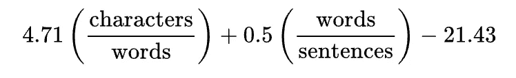

# 用可读性公式理解文本的复杂性。

> 原文：<https://medium.com/analytics-vidhya/visualising-text-complexity-with-readability-formulas-c86474efc730?source=collection_archive---------1----------------------->

## 计算任何给定文本的“易于理解”因子。

**可读性**通常由两个关键部分来衡量——排版和内容**。
字体设计涵盖了文本的表现形式——字体大小、行高、字距等属性。都有记录。内容对文本中的单词采取了更加统计和词汇化的方法。[1]**

## **可读性分数告诉我们什么？**

**可读性分数是近似值。可读性分数的缺点之一是它们没有考虑语法、拼写、语音或文本的任何其他质量方面。充满语法问题的文本可能会得到和语法完美的文本一样的可读性分数。

**可读性测试** —分数通常有助于我们将文本从易于理解的*放置到复杂理解的*中，在这种情况下，理解文本的能力与可读性相关。
这篇文章将帮助你理解如何计算可读性、数学、公式和 python 例子，这样我们就可以计算文本的复杂性。你可以在这篇文章的末尾找到所使用的库和参考资料。****

******注**:我不是[排版的专家](https://en.wikipedia.org/wiki/Wikipedia:Typography)。我在这篇文章中关于可读性公式的所有观点和内容都将严格基于统计或词法方法。****

****我个人使用可读性公式来理解文本的复杂性。我发现所有的可读性公式都适用于它们自己的情况(参见用例)。下面是最常用的可读性公式的列表****

****最常用的可读性公式****

******注意:**在本文中，我们将只关注这些公式****

****从下至上，我们有—****

1.  ******Flesch Reading easy—**Flesch Reading easy 的一般概念是，avg。句子的长度和平均长度。每个单词的音节数来计算阅读的难易程度。可读文本的平均分数是 60-70 分****

********

****轻松阅读****

****我们在哪里使用 Flesch Reading Ease？未经证实，但它是一个很好的因素来考虑搜索引擎优化。通常，对于整体 SEO，可读性是关键。如果你的文本非常复杂，你可能会吓跑你的听众，让他们去别处寻找信息。
参考[轻松阅读](https://en.wikipedia.org/wiki/Flesch%E2%80%93Kincaid_readability_tests#Flesch_reading_ease)****

********

****计算 Flesch 可读性的公式****

****2.**喷雾—** 喷雾与 Flesch Reading Ease 不同，它不输出数字分数。相反，Gunning Fog 估计了一个指数——该指数代表了一个人在第一次阅读时理解文本所需的正规教育年限。枪击福克斯的指数范围从 0-20。
如果一段文字的雾度指数为 7，那么任何受过七年级教育的人(13-14 岁)都会觉得它很容易读懂。
喷雾的平均得分在 8 分左右。****

********

****喷雾配方****

****参见[喷涂雾](https://en.wikipedia.org/wiki/Gunning_fog_index)****

****3.**自动可读性指数(ARI)——**ARI 的计算非常简单。它考虑了字符、单词和句子，留下了像“复杂单词”这样有争议的度量。这个公式是为军队开发的。ARI 是通过连接在打字机上的一小块设备计算出来的。这仍然是一个流行的公式，对技术写作特别有用。
[此处引用 ARI](https://en.wikipedia.org/wiki/Automated_readability_index)****

********

****ARI 的配方****

****它将任何一段文字中键盘敲击、单词和句子的数量制成表格。****

****[此处参考 ARI](https://en.wikipedia.org/wiki/Automated_readability_index)****

****5.**雾霾指数—** 雾霾被认为是医疗保健行业衡量医学著作的“黄金标准”。烟雾代表“天书的简单衡量”。该公式将多音节词考虑在内(多音节意味着多于多个音节)****

********

****[这里指雾霾](https://en.wikipedia.org/wiki/SMOG)****

****6. **Flesch-Kincaid —** IMHO，也许是互联网内容写作中使用最多的公式。我的团队负责为一个电子商务网站开发内容管理系统，该网站也有博客部分，我们决定添加一个指标，内容作者可以选择一个地理位置，我们的后端将计算该位置的用户的平均可读性分数。这个分数稍后会与作者正在撰写的 W.I.P .文章进行比较，以便让他们了解草稿中的内容是否会吸引目标读者。
本质上，包含很多音节的单词比使用较少音节的单词更难读。****

********

****弗莱施·金凯可读性公式****

****[此处参考弗莱施-金凯](https://en.wikipedia.org/wiki/Flesch%E2%80%93Kincaid_readability_tests)****

****7 .**。Coleman-Liau**——大多数可读性公式的问题是它们需要音节计数——这是一个昂贵的过程。Coleman-Liau 基本上认为**字母中的单词长度比音节中的单词长度更能预测可读性。******

****在测试了科尔曼-廖索引后，它被接受作为教育和技术写作的通用案例。****

****CLI(Coleman-Liau Index)= 0.0588–0.296S-15.8
其中 **L** 是每 100 个单词的平均字母数
S 是每 100 个单词的平均句子数****

****[此处参考科尔曼-廖](https://en.wikipedia.org/wiki/Coleman%E2%80%93Liau_index)****

****8. **Dale-Chall 可读性**—Dale-Chall 可读性分数根据四年级学生熟悉的单词数量来衡量文本。按照它的标度，使用的生僻词越多，阅读水平就会越高。****

********

****Dale-Chall 实际上将文本与已知的单词库进行比较，以了解给定文本中的单词是否复杂。这些单词是从 4 年级和 5 年级的教科书中编译出来的。你可以在这里看到单词列表或[(按字母顺序分类)](http://www.readabilityformulas.com/articles/dale-chall-readability-word-list.php)****

********

****戴尔-查尔可读性****

****感谢您的阅读。 **参考文献:******

****[1][https://en.wikipedia.org/wiki/Readability](https://en.wikipedia.org/wiki/Readability)，[https://www . ahrq . gov/talking quality/resources/writing/tip 6 . html](https://www.ahrq.gov/talkingquality/resources/writing/tip6.html)
[http://www . ncpublischools . org/docs/supervisor/memos/2014/01/readability . pdf](http://www.ncpublicschools.org/docs/superintendents/memos/2014/01/readability.pdf)****

****[https://en.wikipedia.org/wiki/Readability#Text_leveling](https://en.wikipedia.org/wiki/Readability#Text_leveling)****

****[3][http://www . readability formulas . com/articles/why-use-readability-formulas . PHP](http://www.readabilityformulas.com/articles/why-use-readability-formulas.php)
[https://www.thoughtco.com/readability-formula-1691895](https://www.thoughtco.com/readability-formula-1691895)
[http://www . impact-information . com/impact info/limits . pdf](http://www.impact-information.com/impactinfo/Limitations.pdf)****