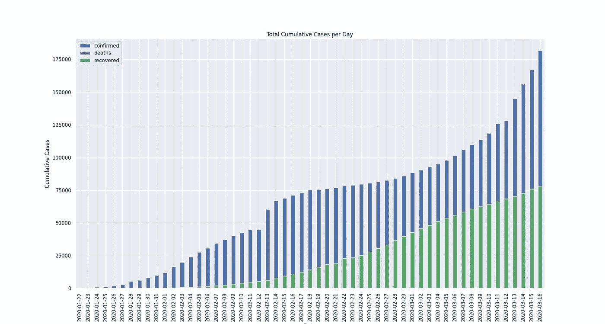
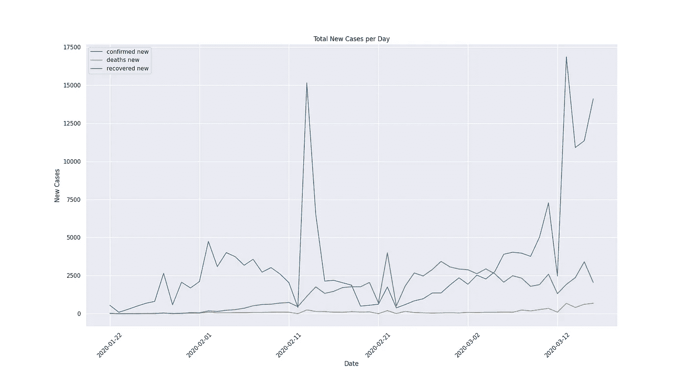
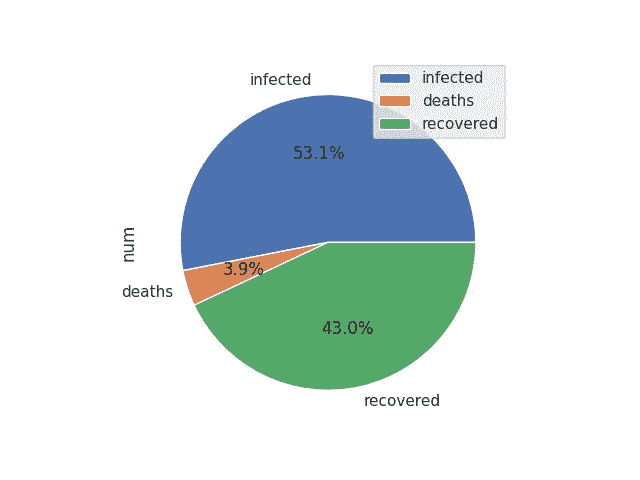
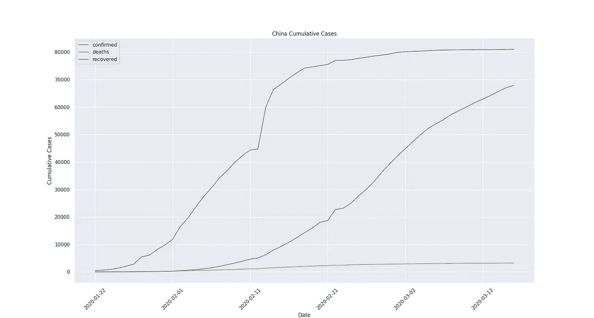
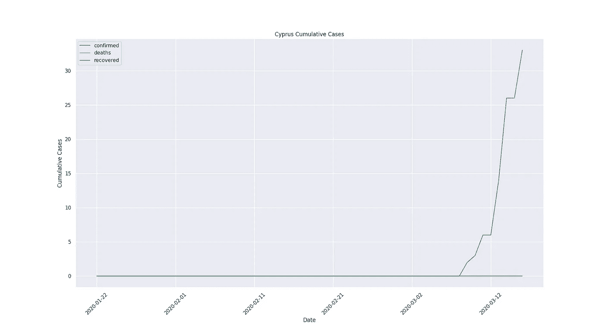
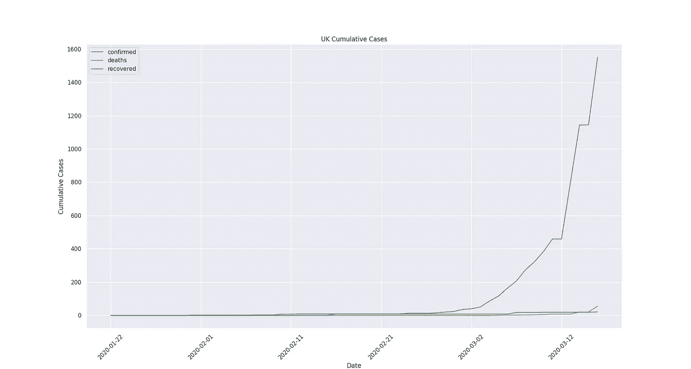

# 想象新冠肺炎的扩张

> 原文：<https://medium.com/analytics-vidhya/visualising-the-spread-of-covid-19-3d31772cc2ee?source=collection_archive---------27----------------------->

## 通过可视化疫情传播获得洞察力

来源:https://unsplash.com/@fusion_medical_animation

毫无疑问，新冠肺炎在公众中引起了极大的恐慌。社交媒体不断向我们发布最新情况。有争议的是，好的结果之一是国家和组织之间迅速和持续的合作，尽早分享尽可能多的数据，以便尚未受病毒影响的国家及时做出反应。

因此，这篇文章的灵感来自于获取必要数据的便利性。这是一种尝试，旨在了解病毒传播的速度有多快。在这篇文章中，我将解释我是如何得到数据的，以及它是如何被预处理的，但是我也将展示几个可以用给定的数据进行的可视化。

> 跟随这个[库](https://github.com/npitsillos/covid-19)的链接，在那里你会找到开始的代码。

为了预处理数据，我按照这个[视频](https://www.youtube.com/watch?v=tI7akX1hfXA)中的说明进行了操作。但是为了使事情变得简单，我将在这里解释这个过程。最初，我正在读取 *data* 目录中的三个数据集文件(可以从[这里下载](https://data.humdata.org/dataset/novel-coronavirus-2019-ncov-cases)，我们只使用时间序列数据)，将它们加载到保存熊猫数据帧的字典中。然后，我对数据进行预处理，如下所示。

在这里，我首先用国家/地区的国家名称填充省/州中的所有 NaN 值，然后我对数据进行解透视，这样我们就可以将每天作为一列，而不是作为一行，最后我将日期系列更改为日期-时间对象。

现在让我们将这三个文件合并成一个数据帧。

上面的代码最初将合并数据目录中所有三个文件的数据。这将对数据框架的公共列执行外部合并，即“省/州”、“国家/地区”和“日期”。接下来，我们创建整个数据集的副本来保存相同的数据，但是在新的数据帧中，我们为原始数据帧中的每一天创建一个保存第二天日期的新列，但命名为“Date-1”，并通过在名称后附加“-1”来重命名列“confirmed”、“deaths”和“recovered”。

简单地说，原始数据帧和新创建的数据帧之间的左合并现在将使用 Date-1 来匹配日期，同时带来前一天的值。实际上，每天我们都将所有案例类别的值偏移 1，同时将这些值保存在另一列中。然后，我减去每个案例类别的值，以获得每天的新案例，最后，为了提供新列的起点，我们只需提供第一个记录日的每个类别的值。

# (英)可视化(= visualization)

让我们先了解一下这种病毒是如何在世界范围内传播的。最初，我想直观显示累计病例总数和新病例总数是如何变化的。

每天累计病例总数

每天新病例总数

在第一个情节中，考虑到案件数量的增长，事情似乎有点糟糕。然而，由于这考虑了之前的所有案例，我们需要研究新发现的案例每天是如何变化的，这是第二个图。在第二个图中，事情看起来没有那么糟糕，但是我们可以明确地识别出分别靠近 2 月 11 日和 3 月 12 日的两个峰值。据美国有线电视新闻网 2 月 13 日报道，许多病例表明病毒可能也传播到了其他国家。

然而，T2 的资源显示大部分新发现的病例主要在东亚。然而，关于第二次高峰，似乎是在几个国家发现许多病例的时候，因为这是在采取严格措施的时候。

就总案例而言，我想绘制一个饼图，以查看不同案例的百分比。如下所示。

感染、死亡和康复的饼状图。

最后，由于中国设法控制了病毒的传播，我想看看在这种情况下曲线是什么样子的。

中国累计案例

考虑到病毒在一定程度上受到遏制，该曲线呈逻辑 s 形，因为没有发现多少新病例。

我终于想看看我的祖国塞浦路斯和居住国英国的情况。下面我绘制了每天累积病例的曲线。

塞浦路斯每日累计病例

幸运的是，没有多少病例被发现，但这并不意味着不会有。可能只是塞浦路斯在疫情传播中仍然远远落后，但是考虑到政府的措施，希望情况不会恶化。

英国累积案例

# 结论

上面绘制的数据截止到 3 月 16 日。我会尽量保持数据经常更新，希望不会太久。最好能有一些其他的可视化效果，比如一张可能显示病毒何时何地传播的世界动画地图，或者一张显示每个国家病例数随时间变化的线图。

这些只是一些基本的图表来了解病毒是如何传播的，所以如果人们有任何其他的想法，就把它添加到这个库中。

 [## npitsillos/新冠肺炎

### 新冠肺炎病毒的可视化。在 GitHub 上创建一个帐户，为 npitsillos/新冠肺炎的发展做出贡献。

github.com](https://github.com/npitsillos/covid-19) 

> 保持安全，并免费贡献给仓库！