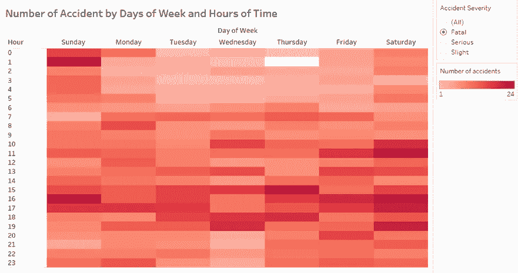
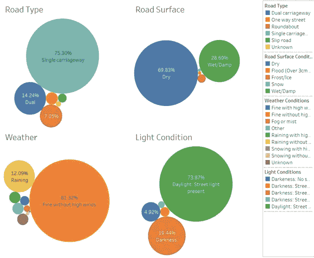

# 用 Tableau 可视化英国道路交通事故数据

> 原文：<https://medium.com/analytics-vidhya/visualising-uk-road-traffic-accidents-data-with-tableau-48ae78485807?source=collection_archive---------5----------------------->

# **简介**

这篇文章旨在确定英国道路交通事故的热点和发生频率。本研究选择的领域应用是交通事故分析。域用户是高速公路运营商和公共工程部门人员。由于交通事故数据容易获得且本质上是多变量的，这提供了进行可视化分析的机会。数据用表格显示出来。

# 资料组

数据集是从 [Kaggle](https://www.kaggle.com/daveianhickey/2000-16-traffic-flow-england-scotland-wales?select=accidents_2012_to_2014.csv) 获得的。它包含英国大约 146，000 个交通事故日志。它们是由英国交通部收集的。此外，这些交通事故数据是由出诊警官记录的，因此不包括轻微事故。

数据集的类型是表，其中每行代表一个事故日志，每列代表特定事故的一个属性。尽管原始数据集有 33 列，但随后对其进行了预处理，以删除缺失的值和不相关的属性。表 1 显示并描述了仅包含相关指标及其各自属性类型的清理数据集。

表 1。已清理数据集的属性、类型和描述列表。

# 可视化数据集

可操作的洞察力可以从观想中提取出来。为了提供可视化如何帮助决策的概述，本节列出了总共九个示例查询。每一个问题都从习语使用的观想的选择和它的基本原理开始，接着是对结果的分析和解释。

**1)英国哪个月的交通事故数量最多？**

使用堆积条形图。使用堆积条形图有三个原因。首先，可以显示和比较每个月发生的事故总数。第二，可以显示跨月交通事故的一般趋势。最后，每月发生的事故总数可以进一步分为 3 个严重程度类别，从而说明了它们的部分与整体的关系。

图一。2014 年英国每月事故数量的堆积条形图。

如图 1 所示，10 月份是 2014 年英国道路交通事故发生率最高的月份，其次是 11 月和 7 月。另一方面，报告的事故数量最少的两次是在 2 月和 4 月。在英国，十月和十一月都是秋天，而四月是春天。同时，二月标志着冬天的结束，或者换句话说，是春天的过渡。因此，季节性可能是导致交通事故的因素之一。此外，轻微事故是最常见的报道。

英国哪个月的致命和严重交通事故数量最高？

同时，通过在图 1 所示的图表上应用过滤器，可以可视化被分类为致命和严重的事故。

图二。2014 年英国每月严重和致命事故数量的堆积条形图。

然而，注意到公路运营商和公共工程部门的目标之一是减少交通事故造成的伤害的严重性，如果这些伤害是不可避免的。因此，图 2 比图 1 更相关，因为轻微事故的存在占据了图 1 中每个柱的大部分。

同时，图 2 揭示了与图 1 不同的模式。7 月是 2014 年英国报道的最严重和致命事故最多的月份，其次是 6 月和 10 月。由于六月和七月都是夏季，交通事故可能是季节性的。同样，在致命事故方面，12 月报告的事故数量最多。

**3)找出一周中事故发生率最高的日子和时间。**

热图非常适合可视化所需的信息，因为它可以使用相对较小的空间向用户提供总体概述。这些任务需要呈现 168 个值，这是两个分类属性级别组合的结果。热图的轴由两个分类属性表示，即星期几和小时中的时间。一周有 7 天，一天有 24 小时。此外，这 168 个数值是定量的，并用颜色编码以显示范围。

图 3。2014 年全天和小时的事故数量热图。

图 3 揭示了一些有趣的模式，两个不同的聚类显示了大多数事故发生的日期和时间。它们包括从星期一到星期五的一天。第一个聚类与早上 7 点到 8 点的早高峰时间一致。第二个聚类与晚上的早高峰时间一致，从下午 3 点开始到下午 6 点。高峰时间是大多数人上下班或上学的时间。在此期间，道路上的汽车数量大幅增加，因此这可能是导致交通事故的一个因素。除此之外，事故最有可能发生在周五，因为它平均有更多的细胞染成暗红色。

找出一周中致命事故发生率最高的日子和时间。

同样，热图被用来回答这个问题。查询 3 和查询 4 之间的唯一区别在于，对该查询应用了额外的过滤步骤，以说明仅被分类为致命的事故。

图 4。2014 年全天和小时的致命事故数量热图。

通过过滤仅选择致命事故，平均而言，周六是 2014 年英国记录的最高致命事故数。此外，周六的死亡事故通常发生在上午 11 点、下午 4 点和晚上 7 点左右。同时，周日上午 12 点至凌晨 2 点之间的死亡事故数量也很高。这可能主要是由于深夜饮酒导致的酒精影响下驾驶。其他致命事故发生率较高的时段包括周日下午 4 点和周四下午 3 点。这两个时段恰逢英国的晚高峰时段。

**5)英国的事故热点在哪里？**

点分布图用于显示英国、伦敦和伦敦市中心的事故分布。它适合这个问题，因为每个记录的交通事故的经度和纬度都可以在数据集上很容易地获得。通过使用地图，事故热点的群集和空间分布可以清晰地可视化。此外，高速公路运营商和公共工程部门人员对英国的道路网络非常熟悉。对他们来说，根据其独特形状和地理位置快速识别特定的道路或交叉点是一件容易的事情。

在地图上，每个点代表一个记录的交通事故，而每个点的大小代表伤亡人数的类别(0 到 5、6 到 10 和 10 以上)。使用了三种尺寸，即小号、中号和大号，分别代表所述的三个类别。同时，每个点用不同的颜色编码，黄色、橙色和红色分别代表轻微、严重和致命的事故严重程度。

图 5。2014 年英国事故热点点分布图。

如图 5 所示，与英国其他地区相比，英国的伦敦、伯明翰、诺丁汉、曼彻斯特、利物浦、利兹和桑德兰等大城市是事故密度较高、颜色较深的地区。换句话说，它们是事故热点。这一现象可以部分解释为这些城市的汽车数量增加，道路网更加密集。此外，由进行的研究表明，在英国道路事故的地点不是随机的，而是高度集中在城市地区。

在伦敦，事故在一天中不同时间的分布是怎样的？

在 Tableau 中，创建了一个仪表板，其中并排显示了点分布图和堆积条形图(图 6)。这使得可以在两个视图之间进行直接比较，而无需在选项卡之间切换。可以在点分布图上选择一个区域，以突出显示感兴趣的区域，即伦敦，其相应的时间出现将显示在堆积条形图上。

图 6。2014 年伦敦按严重程度划分的事故数量点分布图和堆积条形图。

图 6 中点分布图中的圆形区域包含了 2014 年伦敦发生的交通事故，而堆积条形图则按严重程度显示了事故的时间分布。在伦敦，在堆积条形图中可以看到两个显著的峰值。第一个高峰代表上午 8 点到 9 点之间的时间，而第二个高峰是下午 6 点到 7 点之间的时间。它们与早晚高峰时间一致。报告的事故数量从凌晨 4 点开始增加，并达到第一个高峰，随后急剧下降。然后逐渐上升，达到第二个高峰，在晚上 7 点后急剧下降。此外，伦敦发生的大多数事故的严重程度都很轻。

**7)伦敦市中心的事故热点在哪里？**

图 7。2014 年伦敦市中心事故热点点分布图。

图 7 显示，2014 年伦敦大多数主要道路都发生了事故，红色椭圆形突出显示的区域是记录事故数量较高的四条街道。它们是克莱肯威尔路、皮卡迪利广场、霍尔本街和邦德街。Clerkenwell Road 是一条跨首都主干道的中心部分，连接伦敦的西区和东区。皮卡迪利广场是伦敦的著名地标，位于五条繁忙街道的交汇处。此外，霍尔本是一条以写字楼为主的街道，而邦德街是一个著名的购物区，提供高端时尚品牌、奢侈品、精美珠宝、艺术品和古董。因此，乘客和车辆的移动量可能相当大。

**8)英国交通事故的因素是什么？**

包装气泡图用于显示每个分类属性的分布，即行车道危险、特殊条件、人行横道-人控、人行横道-物理设施、道路类型、路面、天气和光照条件。气泡的大小编码了由于相应因素的特定类别而发生的事故数量。这很直观，因为较大的尺寸通常与较高的价值相关联。

图 8。2014 年在英国发生的事故的四个因素的包装泡沫图。

图 9。2014 年在英国发生的事故的四个因素的包装泡沫图。

根据图 8，行车道无危险(98%)、道路无特殊条件(98%)和行人过街区域 50 米内无人为控制(99%)是 2014 年英国发生事故的主要因素。因此，可以得出结论，它们不是导致交通事故发生的因素。

另一方面，81%的事故发生在没有大风的好天气，而只有 12%的事故发生在下雨期间。这可能与路面因素有关，70%的事故发生在干燥路面，而 29%发生在潮湿路面。此外，四分之三的事故发生在单行车道上。同时，大约 74%的事故发生在有路灯的白天。一般来说，可以看出大多数事故发生在良好的条件下，即白天，没有强风或干燥的路面。然而，还不能确定，因为它们是在每个因素下独立评估的。

在英国发生事故的常见外部条件是什么？

树形图用于显示外部条件组合的分布。本研究中考虑的外部条件包括人行横道——物理设施、道路类型、路面、天气和光线条件。每个方块代表这五个外部条件排列的一个输出。此外，每一个区块被分配了在这些条件下发生的事故数量。它们用大小和颜色进行了编码。尺寸越大，颜色越深，事故发生率越高。因此，通过使用树形图，可以立即识别出英国大多数事故发生时的最大街区。

图 10。2014 年英国事故因素树形图(概述)

图 10 显示了具有最大尺寸和最深红色的块具有最高的事故数。2014 年在英国发生的事故中，约有三分之一发生在单车道、有路灯的白天、干燥的路面、没有大风的好天气以及 50 米内没有物理交叉路口。因此，可以得出结论，三分之一的事故发生在可接受的外部条件下。换句话说，原因可能是道路上的汽车数量和司机的态度造成的。

# **结论**

在这项研究中，我们确定了 2014 年英国大多数交通道路事故发生的时间和地点。一般来说，轻微事故比严重和致命事故发生得更频繁。2014 年，10 月份的事故总数最高，而 7 月份的致命和严重事故数量最高。除此之外，大多数交通事故发生在工作日的早晚高峰时间。就致命事故而言，它们经常发生在周六上午 11 点、下午 4 点和 7 点以及周日上午 12 点至凌晨 2 点。同时，英国的大城市是事故热点，因为它们有更多的人口和车辆以及更密集的道路网络。特别是在伦敦市中心，邦德街、皮卡迪利广场和霍尔本的事故发生率明显更高。

此外，大约三分之一的事故发生在良好的外部条件下。因此，这可能归因于道路上的车辆数量和驾驶员的态度。简而言之，了解所有这些见解将有助于高速公路运营商和公共工程部门人员实现其减少事故数量的目标。可以采取一些措施来减少交通事故，例如在事故多发区提醒道路使用者，组织驾驶员态度计划，开发更有效的方法来分散高峰时间的拥挤交通，以及在周末晚上设置路障。

简而言之，可视化增强了用户分析多元交通事故数据的能力。此外，用于可视化数据的可视化习惯用法的选择被证明在为他们的下一步行动提取洞察力方面是有价值的。为了减少道路交通事故的数量，可以制定更完善的战略，这些战略有具体的时间或具体的地区。