# 空气污染的可视化(使用薄层)

> 原文：<https://medium.com/analytics-vidhya/visualization-of-air-pollution-using-folium-31258ad49f00?source=collection_archive---------26----------------------->

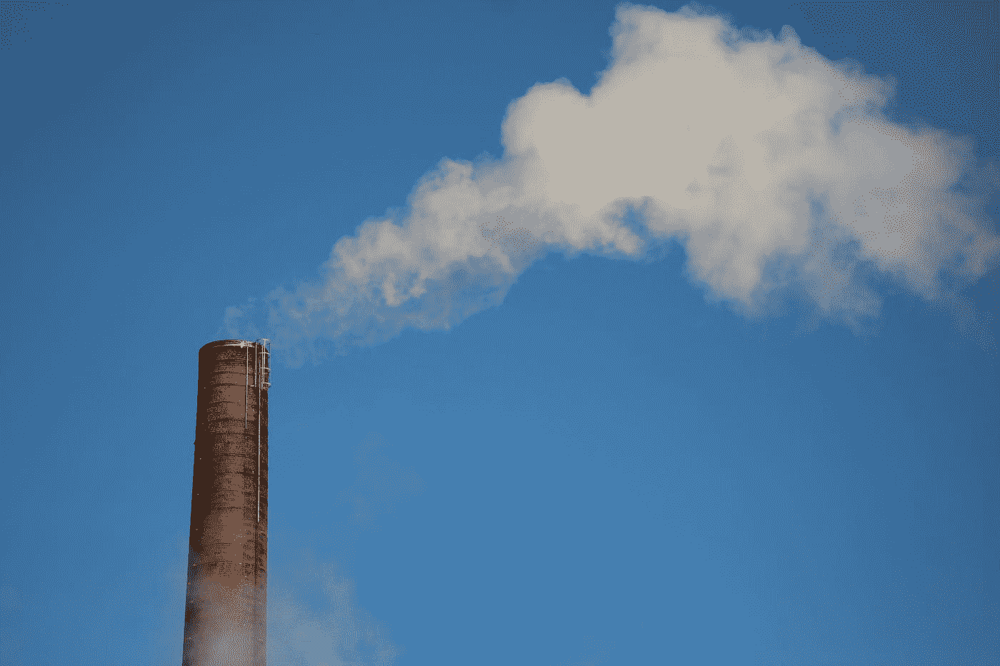

安妮·尼加德在 [Unsplash](https://unsplash.com?utm_source=medium&utm_medium=referral) 上拍摄的照片

在这个全球化阶段，空气污染一直是一个主要问题。不同的国家正在努力推动经济增长，但没有可持续的方法。同样，在韩国的一个城市首尔也可以看到。首尔市政府帮助收集了不同的空气颗粒物测量数据，如 NO2(二氧化氮)、SO2(二氧化硫)、CO(一氧化碳)、PM2.5 和 PM10(颗粒物)。

这篇文章的目的是展示不同的可视化工具，并进一步从中得出推论。先从首尔市政府提供给 Kaggle 作为公共数据集的 dateset 开始数据探索。要下载数据集，[点击此处](https://www.kaggle.com/bappekim/air-pollution-in-seoul)。

像往常一样，我们开始通过熊猫读取 csv 文件。

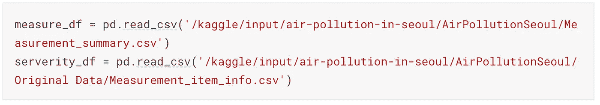

来自熊猫的 read_csv

在调查过程中，我们发现，很少有值是-1，这可能是读取空气污染物读数的设备出现故障的原因。因此，我们决定用平均值来估算这些值。在 scikit 库“SimpleImputer”的帮助下，这可以很容易地完成。

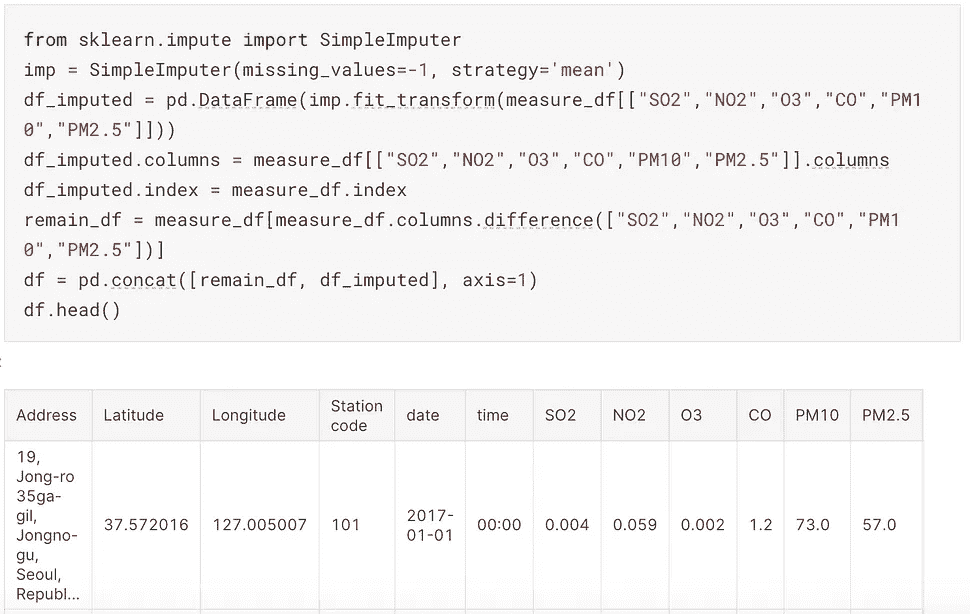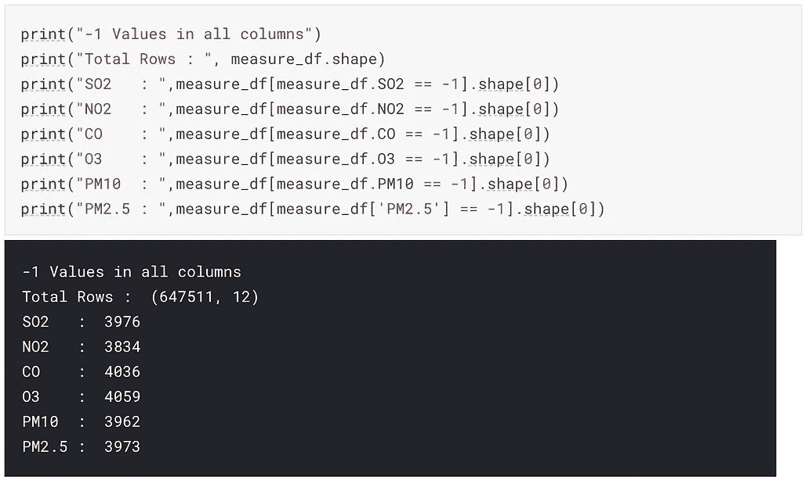

右:“-1 值检查”，左:“使用简单估算库替换为平均值”

我们绘制了不同排放的线形图，x 轴为日期，y 轴为排放类型(NO2、SO2 等)。Seaborn 是绘制这些图表的伟大图书馆。

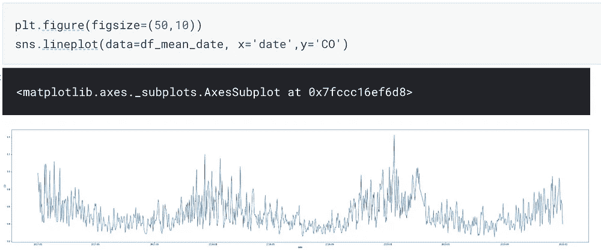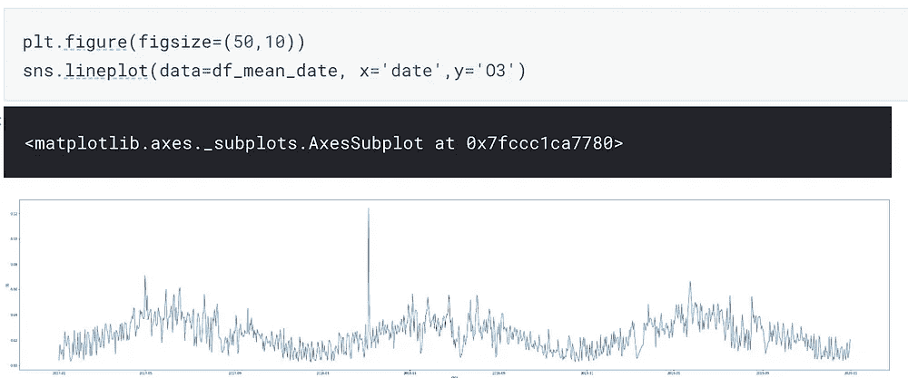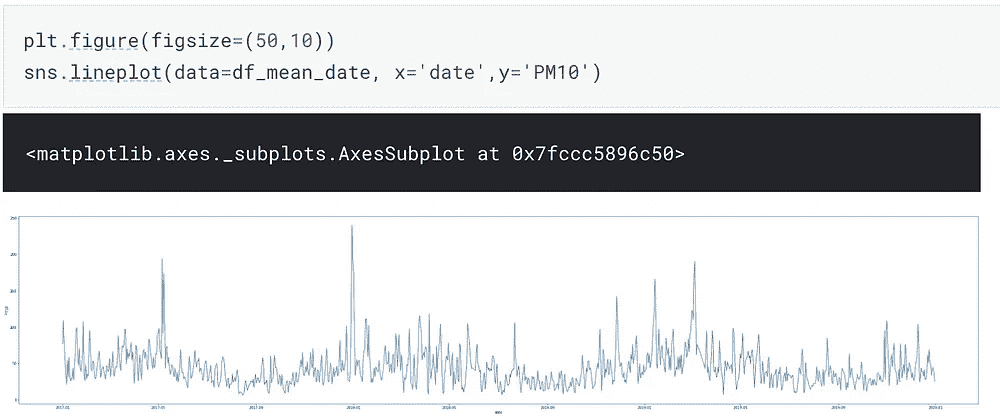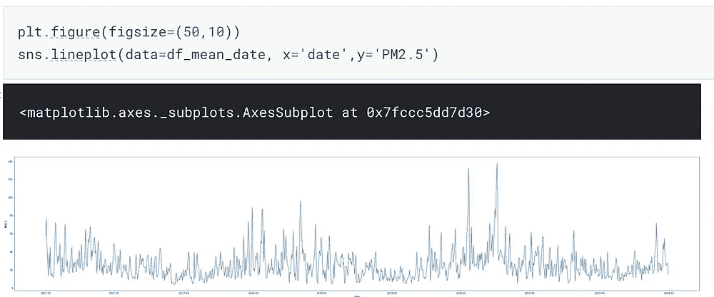

时间跨度上的气体线图

我们还绘制了相关矩阵，以检查哪些气体是相互依赖的。据观察，SO2、NO2 和 O3 高度相关。可以推断，这些气体互相帮助，增加和减少个别其他气体。

Tatiana Rodriguez 在 [Unsplash](https://unsplash.com?utm_source=medium&utm_medium=referral) 上拍摄的照片

在涉及经纬度的时间序列数据分析中，在地图上查看数据总是好的。这个功能可以在一个叫做“叶子”的大型库的帮助下进行探索。它使用起来非常直观，并且是开源的。首先，需要对数据集进行一些预处理。

我们必须创建一些列，如小时、天、周、月和年，这将有助于我们在地图上绘制经度和纬度。

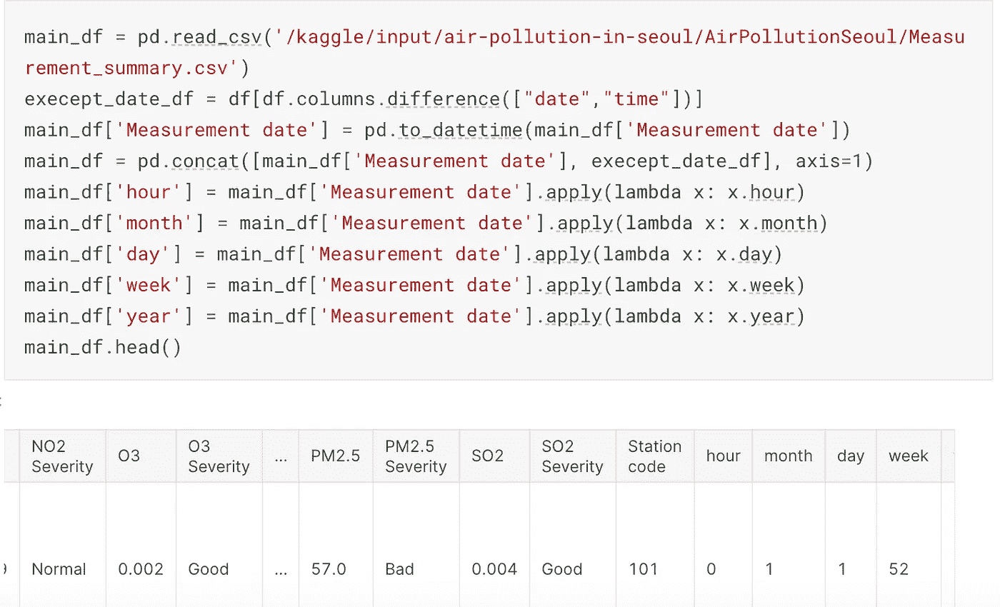

小时、月、日、周、月和年列

接下来，我们用一些默认参数创建函数:

1.  default_location —它以纬度和经度作为参数，将显示在地图上。
2.  control _ scale 启用或禁用给定缩放级别的地图。
3.  zoom _ start 指定地图加载时所需的缩放比例。

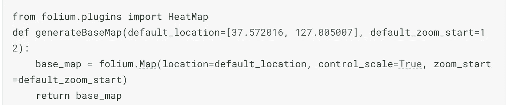

带有一些默认参数的 generateBaseMap()函数

现在我们需要创建一个包含所有纬度、经度、PM2.5(这里可以是任何气体)和年份的列表。然后，我们将所有这些信息传递给 generateBaseMap 函数，该函数将在地图上绘制纬度和经度。以下是供参考的代码:

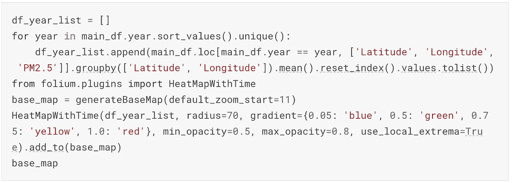

纬度和经度列表，对应全年 PM2.5 值

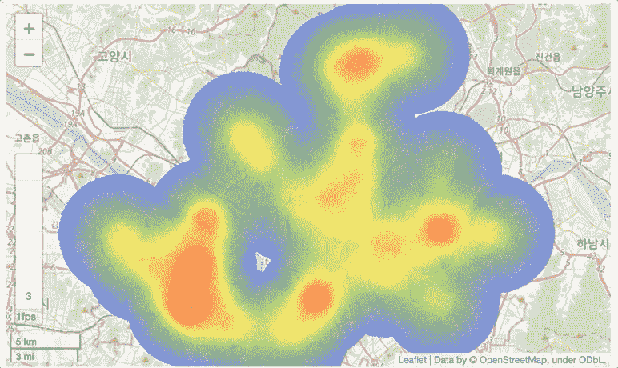

2017 年、2018 年和 2019 年的 PM2.5 图

这里我们可以推断，自 2017 年以来，污染持续增加。此外，颜色向红色的变化表明，“PM2.5”值越来越接近“非常糟糕”的严重程度。

我们还绘制了 2017 年的逐月图，以观察污染在一年中的变化。

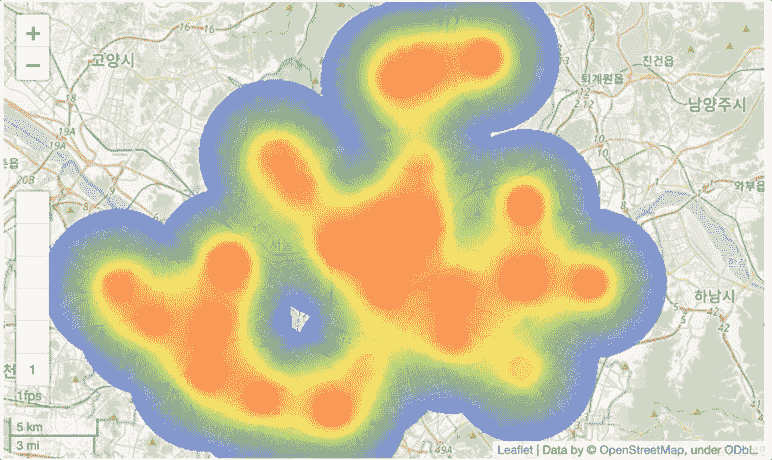

2017 年逐月地图

同样，它遵循同样的模式，每个月都在持续增长。

## 结论

从相关矩阵中可以看出，SO2、NO2 和 O3 之间有很强的相关性。检验这些气体之间的进一步关系将会很有趣。同样，根据进一步的阅读([来源](https://www.scinexx.de/dossierartikel/von-stickoxiden-zum-ozon/))，不同工厂释放的气体在阳光照射下转化为臭氧(O3)。从上面的线图来看，夏季的 O3 总是比冬季多。这再次表明，阳光的存在导致了 O3 的增加。

希望你喜欢这个博客。请一定要鼓掌，分享，评论！请继续关注我的下一篇博客。