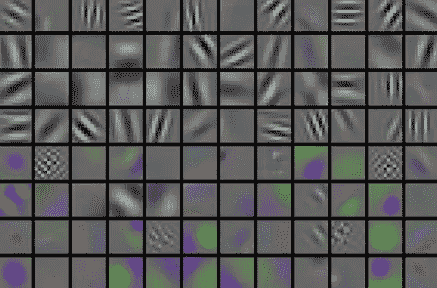
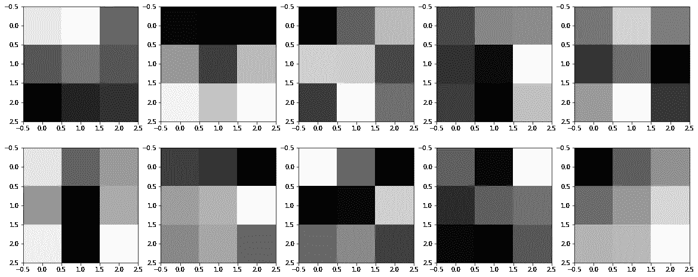
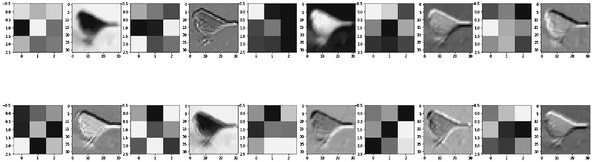

# CNN 中卷积层的可视化及其重要性

> 原文：<https://medium.com/analytics-vidhya/visualization-of-convolution-layers-in-a-cnn-and-its-importance-44d00ad4eb70?source=collection_archive---------17----------------------->

# 介绍

本文旨在提供关于卷积层可视化的信息，以及为什么它很重要。

理解这个话题的前提是简单地了解 CNN 的工作。在文章的最后，我在我的 GitHub 库中附上了简单的基于 PyTorch 的代码。

如果你是一个完全的初学者，那么看看我以前在 CNN 上的文章:[https://medium . com/analytics-vid hya/simple-CNN-using-py torch-c1be 80 BD 7511](/analytics-vidhya/simple-cnn-using-pytorch-c1be80bd7511)

## 一层学什么？

CNN 近似于从图像中提取独特特征的过滤器。这些独特的特征将用于获得预测。

神经网络的权重是在开始时随机选择的核或滤波器的值。在训练过程之后，正确的重量被学习。

上面这组图是 CNN 在训练过程后学习到的不同的核或过滤器。

## 图像表示如何变化？

输入数据集可能是看起来正常、漂亮的图片，但一旦它们被输入 CNN，就会被应用不同的过滤器，因此它们看起来与实际图像非常不同。

我使用的数据集是 CIFAR-10 数据集。

图像是一只鸟。在将其应用于 CNN 之后，这是第一卷积层学习的内容。

## 为什么重要？

当我们训练 CNN 时，大部分时间我们监控损失参数。但是有时 CNN 可以学习不必要的特征，并且损失参数可以是正常的。因此，在这些情况下，CNN 在验证集上的性能受到严重影响。为了很好地控制 CNN，我们需要知道它在学习什么。

这种类型的可视化提供了对 CNN 及其所学内容的良好理解。如果正在学习一些冗余的特征，我们应该考虑应用更多更复杂的变换，以便我们可以突出重要的特征。

# 密码

下面附上我的 CNN 图层可视化的 GitHub 库。代码是开源的，所以你可以在你的项目中随意使用它。

 [## srimanthtnetti/卷积层可视化工具

### 在 GitHub 上创建一个帐户，为 srimanthttenneti/卷积图层可视化器的开发做出贡献。

github.com](https://github.com/srimanthtenneti/Convolution-Layer-Visualizer) 

# 接触

请随意连接

 [## Srimanth Tenneti -自由电子设计师-自由职业| LinkedIn

### 我是 Srimanth Tenneti，一名 20 岁的硬件设计师和软件开发人员。目前就读于北京理工大学二年级…

www.linkedin.com](https://www.linkedin.com/in/srimanth-tenneti-662b7117b/)