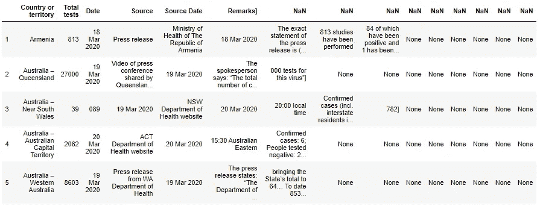
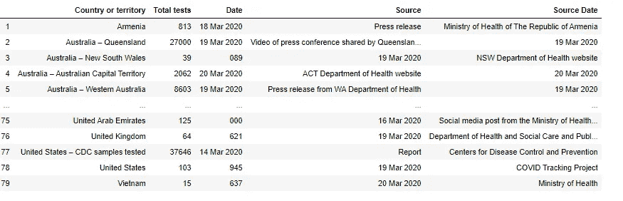
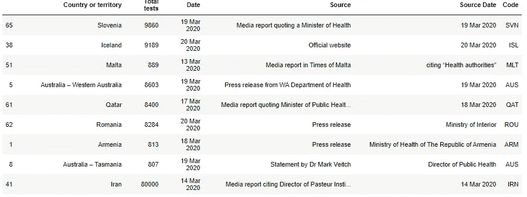
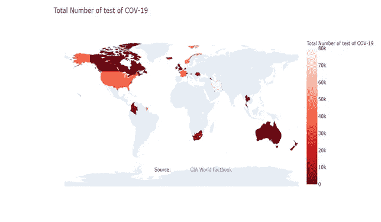

# 利用 Python 中的网页抓取和 Plotly 实现新冠肺炎总测试的可视化

> 原文：<https://medium.com/analytics-vidhya/visualization-of-covid-19-total-tests-using-web-scraping-and-plotly-in-python-7ef9dda2ce37?source=collection_archive---------21----------------------->

测试总数的端到端数据提取，并在可视化中使用提取的数据。


达米安·扎莱斯基在 [Unsplash](https://unsplash.com?utm_source=medium&utm_medium=referral) 上的照片

# 新冠肺炎:冠状病毒病(新冠肺炎)是一种由新型病毒引起的传染病。

这种疾病导致呼吸道疾病(如流感)，症状包括咳嗽、发烧，在更严重的情况下，呼吸困难。你可以通过勤洗手、避免触摸脸、避免与身体不适的人近距离接触(1 米或 3 英尺)来保护自己。

冠状病毒疾病主要通过与感染者咳嗽或打喷嚏时的接触传播。当一个人触摸带有病毒的表面或物体，然后触摸他们的眼睛、鼻子或嘴时，它也会传播。现在全世界都在和冠状病毒做斗争，所以我试着找出前 25 个国家的冠状病毒检测总数。

# 使用 Web 抓取的表格数据提取

Web 抓取是从网站中提取信息、表格数据的过程。


照片由 [Xtina Yu](https://unsplash.com/@tongs?utm_source=medium&utm_medium=referral) 在 [Unsplash](https://unsplash.com?utm_source=medium&utm_medium=referral) 上拍摄

点击[此处](https://ourworldindata.org/coronavirus-testing-source-data)获取验证网站数据。我们在这段代码中使用了这个链接。

我们从这里开始:

我正在使用漂亮的汤库进行网页清理，可以使用`pip`来安装。

```
pip install BeautifulSoup4
```

一旦我们完成以上库的安装，我们就可以提取表格数据。

```
#Importing the moduleimport pandas as pdimport numpy as npimport matplotlib.pyplot as pltimport seaborn as sns%matplotlib inline
```

进口美丽的汤

```
from urllib.request import urlopen#The urllib.request module is used to open URLsfrom bs4 import BeautifulSoup
```

现在我们需要一个从中提取数据的 URL。

```
url ="[https://ourworldindata.org/coronavirus-testing-source-data](https://ourworldindata.org/coronavirus-testing-source-data)"
html = urlopen(url)soup = BeautifulSoup(html, 'lxml')
type(soup)# Get the title
title = soup.title
print(title)# Print out the text
text = soup.get_text()
print(soup.text)soup.find_all('a')all_links = soup.find_all("a")
for link in all_links:
    print(link.get("href"))
```

健全性检查

```
# Print the first 10 rows for sanity check
rows = soup.find_all('tr')
print(rows[:10])for row in rows:
    row_td = row.find_all('td')
print(row_td)
type(row_td)str_cells = str(row_td)
cleantext = BeautifulSoup(str_cells, "lxml").get_text()
print(cleantext)
```

Python 内置的“re”模块为[正则表达式](https://www.regular-expressions.info/tutorial.html)提供了出色的支持，具有现代而完整的正则表达式味道。正则表达式指定一组与之匹配的字符串；这个模块中的函数允许你检查一个特定的字符串是否匹配一个给定的正则表达式(或者一个给定的正则表达式是否匹配一个特定的字符串，这归结为同样的事情)。

```
import re
list_rows = []
for row in rows:
    cells = row.find_all('td')
    str_cells = str(cells)
    clean = re.compile('<.*?>')
    clean2 = (re.sub(clean, '',str_cells))
    list_rows.append(clean2)
print(clean2)
type(clean2)
```

清理完数据后，我正在使用 pandas 库创建一个数据框。

```
df = pd.DataFrame(list_rows)
df.head(10)df1 = df[0].str.split(',', expand=True)
df1.head(10)
df1.fillna(0)
#df1.to_excel('data_check.xlsx')
df1[0] = df1[0].str.strip('[')
df1.head()new_header = df1.iloc[0] #grab the first row for the headerdf1 = df1[1:] #take the data less the header row
df1.columns = new_header
```

运行代码后查看数据:

```
df1.head()
```



选择相关列:

```
df2=df1[['Country or territory',' Total tests',' Date',' Source',' Source Date']]
df2
```



为国家缩写添加新的列名“代码”:

```
Code=['SVN','ISL','MLT','AUS','QAT','ROU','ARM','AUS','IRN','THA','IRL','ZAF','GBR','CAN','NLD','NZL','CAN','HKG','CAN','NOR','COL','CHE','AUS','USA','FRA']df3['Code']=Code
df3
```



# 创建国家地图(前 25 名)


德尔菲·德拉鲁阿在 [Unsplash](https://unsplash.com?utm_source=medium&utm_medium=referral) 上拍摄的照片

```
df = df3fig = go.Figure(data=go.Choropleth(
    locations = df['Code'],
    z = df[' Total tests'],
    text = df['Country or territory'],
    colorscale = 'Reds',
    autocolorscale=False,
    reversescale=True,
    marker_line_color='darkgray',
    marker_line_width=0.5,
    colorbar_tickprefix = '',
    colorbar_title = 'Total Number of test of COV-19 ',
))fig.update_layout(
    title_text='Total Number of test of COV-19  ',
    geo=dict(
        showframe=False,
        showcoastlines=False,
        projection_type='equirectangular'
    ),
    annotations = [dict(
        x=0.55,
        y=0.1,
        xref='paper',
        yref='paper',
        text='Source: <a href="[https://www.cia.gov/library/publications/the-world-factbook/fields/2195.html](https://www.cia.gov/library/publications/the-world-factbook/fields/2195.html)">\
            CIA World Factbook</a>',
        showarrow = False
    )]
)fig.show()
```

最终输出:-



# 结论

我们能够进行端到端的分析，首先，我们从网站中提取表格，然后创建可视化。

我希望这篇文章能帮助你并节省大量的时间。

快乐编码。


照片由 [Nghia Le](https://unsplash.com/@lephunghia?utm_source=medium&utm_medium=referral) 在 [Unsplash](https://unsplash.com?utm_source=medium&utm_medium=referral) 拍摄