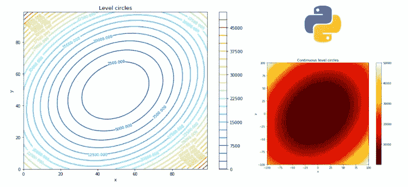
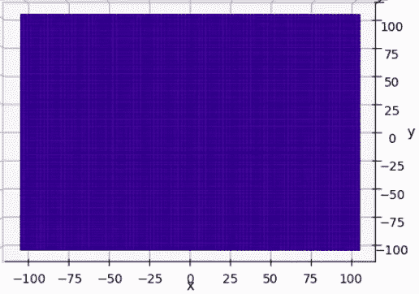
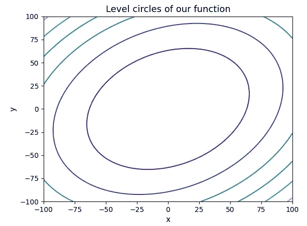
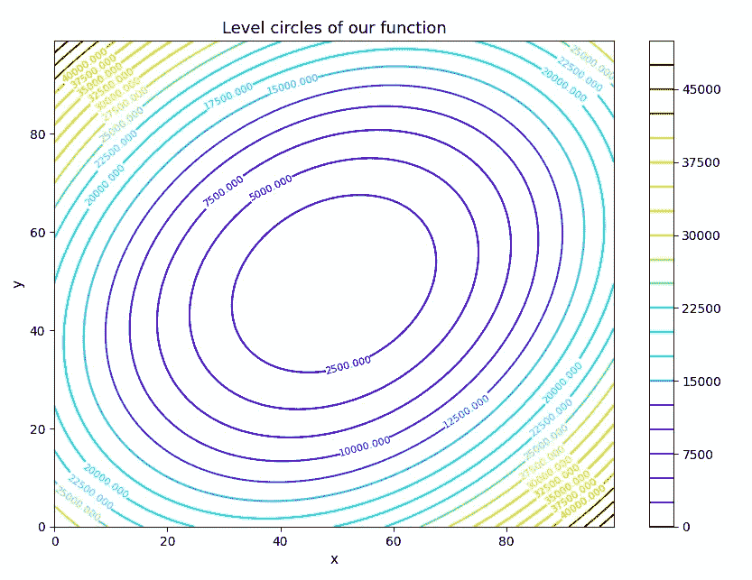
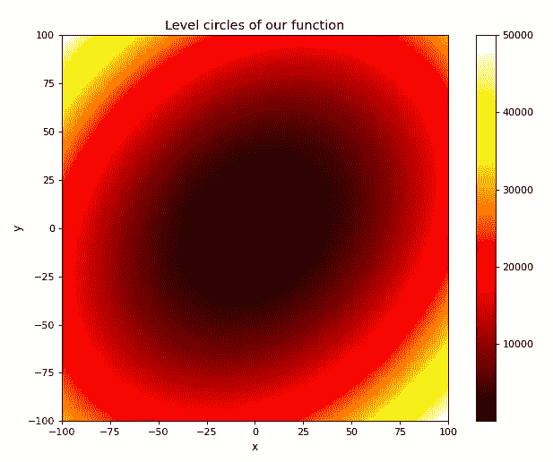
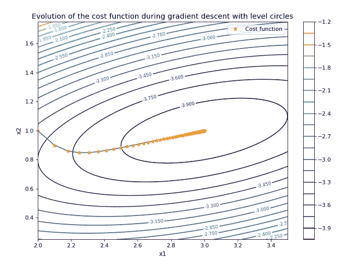

# 水平圆可视化-Python

> 原文：<https://medium.com/analytics-vidhya/visualization-of-the-level-circles-of-a-real-function-of-two-variables-%E2%84%9D%C2%B2-in-%E2%84%9D-with-python-9414922c88b1?source=collection_archive---------7----------------------->

在这篇文章中，我将向你展示如何从水平圆的角度来绘制ℝ的ℝ函数。以下是一些您能够生成的可视化示例:



作者图片

[链接 GitHub repo 下载笔记本。](https://github.com/joctet/Level_Circles_Visualization)

如果您已经学习了教程“[使用 Python](/@JosephinePc/3d-visualization-of-a-function-of-two-variables-from-ℝ²-into-ℝ-with-python-matplotlib-5bd3df39fc94) 在ℝ实现ℝ函数的 3D 可视化”，您可以直接进入本教程的“可视化”部分，因为数据的预处理是相同的。

首先，要安装/导入一些 python 库:

## 装置

```
pip install numpy
pip install matplotlib
```

## 导入

```
import numpy as np
import matplotlib.pyplot as plt
```

## 预处理

设函数 f 从ℝ到ℝ.对于ℝ的任何一对夫妇(x，y ):

f(x，y) = 2*x — x*y + 2*y

函数 f 在 python 中定义如下:

```
def f(x, y):
    return 2*x**2 - x*y + 2*y**2
```

我们从实数ℝ集合中为 x 和 y 选择一个值范围(我将以[-100，100]为例，每个变量有 100 个值)。

```
x = np.linspace(-100, 100, 100)
y = np.linspace(-100, 100, 100)
```

然后，我们将创建一个包含所有值对(xi，易)的值数组，其中 xi 在 x 轴上，易在 y 轴上



x 和 y 在其值范围内的映射(图片由作者提供)

```
X, Y = np.meshgrid(x, y)
```

然后，我们为每对值(xi，易)计算上面定义的函数的值，并将这些值存储在新的变量 Z 中:

```
Z = function(X,Y)
```

之后，只需将 Z 显示为 X 和 y 的函数。

## 形象化

```
fig = plt.figure()contours = plt.contour(X, Y, Z)plt.title("Level circles of our function", fontsize=13)plt.xlabel('x', fontsize=11)plt.ylabel('y', fontsize=11)plt.show()
```



作者图片

这并不疯狂。幸运的是，我们可以更进一步，选择水平圆的数量(“levels”:这里默认水平= 5)，定义图形的大小(figsize)，显示水平圆的值(plt.clabel)，选择水平圆上显示的字符的大小(fontsize)，添加色标(colorbar)，修改色标(cmap:我为 cmap 放了一个可能值的列表)…

## 一个更完整的例子

```
fig = plt.figure(figsize = (10,7))contours = plt.contour(Z, levels = 20, cmap = 'jet')plt.clabel(contours, inline = True, fontsize = 9)plt.title("Level circles of our function", fontsize=13)plt.xlabel('x', fontsize=11)plt.ylabel('y', fontsize=11)plt.colorbar()plt.show()
```



作者图片

更漂亮！

## 水平圆的一种变体

我们也可以连续地表示我们在 2D 函数中的变化。

```
fig = plt.figure(figsize = (10,7))plt.imshow(Z, extent = [-100,100,-100,100], origin = 'lower', cmap = 'hot', alpha = 1)plt.title("Level circles of our function", fontsize=13)plt.xlabel('x', fontsize=11)plt.ylabel('y', fontsize=11)plt.colorbar()plt.show()
```



作者图片

我们可以修改颜色的强度(通过在 0 和 1 之间改变 alpha)，通过修改 cmap 修改颜色的比例…

请注意在定义输出影像边界的范围参数中输入值:这里 x 和 y 取[-100，100]中的值。

# 结论

我们已经看到了在ℝ表示ℝ函数的几种方法，这得益于其水平圆，这在许多情况下是有用的，例如[梯度下降期间成本函数演变的表示，如下所示:](https://josephinepicot.medium.com/visualize-the-gradient-descent-of-a-cost-function-with-its-level-circles-python-d8c850731b0a)



作者图片

正如我在文章开头所说，你可以在我的 GitHub 上找到笔记本。

如果你想更进一步，画出梯度下降过程中成本函数的演变，我建议你看一下这篇文章。

# 我希望这篇文章对你有用！:)