# 使用 Python 可视化 YouTube 趋势

> 原文：<https://medium.com/analytics-vidhya/visualization-of-us-youtube-trends-using-python-1aa64164f841?source=collection_archive---------2----------------------->

大家好！我用 Python 对美国 YouTube 趋势视频数据集做了一些探索性的数据分析和可视化。

代码将在我所有步骤的相关描述之上。让我们看看我发现了什么！

```
from google.colab import files
uploaded = files.upload()import pandas as pd
import numpy as np
import seaborn as sns
import matplotlib.pyplot as plotdf = pd.read_csv(‘US_youtube_trending_data.csv’)
df.head(3)
df.tail(3)
df.shape
```

我从上传数据集和导入库开始。在 Kaggle 上可以获得数据集。那么数据框就创建好了。您可以在图 1 中看到它的前 3 行。数据集有 14798 行和 16 列。换句话说，数据集有 16 个要素。

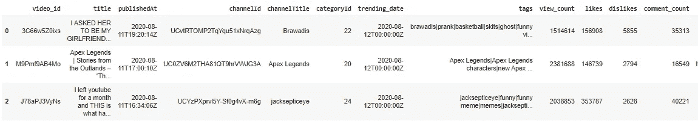

图 1

```
from datetime import datetimedf[‘trending_date’] = pd.to_datetime(df[‘trending_date’], format=”%Y-%m-%dT%H:%M”)
df[‘publishedAt’] = pd.to_datetime(df[‘publishedAt’], format=”%Y-%m-%dT%H:%M”)
df.head(3)
```

如图 1 所示，发布日期和趋势日期列的格式不正确。为了避免这种复杂性，使用了上面的代码。现在，数据帧如图 2 所示。数据集的趋势日期为 2020 年 8 月 12 日至 2020 年 10 月 24 日，发布日期为 2020 年 8 月 11 日至 2020 年 10 月 19 日。

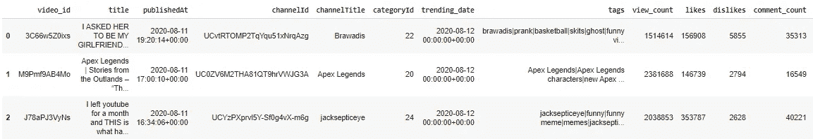

图 2

```
df.nunique()
```

正如我之前提到的，有 16 个特征。数字不能显示所有的特征。上面的代码向我们展示了它的特性和有多少独特的变量。结果如图 3 所示。

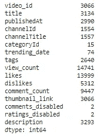

图 3

```
trends = df.drop([‘video_id’, ‘categoryId’, ‘comments_disabled’, ‘ratings_disabled’], axis=1)correlation = trends.corr()
fig = plot.figure(figsize=(10, 8))
sns.heatmap(correlation, xticklabels = correlation.columns, yticklabels = correlation.columns, annot = True, cmap=’RdPu’, annot_kws={‘weight’:’bold’})
plot.title('Heat Map')
```

我们来观察一下相关性。为了找到合理的结果，我删除了一些分类列，即视频 id、类别 id、禁用评论和禁用评级。因此，我们可以使用热图来查看视图计数、喜欢、不喜欢和评论计数的相关性。我们可以看到，在系数为 0.92 的情况下，最高的相关性出现在视图计数和赞数之间，如图 4 所示。

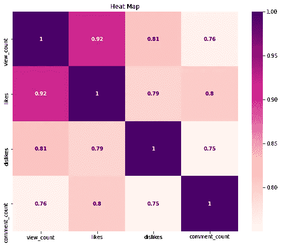

图 4

```
colors = ["#CD4FDE"]
sns.set_palette(sns.color_palette(colors))
sns.lmplot(x = ‘likes’, y = ‘view_count’, data = trends)
plot.title(‘View Count vs. Likes’)
```

在图 5 中可以更清楚地看到观看计数和喜欢之间的线性关系。

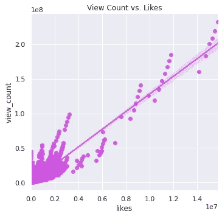

图 5

```
sns.set(rc={‘figure.figsize’:(12,10)})
ax= sns.lineplot(x=’trending_date’, y=’view_count’, data=df, ci=False, color=’#CE4DBD’)
plot.title(‘View Count vs. Trending Date’)
```

让我们来看看浏览量和趋势日期之间的关系。用于此的线图。与所有趋势日期相比，8 月 15 日之后的浏览量非常高。以及在 9 月 15 日之后观察到的最少观看计数。

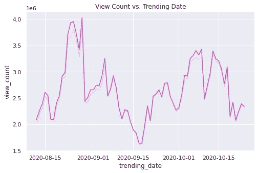

图 6

```
sns.set(rc={‘figure.figsize’:(8,5)})
ax= sns.lineplot(x=’publishedAt’, y=’likes’, data=df, ci=False, color=’#CE4DBD’)
plot.title(‘Likes vs. Published Date’)
```

为喜欢和发布日期创建了一个类似的线图。所以，我们看到 8 月 15 日之后喜欢的人更多了。结果如图 7 所示。

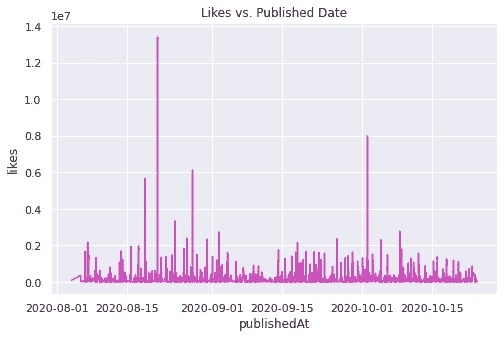

图 7

```
sns.set(rc={'figure.figsize':(8,10)})
top10channel = df.groupby(["channelTitle"]).size().sort_values(ascending = False).head(10)
sns.barplot(top10channel.values, top10channel.index.values, palette = "rocket")
plot.title("Top 10 Trending Youtube Channels")
```

然后根据频率对频道进行排序。您可以在图 8 中看到前 10 大趋势频道。最热门的频道是 NBA。

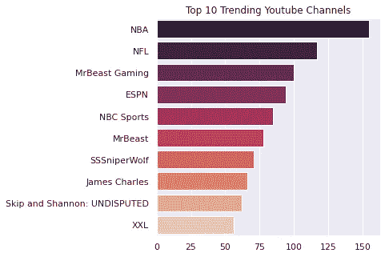

图 8

```
sns.set(rc={'figure.figsize':(8,12)})
by_channel = df.groupby("title").size().reset_index(name="view_count") \.sort_values("view_count", ascending=False).head(20)
ax =sns.barplot(x="view_count", y="title", data=by_channel,palette=sns.cubehelix_palette(n_colors=22, reverse=True))
plot.title('Most Viewed Videos')
plot.xlabel("View")
plot.ylabel("Video Title")
```

点击率最高的视频如图 9 所示。首先，对视频标题进行分组。然后根据查看次数进行排序。所以，贾斯汀比伯——神圣的金融时报。《说唱歌手》可能是数据集中观看次数最多的视频。

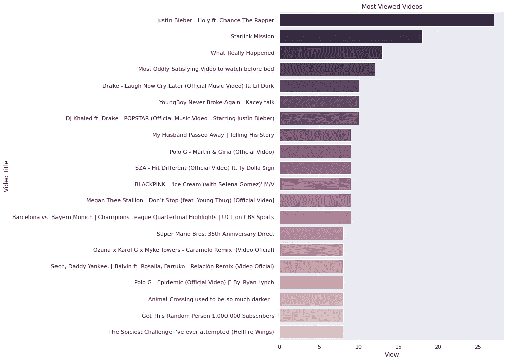

图 9

```
df.loc[df['categoryId'] ==1, 'category'] = 'Film & Animation'
df.loc[df['categoryId'] ==2, 'category'] = 'Autos & Vehicles'
df.loc[df['categoryId'] ==10, 'category'] = 'Music'
df.loc[df['categoryId'] ==15, 'category'] = 'Pets & Animals'
df.loc[df['categoryId'] ==17, 'category'] = 'Sports'
df.loc[df['categoryId'] ==19, 'category'] = 'Travel & Events'
df.loc[df['categoryId'] ==20, 'category'] = 'Gaming'
df.loc[df['categoryId'] ==22, 'category'] = 'People & Blogs'
df.loc[df['categoryId'] ==23, 'category'] = 'Comedy'
df.loc[df['categoryId'] ==24, 'category'] = 'Entertainment'
df.loc[df['categoryId'] ==25, 'category'] = 'News & Politics'
df.loc[df['categoryId'] ==26, 'category'] = 'Howto & Style'
df.loc[df['categoryId'] ==27, 'category'] = 'Education'
df.loc[df['categoryId'] ==28, 'category'] = 'Science & Technology'
df.loc[df['categoryId'] ==29, 'category'] = 'Nonprofits & Activism'df.head(5)
```

众所周知，数据集没有类别名称。它只有类别 id。因此，添加了类别列。“类别”列显示类别名称。匹配类别 id 和类别名称时，我接受了这个[网站](https://techpostplus.com/youtube-video-categories-list-faqs-and-solutions/)作为参考。这样，可以根据类别名称创建图表。您可以在图 10 中看到 category 列。

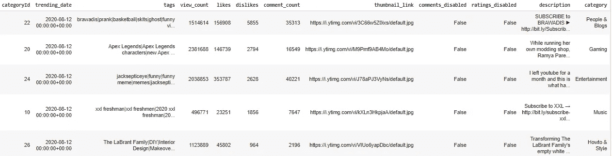

图 10

```
sns.set(rc={'figure.figsize':(10,10)})
ax= sns.barplot(x='likes', y='category', data=df, ci=False, palette='magma')
plot.title('Likes vs. Category')
plot.xlabel("Likes")
plot.ylabel("Category")
```

我们来看看哪个类别的赞最多。如图 11 所示,“音乐”类别最受欢迎，而“新闻和政治”类别最不受欢迎。

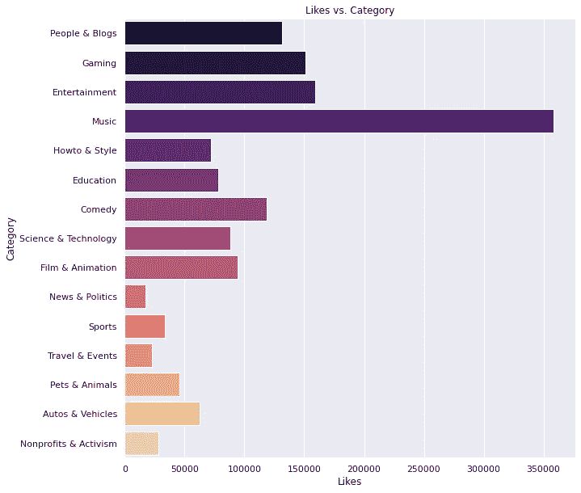

图 11

```
sns.set(rc={‘figure.figsize’:(10,15)})
ax= sns.barplot(x=’view_count’, y=’category’, data=df, ci=False, palette=’rocket’ , hue=’ratings_disabled’)
```

在图 12 中，我们可以看到哪些类别被查看得更多。此外，我们可以看到类别的评级是否被禁用。紫色条显示视频分级未被禁用，而珊瑚色条显示视频分级被禁用。音乐类别的分级大多被禁用。

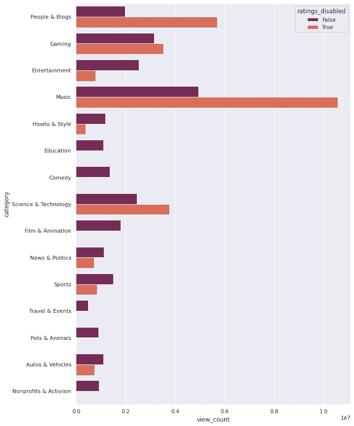

图 12

```
sns.set(rc={‘figure.figsize’:(5,5)})
sns.barplot(x=’comments_disabled’, y=’view_count’, data=df, palette=’magma’, ci= False)
plot.title(‘View Count vs. Comments Disabled’)
```

图 13 显示了视图计数和禁用注释之间的关系。正如所见，禁用评论的视频有更多的浏览量。

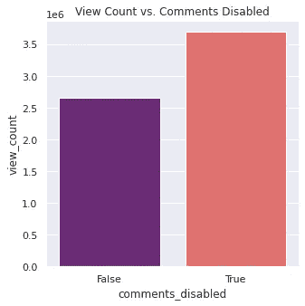

图 13

```
sns.set(rc={‘figure.figsize’:(10,6)})
df.likes.plot(kind=’line’,color=’#93089A’, label = ‘Likes’, linestyle = ‘ --‘)
df.dislikes.plot(color=’black’, label = ‘Dislikes’)
plot.title(‘Likes vs. Dislikes’)
plot.xlabel(‘Number of videos’)
plot.ylabel(‘Likes and Dislikes’)
```

让我们通过视频数量来比较喜欢和不喜欢。紫色线表示喜欢，黑色线表示不喜欢。该图显示，热门视频获得的喜欢远远多于不喜欢。

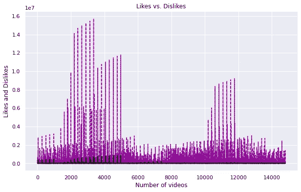

图 14

```
sns.set(rc={‘figure.figsize’:(20,8)})
sns_ax = sns.boxplot(x=’category’,y=’comment_count’,data=df)
category_boxplot = sns_ax.set_xticklabels(labels, rotation=90)
category_boxplot = sns_ax.set(yscale=”log”)
plot.title(‘Boxplot : Category vs. Comment’)
plot.ylabel(‘comments’)
```

箱线图有助于比较每个箱线图各自的中位数。此外，创建盒状图是识别异常值的最简单方法。在图 15 中，根据评论对类别进行了比较。你可以看到，最高的平均评论是在游戏类别。评论的最低均值在旅游&事件类。音乐得到了最多的离群值。

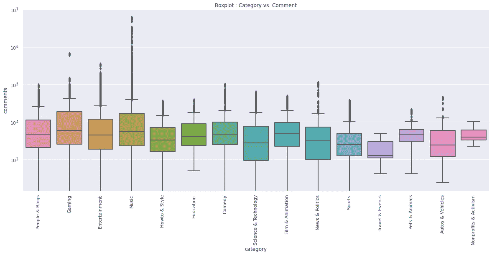

图 15