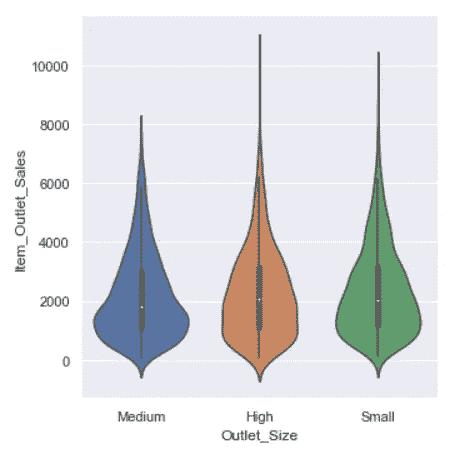

# Seaborn 可视化

> 原文：<https://medium.com/analytics-vidhya/visualization-with-seaborn-e2d9cacd932b?source=collection_archive---------19----------------------->

*   Seaborn 是一个基于 Matplotlib 的 Python 数据可视化库。
*   它提供了一个高层次的界面来绘制有吸引力的和信息丰富的统计图形。它提供了绘图样式和颜色默认值的选择，为常见的统计绘图类型定义了简单的高级函数，并与 Pandas DataFrames 提供的功能相集成。
*   Seaborn 的主要思想是，它提供高级命令来创建各种对统计数据探索有用的绘图类型，甚至一些统计模型拟合。

# 目录

1.  创建基本情节
2.  Seaborn 的高级分类图
3.  密度图
4.  配对图

```
# importing required libraries
import seaborn as sns
sns.set()
sns.set(style='darkgrid')import numpy as np
import pandas as pd#importing matplotlib
import matplotlib.pyplot as plt
%matplotlib inlineimport warnings
warnings.filterwarnings("ignore")
plt.rcParams['figure.figsize']=(10,10)
```

在本笔记本中，我们将使用大型超市的销售数据。你可以从 Github 下载数据:[https://github.com/Yuke217](https://github.com/Yuke217)

```
# read the dataset
df = pd.read_csv("dataset/bigmart_data.csv")
# drop the null values
df = df.dropna(how="any")
# View the top results
df.head()
```


# 创建基本图

让我们看看如何在 seaborn 中用一行创建一些基本的绘图，而在 Matplotlib 中需要多行。

## 1.0.2.1 折线图

*   对于某些数据集，您可能希望了解某个变量随时间的变化或类似的连续变量。
*   在 seaborn 中，这可以通过 **lineplot()** 函数直接完成，或者通过设置 **kind="line":** 与 **relplot** 一起完成

```
# line plot using lineplot()
sns.lineplot(x="Item_Weight", y="Item_MRP",data=df[:50])
```


## 1.0.2.2 条形图

*   在 seaborn 中，您可以简单地使用 **barplot** 函数创建一个条形图。
*   请注意，为了在 Matplotlib 中实现相同的功能，我们必须编写额外的代码来对数据进行分类。
*   然后我们不得不写更多的代码来确保情节的正确性。

```
sns.barplot(x="Item_Type", y="Item_MRP", data=df[:5])
```


## 1.0.2.3 直方图

*   您可以使用 **distplot()** 在 seaborn 中创建一个直方图。

```
sns.distplot(df['Item_MRP'])
```


## 1.0.2.4 箱线图

*   您可以使用 **Boxplot()** 在 seaborn 中创建箱线图
*   让我们试着把 Item_Outlet_Sales 的物品分布形象化。

```
sns.boxplot(df['Item_Outlet_Sales'], orient='vertical')
```


## 1.0.2.5 小提琴情节

*   小提琴图与盒须图的作用相似。
*   它显示了数量数据在一个(或多个)分类变量的几个级别上的分布，以便对这些分布进行比较。
*   与箱线图不同，在箱线图中，所有图的组成部分都对应于实际数据点，violin 图的特点是对基础分布的核密度估计。
*   您可以使用 seaborn 中的 **violinplot()** 创建一个小提琴情节

```
sns.violinplot(df['Item_Outlet_Sales'], orient='vertical')
```


## 1.0.2.6 散点图

*   它使用点云来描述两个变量之间的关系，其中每个点代表数据集中的一个观察值。
*   您可以使用 **relplot()** 和 kind=scatter 选项在 seaborn 中绘制散点图。
*   请注意，默认选项是“分散”

```
# scatter plot
sns.relplot(x="Item_MRP", y="Item_Outlet_Sales", data = df[:200], kind="scatter")
```


## 1.0.2.7 色调语义

我们还可以通过根据第三个变量给点着色来给图添加另一个维度。在 seaborn 中，这被称为使用“色调语义”。

```
sns.relplot(x="Item_MRP", y="Item_Outlet_Sales", hue="Item_Type", data=df[:200])
```


*   还记得我们之前创建的折线图吗，当我们有了**色调**语义后，我们可以在 seaborn 中创建更复杂的线图。
*   在下面的例子中，**为不同类别的 Outlet_Size** 绘制不同的线图。

```
# different line plots for different categories of the Outlet_Size
sns.lineplot(x="Item_Weight", y="Item_MRP", hue="Outlet_Size", data=df[:100])
```


## 1.0.2.8 泡沫图

*   我们利用**色调**语义根据项目可见性给气泡着色，同时使用它作为单个气泡的大小。

```
# bubble plot
sns.relplot(x="Item_MRP", y="Item_Outlet_Sales", data=df[:200],kind="scatter", size="Item_Visibility", hue="Item_Visibility")
```


## 1.0.2.9 类别明智子图

*   您还可以基于 seaborn 中的类别创建**图。**
*   我们为每个插座尺寸创建了散点图
*   现在，我们使用**列**根据不同的 Outlet_Size 创建三个图。

```
# subplots for each of the category of Outlet_Size
sns.relplot(x="Item_Weight", y="Item_Visibility", hue= 'Outlet_Size',col ="Outlet_Size",data=df[:100] )
```


# 1.1 2.seaborn 的高级分类图

对于分类变量，我们在 seaborn 有三个不同的家族。

*   **分类散点图:**
*   strip lot()(with kind = " strip "；默认)
*   swarmplot() (with kind="swarm ")
*   **分类分布图:**
*   boxplot() (with kind="box ")
*   violinplot() (with kind="violin ")
*   Boxenplot() (with kind="bowen ")
*   **分类估计图:**
*   pointplot() (with kind="point ")
*   条形图()(with kind="bar ")

**cat plot()中数据的默认表示使用散点图。**

# 1.1.1 a .分类散点图

## 1.1.1.1 带状图

*   绘制一个散点图，其中一个变量是分类变量。
*   你可以通过在`catplot`中传递 **kind=strip** 来创建它。

```
sns.catplot(x="Outlet_Size", y="Item_Outlet_Sales", kind="strip", data=df[:250])
```


## 1.1.1.2 虫群图

*   这个功能和`stripplot()`类似，但是调整了点，使它们不重叠。
*   这更好地表示了值的分布，但是它不适用于大量的观察。这种类型的情节有时被称为“蜂群”。
*   你可以通过在`catplot`中传递 **kind=swarm** 来创建它。

```
sns.catplot(x="Outlet_Size", y="Item_Outlet_Sales", kind='swarm',data=df[:250])
```


# 1.1.2 b .分类分布图

## 1.1.2.1 箱线图

*   箱线图显示了分布的三个四分位值以及极值。
*   “触须”延伸到位于上下四分位数 1.5 IQRs 内的点，然后落在此范围之外的观察值被独立显示。
*   这意味着箱线图中的每个值对应于数据中的一个实际观察值。

```
sns.catplot(x="Outlet_Size", y="Item_Outlet_Sales", kind="box", data=df)
```


## 1.1.2.2 小提琴曲

```
sns.catplot(x="Outlet_Size", y="Item_Outlet_Sales", kind="violin",data=df)
```



## 1.1.2.3 博兴地块

*   这种样式的图最初被命名为“字母值”图，因为它显示了大量被定义为“字母值”的分位数。
*   它类似于绘制分布的非参数表示的箱线图，其中所有特征都对应于实际观察值。
*   通过绘制更多的分位数，它提供了关于分布形状的更多信息，特别是在尾部。

```
sns.catplot(x="Outlet_Size", y="Item_Outlet_Sales", kind="boxen",data=df)
```


## 1.1.2.4 点图

```
sns.catplot(x="Outlet_Size", y="Item_Outlet_Sales",kind="point",data=df)
```


## 1.1.2.5 条形图

```
sns.catplot(x="Outlet_Size", y="Item_Outlet_Sales", kind="bar",data=df)
```


# 1.2 3.密度图

***我们可以使用核密度估计来获得分布的平滑估计，而不是直方图，这是 Seaborn 用 sns.dkeplot 做的:***

*   密度图显示了连续时间间隔或时间段内的数据分布。
*   密度图通过消除噪声使分布更加平滑。密度图的峰值有助于显示值在间隔内的集中位置。
*   密度图优于直方图的一个优点是，它们更善于确定分布形状，因为它们不受所用条柱数量的影响(典型直方图中使用的每个条柱)。

```
# distribution of Item Visibility
plt.figure(figsize=(10,10))
sns.kdeplot(df["Item_Visibility"],shade=True)
```


```
# distribution of Item MRP
plt.figure(figsize=(10,10))
sns.kdeplot(df["Item_MRP"],shade=True)
```


# 直方图和密度图

***直方图和 KDE 可以使用 distplot:*** 组合

```
plt.figure(figsize=(10,10))
sns.distplot(df['Item_Outlet_Sales'])
```


# 1.3 4.配对图

*   当您将联合图推广到更大维度的数据集时，您最终会得到配对图。当您想要绘制所有值对之间的相互关系时，这对于探索多维数据之间的相关性非常有用。
*   我们将用著名的鸢尾数据集来演示这一点，该数据集列出了三种鸢尾物种的花瓣和萼片的测量值:

```
iris = sns.load_dataset("iris")
iris.head()
```


```
sns.pairplot(iris,hue='species',height=2.5)
```

