# 使用 Azure 数据块可视化数据

> 原文：<https://medium.com/analytics-vidhya/visualize-data-in-azure-databricks-d9f087be093d?source=collection_archive---------22----------------------->

Azure Databricks 通过提供一个两个学科的用户都可以轻松使用的公共平台，将数据工程师和数据科学家聚集在一起，从而统一了数据分析流程。数据工程师为数据科学家收集和移动数据以执行分析。来自 SQL 背景的我喜欢使用数据块，因为我可以在数据块笔记本中使用熟悉的 SQL 编码，或者我可以很容易地切换到 Python。

假设，需要了解英国房地产市场过去的表现，以及哪些地区对房地产投资有吸引力。为了执行探索性的数据分析，使用 Azure Data Lake Gen 2 和 Azure Databricks 提出了一个解决方案。

图片来源；[https://www.talavant.com/databricks-azure-data-lake-store/](https://www.talavant.com/databricks-azure-data-lake-store/)

## 1.创建 Azure Data Lake Gen 2 帐户

这是活动中最简单的一步，但是 Azure 上没有 Azure Data Lake Gen 2。Azure Data lake Gen 2 只不过是启用了*分层名称空间*的 Azure 存储帐户。

在 Azure Data Lake(ADL)中，创建了一个文件夹结构，不仅用于组织内容，还用于管理安全性。

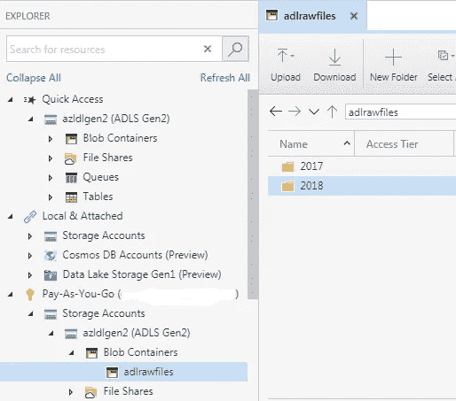

为了便于分析，每年从英国政府网站下载 csv 源文件，并存储在带有年份标签的文件夹中。

## 2.创建服务主体

为了使数据块安全地访问 ADL，必须通过应用程序注册来创建服务主体。虽然数据块可以通过*访问密钥*访问 ADL，但是通过服务主体访问是安全和干净的。

1.  通过应用程序注册创建服务主体

在 Azure Active Directory 中，选择*应用注册*，点击*新注册*

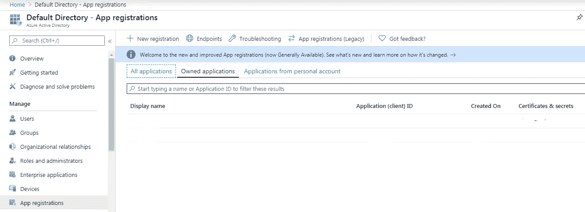

2.为服务主体生成密钥。输入名称并保留默认设置

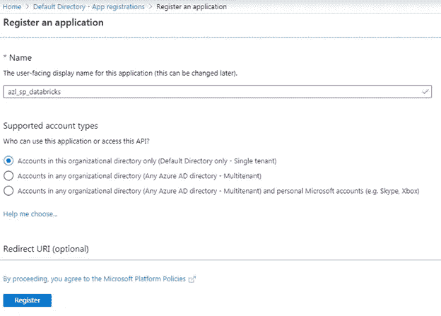

创建新的应用程序注册后，保存应用程序 ID 和目录 ID，以便稍后在步骤 4 中使用。

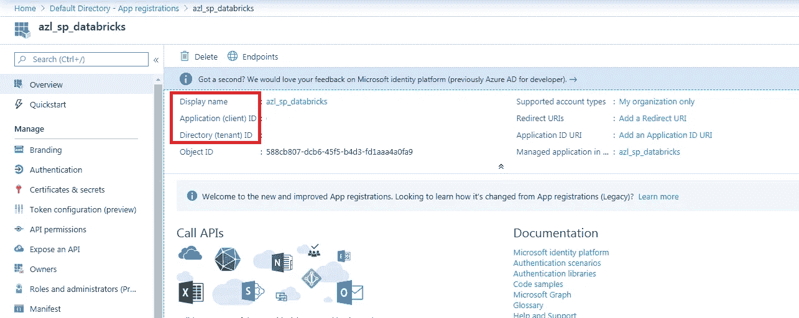

然后，要创建机密，请单击*证书和机密*

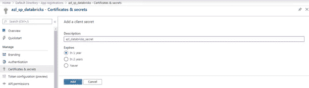

然后选择*客户端机密*和*新客户端机密*。键入密码的名称，然后单击*添加*

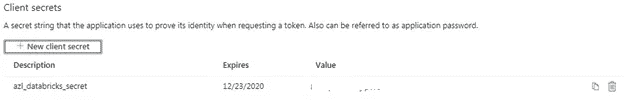

请确保复制并保存该值，因为无法再次检索该值。该值称为身份验证密钥，将在步骤 4 中使用。

## 3.授予 ADL 对服务主体的访问权限

通过添加新的*存储 Blob 数据贡献者*角色分配，授予 ADL 对服务主体的访问权限。

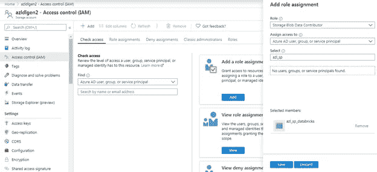

## 4.创建 Azure 密钥库

创建密钥库是为了安全地存储机密。

存储在密钥库中的内容；

应用程序或客户端 ID。(步骤 2-应用程序 ID)

认证密钥。(步骤 2-认证密钥)

存储帐户名是 ADL 帐户名。

租户 ID 是目录 ID。(步骤 2-目录 ID)

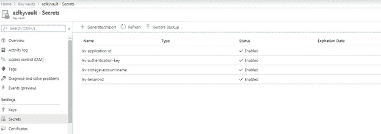

给一个名称，并复制粘贴值文本框中的秘密值。

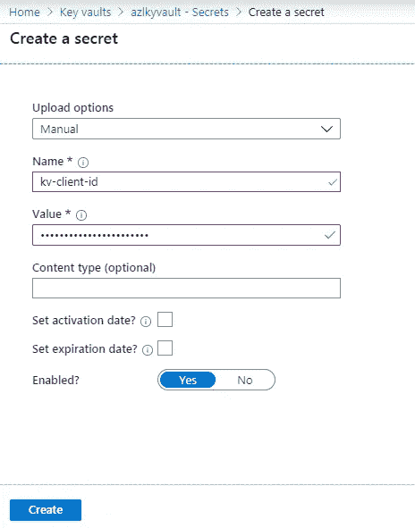

一旦所有的秘密都被加入。注意 DNS 名称和资源 ID，这些将在步骤 5 中使用。

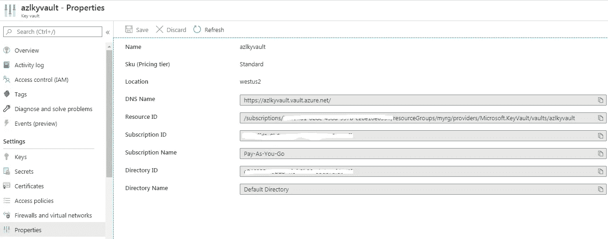

## 5.从 Azure 数据块访问 ADL

要读取和分析数据，需要 Databricks workspace。启动 Databricks workspace 后，下一步是创建集群。由于工作负载较小，因此通过禁用*自动扩展、*更改*工作线程数量和到期时间的默认值，集群被配置为使用更少的资源。*

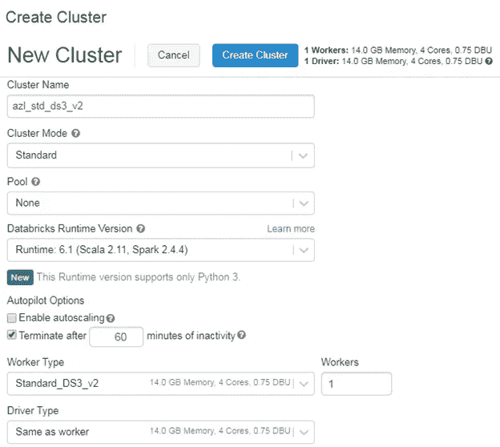

必须创建 Azure Databricks secret 作用域才能与 Azure Key Vault 连接。使用链接创建一个秘密范围；

https://【.azuredatabricks.net/ ？o =#秘密/创造范围

从 Azure Databrics 链接中获取*位置*和 *orgID* ，如下所示

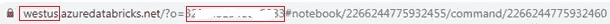

给定作用域名称并提供从 Azure Key Vault 复制的 DNS 名称和资源 ID。

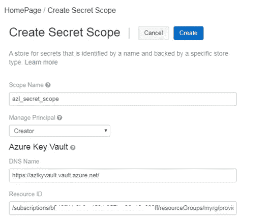

要执行探索性数据分析，需要添加一个连接了集群的笔记本。

首先，初始化变量并通过 secret scope 从 Azure Key vault 读取机密

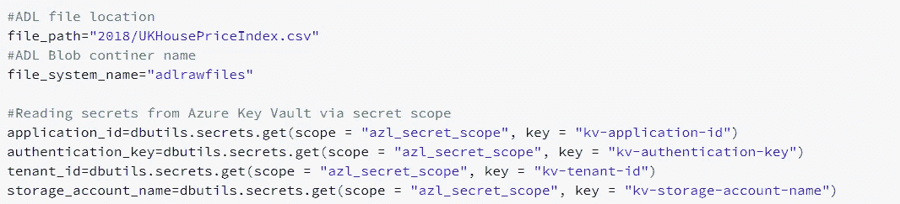

笔记本会话配置使用从密钥库中读取的值进行更新。

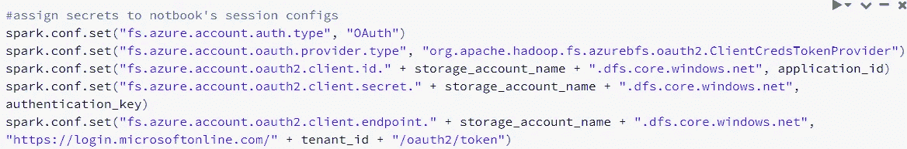

将数据读入 pySpark 数据帧并打印数据帧模式以显示数据类型

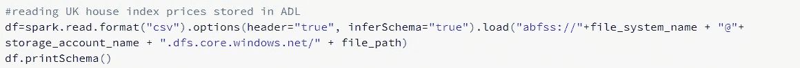

日期字段是字符串，因此需要更改为日期类型以便分析。此外，数据框架被过滤以仅包括英国的地区。与 pandas 中的数据帧不同，pySpark 数据帧是不可变的，因此对于模式的每次更改，都必须创建一个新的数据帧。

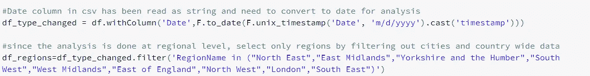

为了使用更熟悉的 SQL，pySpark DataFrame 被转换为 Azure Databricks 中的 temp 对象

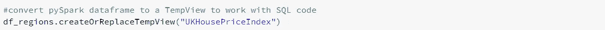

使用%sql 将语言从 python 改为 sql，并使用 SQL 查询来分析数据。第一个 SQL 查询显示了各个地区过去的平均价格波动情况，第二个查询显示了各个地区的销售额。

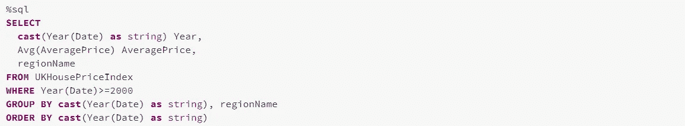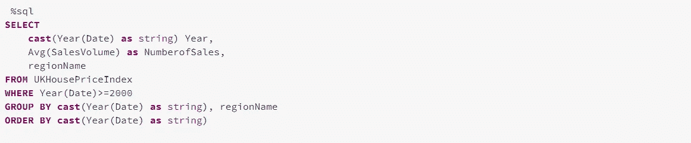

可以将输出列在表格上，或者使用笔记本中的可视化选项将数据可视化

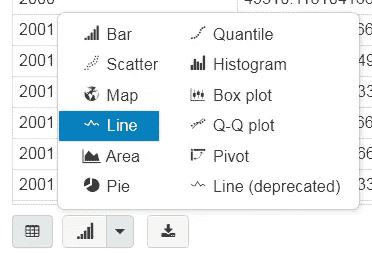

创建图表后，创建一个仪表板将所有内容放在一起

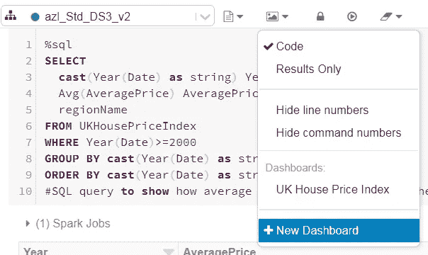

通过单击单元格中的条形图图标并选择仪表板，可将图表添加到仪表板中。

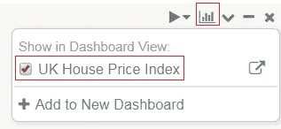

按地区显示过去趋势的最终 Dashbord。

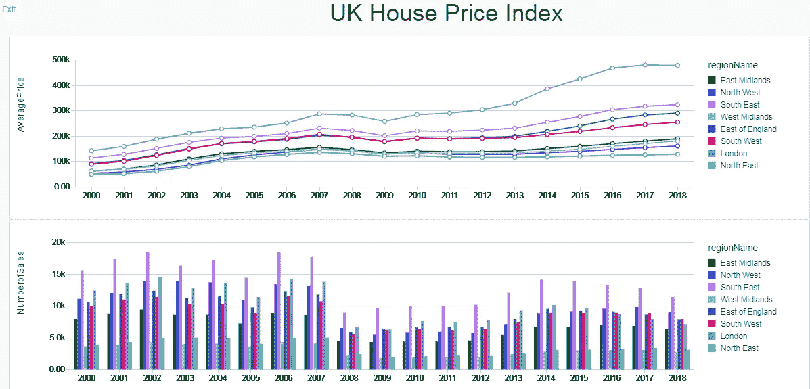

参考资料:

[https://docs . data bricks . com/data/data-sources/azure/azure-data lake-gen 2 . html](https://docs.databricks.com/data/data-sources/azure/azure-datalake-gen2.html)