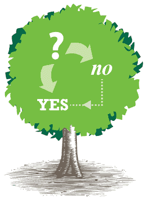
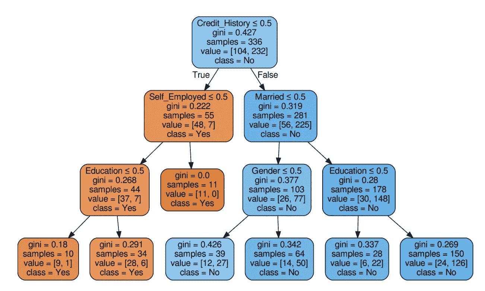

# 用 5 行代码可视化决策树

> 原文：<https://medium.com/analytics-vidhya/visualize-decision-tree-in-5-lines-of-code-6227f2895e39?source=collection_archive---------18----------------------->

# 注意:

## 用于决策树可视化的重要库是 Graphviz。
确保它已安装在您的机器上，如果您使用 collab 或 Kaggle 笔记本，则该库已经安装。

完整的代码在我的 GitHub 上，下面是链接。用你自己的数据集替换这些数据，然后你就可以开始可视化决策树了。

 [## HemanthDavuluri/MediumBlog

### 此时您不能执行该操作。您已使用另一个标签页或窗口登录。您已在另一个选项卡中注销，或者…

github.com](https://github.com/HemanthDavuluri/MediumBlog/tree/master/Loan_dataset) 

# 代码解释

## 步骤 1:导入所有需要的库

## 步骤 2:加载数据集，并将其拆分用于训练

## 步骤 3:训练决策树模型

## 步骤 4:可视化的 5 行代码

**注:**

**要素名称属性采用每个要素的名称，类名属性采用每个目标类的名称，以数字升序排列。仅与分类相关，不支持多输出。如果** `**True**` **，显示的是类名的符号表示。**

这是最终结果

最终结果将保存为 pdf 文件。

## 更多资源:

如果您想了解关于决策树[的更多信息，请单击此处](/@hemanthdavuluri/decision-tree-explained-70bf80668bc7)

## 结论

最后，你学会了如何用 5 行代码构建一个决策树并可视化。掌声和跟随将被赞赏。

可以在 Linkedin 上找到我:[Davuluri he manth chow dary](https://www.linkedin.com/in/davuluri-hemanth-chowdary-627bb9128/)。