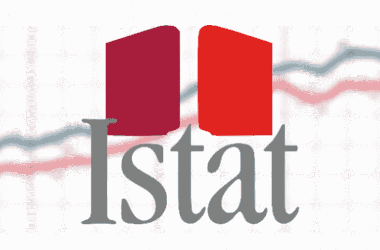

# 借助 Microsoft Power BI 可视化 ISTAT 数据

> 原文：<https://medium.com/analytics-vidhya/visualize-istat-data-with-microsoft-power-bi-faef3594c155?source=collection_archive---------18----------------------->

## 借助 Power BI 可视化数据

[https://www . open . online/WP-content/uploads/2019/04/ISTAT-litalia-e-fuori-dalla-recession-nel-primo-trimestre-pil-a-02 . png](https://www.open.online/wp-content/uploads/2019/04/istat-litalia-e-fuori-dalla-recessione-nel-primo-trimestre-pil-a-02.png)

T2 ISTAT(意大利国家统计局)是意大利官方统计数据的主要编制者，包括人口普查、经济普查以及一些社会和环境调查和分析

一如既往，让我们应用 **CRISP-DM 流程**(跨行业数据挖掘流程)来解决…