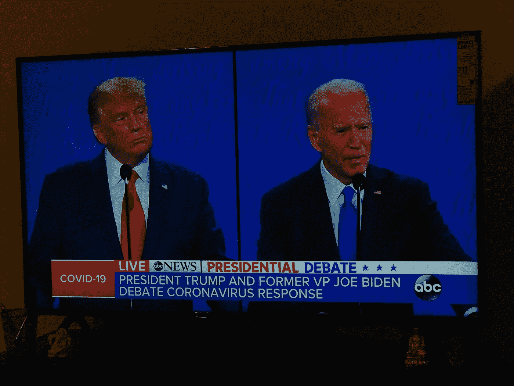

# 在单词云上可视化 2020 年总统辩论

> 原文：<https://medium.com/analytics-vidhya/visualize-presidential-debate-of-2020-on-word-cloud-3532c70487d3?source=collection_archive---------23----------------------->

乔·拜登(Joe Biden)和唐纳德·特朗普(Donald Trump)之间的 2020 年美国总统辩论在纳什维尔举行，其形式有所变化，例如在每个环节的前两分钟，没有轮到发言的候选人将被切断麦克风，嘉宾必须戴上口罩。耶！！我们在 2020 年！！

照片由萨姆兹·卡尔基拍摄