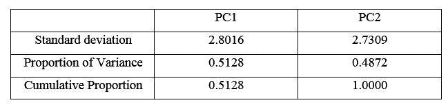

# 可视化主成分分析

> 原文：<https://medium.com/analytics-vidhya/visualize-principal-component-analysis-475580deec44?source=collection_archive---------33----------------------->

在下面的文章中，我将使用非常基本的术语和定义来描述主成分分析。我只是试图给出一个清晰的视觉效果，来说明 PCA 实际上是如何处理数据的。我不会深入研究数学和其他理论性的东西。学习 PCA 背后的数学还有各种其他来源。我还会在本文末尾分享一个有用的链接。所以，不浪费时间，让我们进入今天的主题。

主成分分析

什么是主成分分析？

根据维基百科

“主成分分析(PCA)是一种统计程序，它使用一种[正交变换](https://en.wikipedia.org/wiki/Orthogonal_transformation)将一组可能相关变量的观察值转换成一组被称为主成分的[线性不相关](https://en.wikipedia.org/wiki/Correlation_and_dependence)变量的值。”

简单地说，我们可以说

**将高维数据投影到低维数据是 PCA** 的主旨

示例:

一个非常基本的例子就是“图像”。目前，我们都被像日历、电影海报、广告海报等图像所包围。所以，你可以看到一个图像可以把多维数据表示成二维数据。但是如果我问你“图像能够承载一个事物或一个人的所有信息吗？”你可以轻松地说“不”

假设你点击了一个三维盒子的图像。

在图像中，你看不到它的所有维度。尽管如此，你还是能猜出这个盒子的大概大小。

“一个图像通过丢失一些信息把多维数据表示成二维数据。”

类似 PCA 做的事情。它试图通过丢失一些不必要的(“不是很重要”是比较合适的)信息，把高维信息表示成低维。

PCA 试图捕捉其成分中数据的所有变化。变化见下图:

变化的简单定义是“一个变量如何在整个平面上传播。”

在上图中，变化是双向的。第一种以“第一主成分”为代表，第二种以“第二主成分分析”为代表。从这里还可以清楚地看到，第一个 PC 捕获了大部分变化，第二个 PC 捕获了第二个变化，依此类推。

使用下面的可视化，我将尝试解释 PCA 做什么。

为了形象化，我生成了自己的数据来解释。在生成的数据中，我只从两个数据簇开始，并增加簇的数量。

我已经用 r 实现了这一点。您也可以用任何其他语言重新创建它:

假设你有以下二维数据。

我们在数据中有两个集群。现在我已经计算了主成分，主成分分析的总结如下:

组件的重要性:

这意味着由第一主成分解释的方差约为 91%,即如果我们使用 PC1 来表示信息，那么我们将仅丢失 9%的信息。我们可以用下面的图来验证它。

上面的图是 PC1 的。您可以很容易地看到，它保留了几乎所有的数据信息。它清楚地表明了数据中的两个集群。

现在我们将把我们的集群增加到 3 个。

现在，我们的数据中有三个集群:

认证后活动摘要:

组件的重要性:

随着变化的增加，我们看到在单个组件中保留信息变得复杂了。这一次，PC1 只能解释 70%的变异。尽管如此，这还不算太糟。

使用 PC1 图我们可以看到

我们可以看到，PC1 仍代表三个集群，但不像两个集群那样清晰。这是合乎逻辑的，因为我们仅使用 PC1 就丢失了 30%的数据信息。

现在集群的数量越来越多，达到 4 个。

您可以清楚地看到，我们的数据中有 4 个集群。执行 PCA，PCA 总结如下:

组件的重要性:

PC1 无法解释 48%的数据差异。您可以很容易地猜到，如果我们绘制 PC1，它不会给出关于数据的适当信息。看见

它仅给出数据中有两个/三个聚类的信息。但是我们数据中的真实聚类数是 4。现在我们脑海中出现了一个问题。信息在哪里？即关于其他集群的信息在哪里？PC2 解释了该信息(变化)。如果我们在 PC1 上绘制 PC2。我们可以解释所有的变化。

您可以使用下图进行验证:

在上图中，我绘制了 PC1 和 PC2。我们可以看到我们的数据中有四个集群。

因此，我们的数据变化越多，用单一成分解释就越复杂。我只谈了二维数据。你可以很容易地将其推广到更高的维度。

有一点要记住。"集群数量的增加并不意味着变异的增加."

我生成了上面的数据集来简单解释它。尝试将数据中的聚类数增加到，并查看令人惊讶的结果。

(注意:请不要与点的颜色混淆。这仅仅是为了表示目的)

我试图解释我对五氯苯甲醚的理解。如果有任何错误，请通知我。