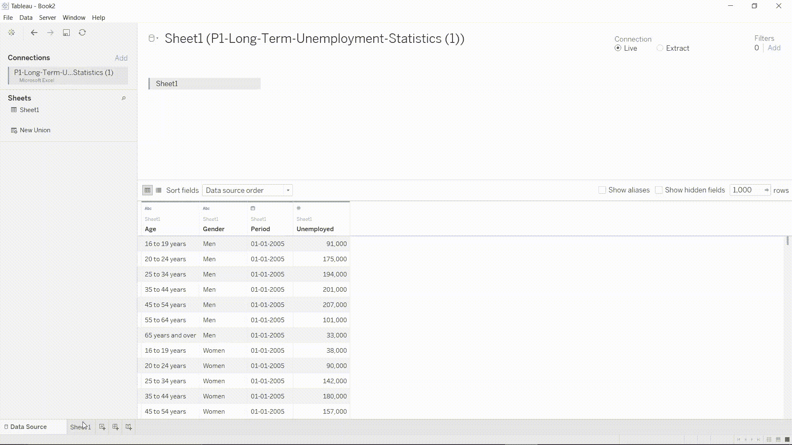
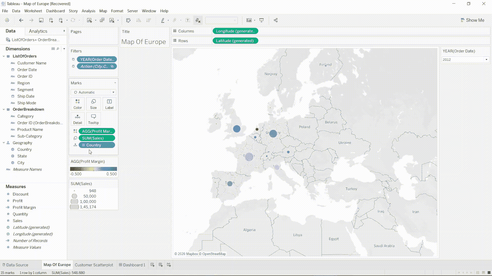

# 可视化 Tableau 2020，但采用 GIF 格式

> 原文：<https://medium.com/analytics-vidhya/visualize-tableau-2020-but-in-an-animated-graphics-interchange-format-a56ba35c8809?source=collection_archive---------20----------------------->

## 数据可视化和商业智能表格。

预览图像

你好，我是苏米特·帕蒂尔。我喜欢和数据打交道，数据科学让我感到惊讶。在许多方面，Tableau 改变了我的数据可视化视角，因此，在本文中，我将以 gif 格式解释 Tableau- basic 的主要概念，这将更容易理解，并基于这些概念添加我的项目的一个小片段。我也要对 Tableau 做类似的事情——高级概念。让我们开始吧…

# 指数

> 什么是 Tableau
> 
> 项目-1 年度奖金分析
> 
> 项目-2 长期失业
> 
> 项目 3 地图和层次结构
> 
> 结论

# 什么是 Tableau？

*   Tableau 是商业智能行业中令人难以置信且发展最快的信息感知工具。它有助于将原始信息分解成有效合理的格式。最佳元素表是数据融合、实时检测、信息协作。
*   Tableau 产品套件包括 1) Tableau 桌面 2) Tableau 公共 3) Tableau 在线 4) Tableau 服务器和 5) Tableau 阅读器。
*   我不会去在这些 Tableau 产品的细节，因为他们有许多功能。在我几个月来所学项目的帮助下，我们将理解 Tableau 中的主要概念..:))

# 1)年度奖金分析-项目 1

## 1.1 计算字段

在 Tableau 中，计算字段是留给您的信息源的，并且可以用来进行逐步增强的表示。你的小说数据保持完美或无可挑剔。

您必须右键单击**措施**部分。单击“create a new calculated field ”(创建新的计算字段),并输入带有特定公式的术语。

即**总销售额=(单位)*(单价)**

> **创建计算字段:**

计算字段

数据类型图标旁边会出现一个等号(=)。在**数据**窗格中，所有计算字段旁边都有等号(=)。

## 1.2 添加颜色

将尺寸拖到颜色部分。Tableau 将自动为您的条形图找到最佳的可视化效果。通过点击颜色，您可以切换到各种颜色和调色板效果。

在下面的例子中，我将“区域”维度拖到了颜色上，所以所有相同的区域都有相似的颜色，这样更容易理解。

基于区域的颜色变化

## 1.3 标签和格式

首先，你需要在你的条形图上指定有代表性的、有销售总额的地区，以便完美地描绘出来。为此，我们需要将这些参数拖到字段标签上。在这之后，你清楚地看到那些维度被呈现出来。

1.  当你右击视图中的字段标签并选择**格式**时。
2.  在**格式**窗格中，您可以为每种类型的字段标签指定字体、阴影、对齐和分隔符。

格式化标签

> 基于这些概念，你可以做以下项目。我会附上数据集的链接，自己试试:))

[https://SDS-platform-private . S3-us-east-2 . Amazon AWS . com/uploads/P1-office supplies . CSV](https://sds-platform-private.s3-us-east-2.amazonaws.com/uploads/P1-OfficeSupplies.csv)

**基于办公用品总销售额的年度奖金分析:-**

项目 1

# 2)长期失业-项目 2

## 2.1 表格中的数据摘录

在你提取信息的时候，你可以通过利用渠道和设计不同的截止点来减少信息的总量。

> 1.支持大量的信息收集
> 
> 2.快速制作
> 
> 3.帮助提高执行力
> 
> 4.增强额外的有用性
> 
> 5.授予对您的信息的离线访问权限

数据析取

## 2.2 表格中的时间序列

理解你的信息是至关重要的。向前看和向后看的能力，从几年到几天的时间，以及看到不同时间范围内的信息偏差的能力，是最彻底的调查的基础。

您需要将**周期**维度更改为年、季度、月、周、日格式，以观察其分析。

时间序列分析

## 2.3 粒度和详细程度

粒度是指表中信息的详细程度。

细节层次表达(LOD)允许你在信息源层次和感知层次表达敬意。

**细节层次(LOD) (** [**来源**](https://www.thedataschool.com.au/atule-sheorn/introduction-to-level-of-detail-lod-in-tableau/) **)**

粒度和 LOD

## 2.4 突出显示行动和面积图

1.  **工作表>动作**。选择**仪表板>动作**。
2.  在**动作对话框中，添加动作**按钮，然后选择**高亮显示**。

突出

## 2.5 快速过滤器

Tableau 中的许多过滤器类型都可以通过右键单击测量来快速访问。这些被称为快速过滤器的过滤器具有足够的实用性，可以满足绝大多数的基本分离需求。

应用快速过滤器

单值(列表)、单值(下拉列表)、多值(列表)、多值(下拉列表)、多值(自定义列表)、单值(滑块)、通配符匹配是各种可用的快速过滤器。

> 基于这些概念，你可以做下面的项目。我会附上数据集的链接，自己试试:))

[https://SDS-platform-private . S3-us-east-2 . Amazon AWS . com/uploads/P1-长期-失业-统计. xlsx](https://sds-platform-private.s3-us-east-2.amazonaws.com/uploads/P1-Long-Term-Unemployment-Statistics.xlsx)

> **基于这些概念的长期失业-**

项目 2

# 3)地图和散点图-项目 3

## 3.1 数据连接

您在 Tableau 中研究的信息通常由各种表格组成，这些表格通过显式字段(即节)连接在一起。加入是巩固这些基础领域相关信息的一种策略。

一般来说，有四种联接可以用来合并 Tableau 中的信息:内联接、左联接、右联接和全外联接。

## 3.2 创建地图和使用等级

Tableau 地图有助于想象地形信息。您可以在地图上创建自己的等级。您只需选择一个方面，如国家、州或城市，并形成一个新的 Grogrfapgy 层次结构，然后在可视化中拖动该字段参数，您将获得基于纬度和经度的详细视图。

地图和层次结构

## 3.3 表格中的散点图

在 Tableau 中，通过将一个度量放在列架中，将另一个度量放在行架中来创建散点图。

散点图

## 3.4 将过滤器应用于所需的工作表

现在，您可以将筛选/快速筛选应用于所有需要的工作簿。在“过滤器”部分拖动维度后，有三个选项可供选择，例如

1.  应用于所有工作表
2.  应用于使用此数据源的工作表
3.  仅适用于此工作表

您对过滤器所做的任何更改都会影响您选择的选项。

筛选到工作表

## 3.5 创建我们的第一个仪表板以及与过滤器的交互

仪表板是众多工作表和相关数据在一个单独位置的组合表示。它一直被用来分析和筛选各种信息。

在工作表的上角，启用“用作过滤器”替代选项，将工作表中的选定图章用作仪表板中不同工作表的通道。

带过滤器的仪表板

> **基于这些概念，你可以做以下项目。我会附上一个数据集的链接，自己试试:))**

[https://SDS-platform-private . S3-us-east-2 . Amazon AWS . com/uploads/P1-amazingmartu2 . xlsx](https://sds-platform-private.s3-us-east-2.amazonaws.com/uploads/P1-AmazingMartEU2.xlsx)

> **地图和层级仪表板-**

项目 3

# 结论

当我们结束对使用 Tableau 的信息可视化的简短研究时，很明显，该领域在不同学科中有丰富的潜在应用，同时我们应该了解它的常识和道德复杂性。信息表征正在进入另一个时期。不断增长的知识源泉、假设性的改进和多维成像的进步正在重塑检查和经验所能赋予的潜在价值，而表征承担了一项关键工作。成功信息表示的标准不会改变。无论如何，尖端的进步和主观结构的发展正在打开新的天际线，从工艺到科学和画面的信息感知正在同时产生关键的影响。

> **如果您有任何问题，欢迎在评论中或通过以下方式提出:**

*   领英:【https://www.linkedin.com/in/sumit1407/ 
*   给我发电子邮件到 sumitpatil39181@gmail.com

> ****参考文献:****

**[1][https://www.tableau.com/support/help](https://www.tableau.com/support/help)**

**[https://www.tutorialspoint.com/tableau/index.htm](https://www.tutorialspoint.com/tableau/index.htm)**

**[3][https://www.tutorialgateway.org/tableau/](https://www.tutorialgateway.org/tableau/)**

**[https://towardsdatascience.com/tagged/tableau?[4]gi=5ded1b41339c](https://towardsdatascience.com/tagged/tableau?gi=5ded1b41339c)**

> ****谢谢，第二部正在制作中:)****