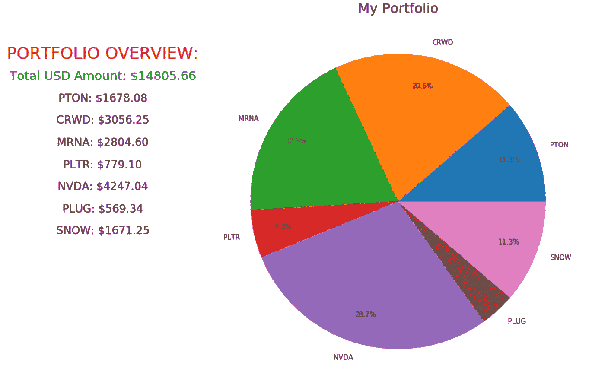

# 用 30 行代码可视化您的投资组合。

> 原文：<https://medium.com/analytics-vidhya/visualize-your-portfolio-in-30-lines-of-code-d0200d15698c?source=collection_archive---------12----------------------->


今天我们将讨论如何使用 Python 在两分钟内可视化您的投资组合。只需用你投资组合中的股票替换下面列出的代码，并用实时数据打印一个简单的饼图。

```
import datetime as dt
import matplotlib.pyplot as plt
from pandas_datareader import data as web
```

我想给每个人一个快速有趣的项目，产生一个实时数据的信息图表，以便您快速更新和跟踪您的投资组合。

```
tickers = ['PTON','CRWD','MRNA','PLTR','NVDA','PLUG','SNOW']
amounts = [12,15,20,30,8,18,5]
prices = []
total = []# SET THE OUTLINE OF THE PIE CHART
fig, ax = plt.subplots(figsize=(10,10))ax.set_facecolor('black')
ax.figure.set_facecolor('white')
ax.tick_params(axis='x', colors='black')
ax.tick_params(axis='y', colors='black')
```

*   *在*[*Matplotlib*](https://matplotlib.org/3.2.1/gallery/style_sheets/style_sheets_reference.html)*网站上查看你所有的视觉选项，选择各种风格和颜色。*

**规划你的投资组合:**

```
ax.set_title("Your Portfolio", color='black', fontsize=20)_, texts, _ = ax.pie(total, labels=tickers, autopct='%1.1f%%', pctdistance=0.8)
[text.set_color('black') for text in texts]ax.text(-2,1, 'PORTFOLIO OVERVIEW:', fontsize=24, color="red", horizontalalignment='center', verticalalignment='center')
ax.text(-2,0.85, f'Total USD Amount: ${sum(total):.2f}', fontsize=18, color="green", horizontalalignment='center', verticalalignment='center')
counter = 0.15
for ticker in tickers:
    ax.text(-2, 0.85 - counter, f'{ticker}: ${total[tickers.index(ticker)]:.2f}', fontsize=16, color="black",
            horizontalalignment='center', verticalalignment='center')
    counter += 0.15plt.show()
```



**感谢阅读！**

*如果你觉得这篇文章有用，欢迎访问我的*[*GitHub*](https://github.com/scottandersen23/Medium_Blog/tree/main/Articles)*下载本文使用的文件，或者直接发邮件给我，地址是 scottandersen23@gmail.com。*

*有兴趣了解更多关于数据分析、数据科学和机器学习应用的信息吗？跟我上* [*中*](/@scottandersen23) *。*

*在*[*LinkedIn*](https://www.linkedin.com/in/scott-andersen-3208897b/)*上跟我连线。*