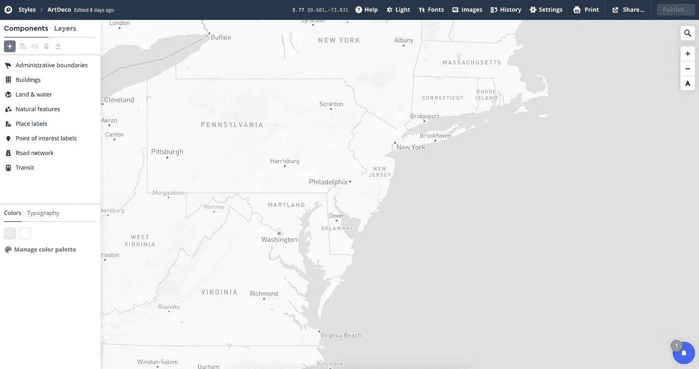

# 使用 Mapbox 的 flyTo 功能和反应可视化装饰艺术建筑位置

> 原文：<https://medium.com/analytics-vidhya/visualizing-art-deco-building-locations-with-mapboxs-flyto-function-and-react-235b9d9ee881?source=collection_archive---------21----------------------->

纽约帝国大厦

Mapbox 为用户提供了一种简单的方法来构建高质量的交互式地图，并且它们与 React 的集成使得这一过程更加容易。使用 Mapbox Studio(用于设计地图样式)和 [react-map-gl](https://github.com/visgl/react-map-gl) 包装器(用于构建地图本身)的组合，创建在线地图变得非常有趣。

我偶然发现了 Mapbox 的 [flyTo](https://docs.mapbox.com/mapbox-gl-js/example/flyto/) 功能，并决定在一张可视化世界各地装饰艺术建筑的地图中利用它。装饰艺术是 20 世纪 10 年代末和 20 年代的一种艺术风格，出现在世界上许多最著名的建筑中，包括纽约的帝国大厦和克莱斯勒大厦、里约热内卢的基督教堂和巴黎的东京宫。

最终结果是下面的[地图](https://decomap.netlify.app/)，允许用户在全球六个城市之间导航:

这六个城市——纽约、芝加哥、里约热内卢、巴黎、迈阿密和纳皮尔——都在装饰艺术史上扮演了重要角色，并有助于说明装饰艺术运动本身的风格范围(当然，还有许多其他城市也是不可或缺的)。

当你点击一个新的城市时，flyTo 函数(在 react-map-gl 中称为 *FlyToInterpolator* )将会显示从你当前位置到所选城市位置的移动。例如，当点击“巴黎”位置时，我们离开当前位置并*飞往*法国首都。

从纽约飞往巴黎

**这是如何创建的:**

样式本身是在 Mapbox [Studio](https://studio.mapbox.com/) 中设计的，使用简单的灰色/白色调色板，没有其他特定的配置。

地图的其他方面是使用 react-map-gl 包装器创建的，特别是使用 MapGl、Marker、Popup 和 FlyToInterpolator 组件。这四个组件一起用于读取数据(JSON 格式)，将点显示为标记，并使用户能够在地图上移动/飞行。代码的许多部分，尤其是侧边栏，都受到了 react-map-gl 网站上的这个[示例](http://visgl.github.io/react-map-gl/examples/viewport-animation)的影响，该示例展示了如何使用 FlyToInterpolator 函数。

最后，地图托管在 Netlify 中，这提供了一种通过 [CLI](https://www.netlify.com/blog/2016/07/22/deploy-react-apps-in-less-than-30-seconds/) 部署 React 应用的简单方法。

请随意摆弄地图，并请评论任何问题/反馈。谢谢！

地图:[https://decomap.netlify.app/](https://decomap.netlify.app/)

github:【https://github.com/stefangouyet/deco_map 