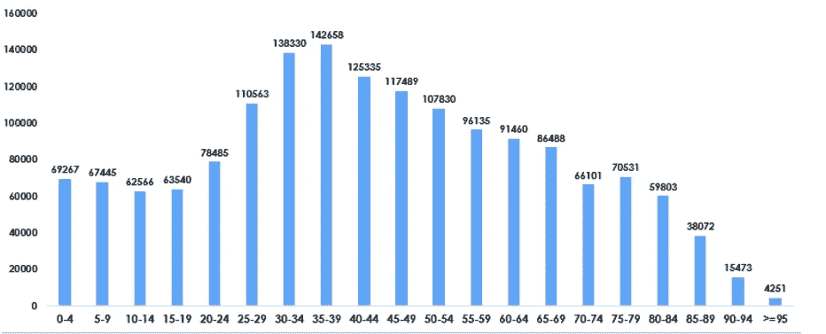

# 可视化巴塞罗那数据集

> 原文：<https://medium.com/analytics-vidhya/visualizing-barcelona-datasets-part-ii-e5aa39511a6f?source=collection_archive---------17----------------------->

## 第 2 部分:中间可视化和绘图技术

在 *我之前的博客中，我们已经看到了一些基本的情节以及在什么情况下使用什么媒介。在这个博客中，我们将看到一些高级图表以及何时使用它们。*

如果你没看过我的上一篇博客，这里有链接 [*blog1*](/@maniyaswanth123/visualizing-barcelona-datasets-42784bbe0bd3) *。它由一些基本的绘图组成*

> 我们将首先从分析人口数据集开始。如果有人想搬到巴塞罗那的某个地方，他首先会看这个地方看起来怎么样，那里的污染如何，污染取决于人口。人口越多，车辆造成的污染就越多。所以，现在我们将分析巴塞罗那的人口数据。我们将从人口数据中获得一些见解，这样这个人就会受益。

> 巴塞罗那人口数据集由 8 个参数组成，如年份、地区代码、地区名称、街区代码、性别、年龄、数量(人口)。年表示日历年，地区代码是每个地区的代码，邻里名称是特定地区的邻里，邻里代码是特定地区的邻里代码。我们可以看到每个地区的性别人口以及每个地区的年龄和人口。

图表 1:

> 从这个图我们可以很容易地看出。女性人口略高于男性，我们还可以看出，2017 年女性人口是所有记录年份中最高的。

**图表 2:**

**巴塞罗那市的人口保持相对稳定，因为它的人口已经非常密集。每年的人口数量非常相似，因此在下面的可视化中，我们将只考虑去年(2017 年)。我们可以继续按年龄划分人口。**

> *人口分布集中在 35-44 岁之间。有趣的是，观察到男性人口从 40-44 岁的范围大幅下降，而女性人口的下降不太明显。很明显，男人在巴塞罗那的寿命更短。*

**图表 3:**

> *在这种情况下，我们使用堆叠棒线。从图中，百分比告诉我们关于男性和女性人口。条形长度告诉我们特定区域的人口数量。如果酒吧的长度越长，意味着该地区的人口越多。因此，我们可以很容易地看出，人口更多的是在埃克塞特，而很少在 Les Corts。*

**图表 4:**

2013 年的人口年龄如下图所示。我们没有像图 2 那样使用条形，因为在图 2 中，我们比较的是 2 个分类变量与其他变量，所以我们使用了这种图表。在这种情况下，将只有一个可变的年龄，我们发现年龄相对于人口。所以，我们只是使用一个普通的条形图

> *从上图我们可以看出，巴塞罗那 35-39 岁年龄段的人较多，而 95 岁以上年龄段的人很少。我们可以得出结论，巴塞罗那的在职人员更多，因为 35-39 岁年龄段的在职人员更多。*

**图表五:**

**在这张图表中，我们将看到从 2013 年到 2014 年各年龄组的人口变化**

*从上图中，我们可以很容易地看出，更多的变化发生在 90-94 岁年龄组，为 5.89%，其次是 95 岁以上年龄组，75-79 岁年龄组的变化急剧减少，为 5.78%。其余所有年龄组人口变化相对较小。*

**图表 6:**

在这个图表中，我们可以看到每个地区的人口数量，所有的切片都按降序排列。正如我们所看到的，埃克塞特的人口更多，而莱斯科特的人口最少

*在这种情况下，我们显示的是每个地区的人口百分比，否则很难区分 Eixample 和 Sant Marta，因为两者看起来几乎一样。所以饼图是不推荐的，我们可以在这种情况下选择棒线，这将是完美的比较。*

> ***现在我们将从失业数据中获得一些见解。假设一个人第一次来到巴萨，他想在某个公司招聘，如果他知道这些数据洞察，对他会很有帮助。***

> ***但如何？？？***

> 假设他知道哪里有这么多的失业人口，他会更愿意去那里，因为那里有这么多的失业人口，所以他被录用的可能性会更大。很明显，在失业率很低的地方，他被聘用的机会也很少。

**图表 7:**

**这张图表显示了巴塞罗那失业女性的情况**

> *从上图我们可以看出，2015 年巴塞罗那失业女性较多，2017 年失业女性很少。我们对此使用了线形图，因为我们正在检查 2013 年至 2017 年的失业女性。因此，我们正在检查时间。每当我们检查关于时间的东西时。我们将使用线图。*

**图表 8:**

在这张图表中，我们将看到巴塞罗那失业男性的情况

> *之前的图和现在的图之间的区别在于，我们使用了线图，但是在这个图中，我们降低了数据墨水比率，移除了所有网格线，并移除了 y 轴刻度。y 轴刻度被移除，因为已经为点给出了标签，所以不需要 y 轴刻度。*

**图表 9:**

在这张图表中，我们将看到每个地区的失业情况

> *在这种情况下，我们使用了条形，因为条形最适合于比较，并且所有地区都根据其失业率按降序排列。*

**图表 10:**

## 在这张图表中，我们将看到每月的平均失业率

> 我们在这种情况下使用了折线图，因为我们看到了 1-2 月或 2-3 月等的趋势或变化。它和时间有关，所以我们用线图。

**图表 11:**

在这张图表中，我们将看到基于性别的地区失业率

> 我们使用这张图表是因为在这种情况下有三个变量性别，人口，地区。所以，我们用了这种图表。

***现在我们将从出国移民和移民数据中获得一些见解***

**图表 12:**

在这张图表中，我们将看到按性别分列的年度移民和迁出移民

> 在这种情况下，我们使用两个堆叠的条形图来表示性别，我们可以看到进出巴塞罗那的移民和移民的性别

**图表 13:**

**在这张图表中，我们将看到巴塞罗那不同年龄的移民**

> *我们可以看到，2017 年有超过 20，000 名 20-24 岁的移民。关于移民，分布集中在 25-39 岁之间。*

与我之前的博客相比，这些是更高级的图表。让我们在我的下一篇博客中看到一些更高级和更复杂的图表:)