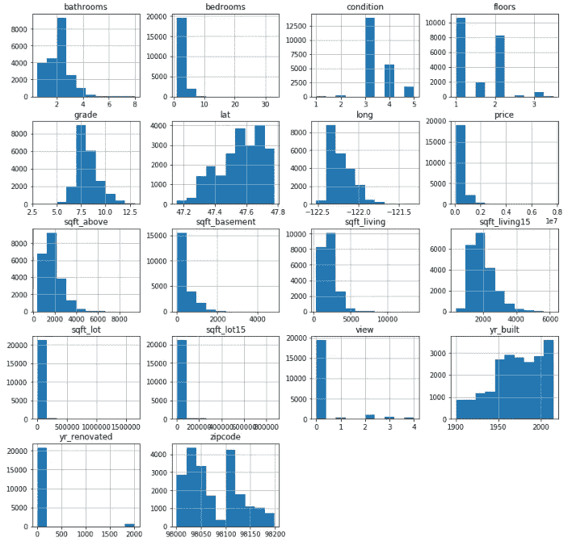
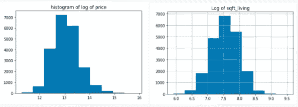
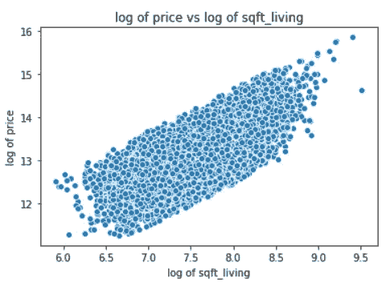
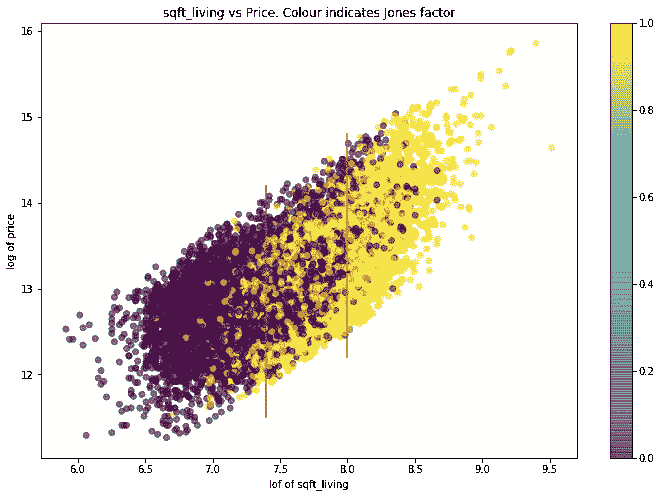
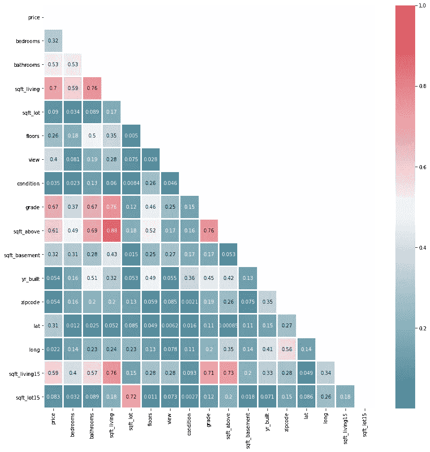
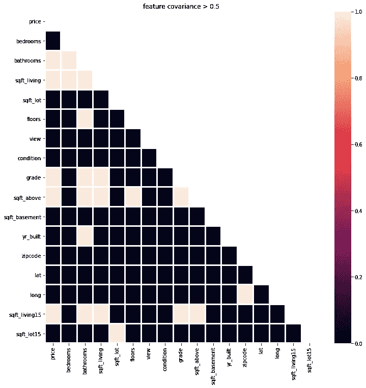

# 可视化您的探索性数据分析

> 原文：<https://medium.com/analytics-vidhya/visualizing-cea6e3be6ad5?source=collection_archive---------15----------------------->

这篇博文将使用国王郡房价数据集探索探索性数据分析的可视化方面。

在 github 上探索笔记本:[https://github . com/ktzioumis/DSC-1-final-project-online-ds-pt-112618/blob/master/student . ipynb](https://github.com/ktzioumis/dsc-1-final-project-online-ds-pt-112618/blob/master/student.ipynb)

探索性数据分析的很大一部分是可视化。数千行数据可以同时表示为点、线、条、区域和许多其他形式，这对于识别和探索数据集的趋势或重要方面非常有用。一旦数据集清除了缺失值，我们已经看到的探索性数据分析的第一步就是生成每个特征的直方图。到目前为止，我们的可视化是由 matplotlib.pyplot 生成的，有些使用了 seaborn。单独为数据集的每个要素生成直方图会非常重复，使用 for 循环来自动重复这些步骤是非常快捷的方式，但如果使用 pandas，效果会更好，只需使用命令 df.hist()即可完成

这是完美的，18 个直方图的一小段代码。可视化数据的第一步，现在我们可以决定如何处理数据。我们项目的最终目标是目标特征价格的普通最小二乘回归模型，我们使用的回归方法有一些假设，其中第一个假设是正态性。数据服从正态分布吗？我们刚刚生成的直方图是对正态性和偏斜的一个很好的视觉测试。通过这种可视化，我们可以对我们的特征集进行转换，以将数据变成我们想要的回归形状。Price 和 sqft_living 都经过对数变换，可以生成新的直方图来展示这种分布。

更适合正态分布，我们还可以绘制这两个特征的对比图，直观地表示它们之间的关系

这个散点图是使用 seaborn 而不是 matplotlib 生成的，以利用它们默认设置中的细微差异。Seaborn 使用蓝色圆圈周围的白色圆环作为默认设置，matplotlib 绘制普通的蓝色圆圈。这里的区别是，当数据密集和重叠时，matplotlib 版本创建了一个实心的蓝色块，而在 seaborn 版本中，每个数据点仍然是可识别的。还有其他方法可以使重叠数据更加明显。绘图时的“alpha”设置允许图形特征透明，因此重叠的数据点可以被看到，因为重叠产生了更明显的颜色。这在该数据的另一个散点图中使用，其中颜色编码用于制作代表第三个特征的 2D 散点图，有效地增加了第三个维度。

这是同一个情节！这次使用 matplotlib 生成了相同的散点图，并将第三个特征/维度“琼斯”特征添加到颜色中，以确定数据点的颜色。对于这个可视化，我只关心琼斯因子是正还是负，所以生成这个图的代码如下

plt.scatter(log_sqft_living，price_log，alpha=0.6，c=jones>0)

c 是色标映射函数。通过确定琼斯大于 0，而不仅仅是琼斯值本身，我将颜色的光谱切割成两种颜色的二元选择:紫色或黄色。并且通过传递 0.6 的 aplha 值，这些数据点重叠的地方更加明显，尤其是在两条红线之间的区域中，在该区域中存在紫色点和黄色点的混合。通过传递 commad plt.colorbar()将颜色条添加到绘图中，它允许全光谱的颜色差异，以便更细致地理解数据的 3D 内容，但这在本例中并不理想，如果不小心使用，作为绘图比例的全光谱可能会更令人困惑，而不是更有启发性。作为确定回归模型中 usd 因子的一部分，生成了每个特征相关因子的热图。

sns.heatmap(np.abs(corr)，线宽=2，mask=mask，cmap=cmap，annot=True)

在制作这张热图时，我意识到用颜色作为尺度会很困难。我试图尽可能地增加清晰度，这些方框用线宽分隔开，色标代表相关性的绝对值，但我仍然觉得有必要用它们的值来注释这些方框。取绝对值使数据在颜色上更具可比性。0.8 和-0.79 几乎离零一样远，但如果用红色和绿色来表示，就不可能区分哪个“这个比这个更绿？”。最后，虽然在选择功能时进行截止呼叫很重要，但如果我希望此图能快速告诉我我想知道的内容(哪些功能超出了截止范围),还有一种更简单的方法。

这就是了，黑白的。我再次在色域中使用了测定，这次是绝对数值相关系数是否高于 0.5

sns.heatmap(abs(corr)>.5，mask=mask，linewidths=2)

这就创建了一个简单易懂的热图。它告诉我们的不多，但它告诉了我们需要知道的，除此之外别无它物。这可能是最完美的视觉化