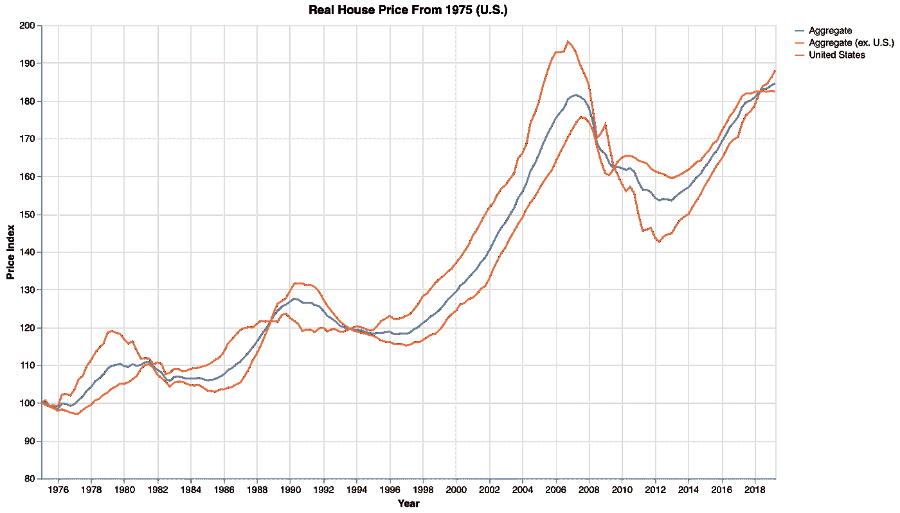
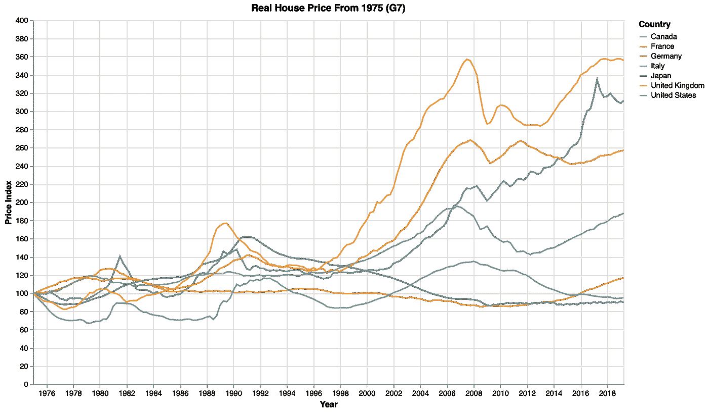
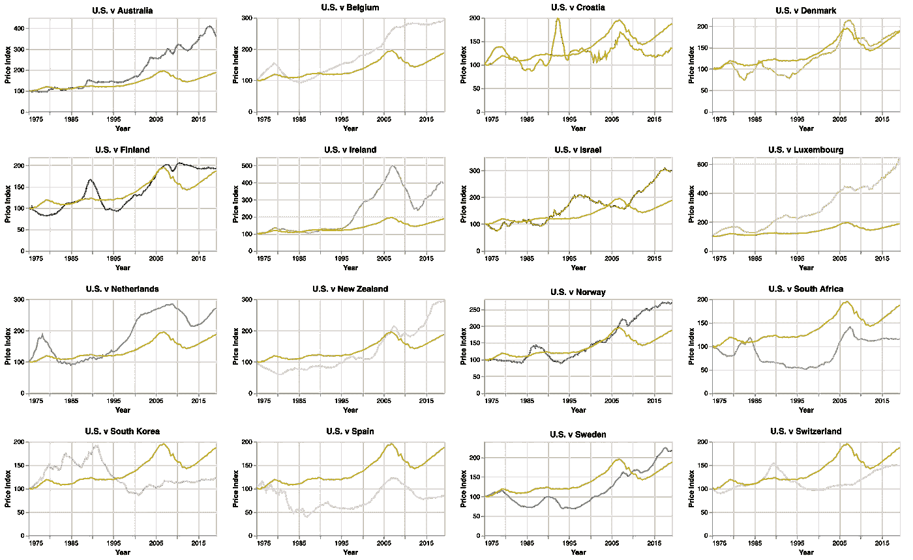

# 可视化国际房价变化

> 原文：<https://medium.com/analytics-vidhya/visualizing-changes-in-international-housing-prices-bc1536f45766?source=collection_archive---------13----------------------->

## 23 个不同的国家，包括所有的 G7，从 1975 年开始

数据取自国际房价数据库，由达拉斯美联储银行的全球化研究所每季度制作和更新。

下面的可视化反映了以下 23 个国家的实际(经通胀调整的)房价变化:澳大利亚、比利时、加拿大、瑞士、德国、丹麦、西班牙、芬兰、法国、英国、爱尔兰、意大利、日本、韩国、卢森堡、荷兰、挪威、新西兰、瑞典、美国、南非、克罗地亚和以色列。

对于每个国家，每个价格点都反映了一个季度的房价；这意味着每年有四个价格点，代表一年的四个季度。最老的价格点反映的是 1975 年一季度的房价(1975-Q1)，最近的一个显示的是 2019 年二季度的房价(2019-Q2)。

该数据集提供了所有这些价格点，索引到 2005 年。为了突出一开始的变化，我把它们重新编到了 1975 年第一季度。这意味着对于每个国家来说，1975 年 Q1 的价格指数是 100。因此，说美国 2006 年第四季度的价格指数为 195.66，相当于说从 1975 年第一季度到 2006 年第四季度，美国的实际房价上涨了 195.66%，几乎是两倍。

下面的折线图进一步说明了美国实际房价在过去 44 年中的变化，并将其与其余 22 个国家的总房价进行了比较。美国)和所有 23 个国家之间的另一个合计价格(合计)。

对于任何一个年度-季度时间戳，一组国家之间的总价格是当时这些国家房价的*加权平均值*。一个国家的权重相当于国际货币基金组织记录的 2005 年全球 GDP 中 T4 所占的百分比。(2005 年，这一份额根据该国的购买力平价(PPP)进行了重新调整。更多信息可在[这里](https://www.dallasfed.org/~/media/documents/institute/wpapers/2011/0099.pdf)找到。)

如需该折线图及其代码的互动版本，请点击[此处](https://observablehq.com/@duynguyen1678/visualizing-the-international-house-price-dataset-line-pl)。

美国的实际房价在 2006 年最后一个季度达到顶峰，反映了当时全国范围内的房地产泡沫，这是导致 2008 年金融危机的因素之一。

它在 2012 年第二季度达到低点，但此后一直保持上升。今年第二季度房价几乎是 1975 年第一季度的 1.9 倍。

看起来美国的价格变化也反映在总价格的变化上。这是因为美国经购买力平价调整后的 GDP 份额远远高于其他 22 个国家(2005 年为 20.7%，而排名第二的英国为 3.1%)。因此，美国的价格比其他国家的价格更有分量。

接下来的图像比较了美国和其他国家的价格变化。下面是一个折线图，记录了 G7 集团国家间的价格变化。

如需该折线图及其代码的交互式版本，请点击[此处](https://observablehq.com/@duynguyen1678/visualizing-the-international-house-price-dataset-line-pl)。

我们可以看到，美国在 2006-2007 年的崛起在英国、法国和意大利也(多少)可见。

美国房价的上涨是显著的，但绝不是最大的。2019 年第二季度，法国实际房价是 1975 年第一季度的 2.6 倍。对加拿大来说，这个数字大约是 3.1。英国的记录是 3.6——今年第二季度它的实际房价几乎是 44 年前的四倍*。*

与其他四个国家相比，日本、意大利和德国没有出现太多的价格波动。他们最近的季度价格和 44 年前差不多。

接下来，下面的线形图矩阵比较了美国和其余 16 个不属于 G7 的国家的房价变化。

对于用于创建该折线图矩阵的代码，请点击[此处](https://observablehq.com/@duynguyen1678/visualizing-the-international-house-price-dataset-line-pl)。

我们可以看到，除了英国、法国和意大利，美国在 2006 年至 2007 年的增长(甚至达到峰值)在比利时、克罗地亚、丹麦、芬兰、爱尔兰、卢森堡、新西兰、南非和西班牙也很明显。

有五个国家在 1975 年第一季度至 2019 年第二季度之间的价格变化明显小于美国:克罗地亚、南非、韩国、西班牙和瑞士。对于其他 11 个国家，价格变化明显更大或大致相等。

卢森堡是价格(指数)变化最大的国家——其 2019 年第二季度的房价是 1975 年第一季度的 6 倍多！

最后，下面的赛车条形图显示了自 1975 年以来价格变化最大的前 10 个国家-Q1，从 2000 年开始-Q1。根据联合国的惯例，条形的颜色代表该条形上国家的地理区域(或次区域，对于欧洲国家来说，只是因为数据集中有太多这样的国家)。

[链接](https://observablehq.com/@duynguyen1678/visualizing-the-international-house-price-dataset)到代码。颜色信息:黄色(亚洲)，红色(美洲)，蓝色(大洋洲)，绿色(北欧)，橙色(西欧)。

虽然我们的 23 个国家名单包括非洲(南非)和南欧(克罗地亚，意大利，西班牙)，非洲和南欧没有出现在这个赛车条形图。

卢森堡从 2001 年开始将其他国家甩在后面，并一直名列前茅。

你还注意到了什么？

感谢阅读！