# 可视化卷积神经网络[隐藏的真相]

> 原文：<https://medium.com/analytics-vidhya/visualizing-convolution-neural-network-the-hidden-truth-c825d69f1832?source=collection_archive---------20----------------------->

对计算机视觉、深度学习感兴趣的人，这可能很有见地


现在人们为计算机视觉任务建立各种复杂的神经网络，其中一个主要任务就是图像分类。但是如果你知道如何编码，制作一个模型是简单的，但是最终，你永远不知道网络里面有什么。这就像一个**黑盒**，你像**魔术**一样向其中输入并获得输出。当你实际传递一个特定的输入时，了解网络内部的实际情况是很重要的,**网络如何做出反应并产生有利的结果。**


这个博客将指导你使用最流行的机器学习库 [**Tensorflow**](https://www.tensorflow.org/) **来可视化你自己创建的模型。**本教程分为两部分:

**1。建立并训练一个模型**

**2。在内部可视化模型**

# 建立和训练模型

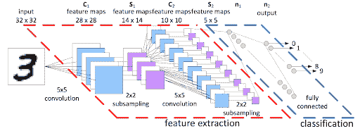

步骤 1:下载并处理数据

对于这个例子，我们将使用世界闻名的数字的 [MNIST 数据集](https://www.tensorflow.org/datasets/catalog/mnist)，也称为修改后的国家标准与技术研究所数据集，使它简单而简短。

**导入重要库**

```
import tensorflow as tf
import matplotlib.pyplot as plt
import random
import numpy as np
```

用于构建网络和数据集的 Tensorflow

用于绘制图形和可视化的 Matplotlib

Random 用于生成随机数

**下载数据**

```
mnist_data = tf.keras.datasets.mnist(train_images,train_labels),(test_images,test_labels) = mnist_data.load_data()print("No of training exapmles "+str(train_images.shape[0]))
print("No of Test exapmles "+str(test_images.shape[0]))
print("Shape of Each Image "+str(train_images[0].shape))'''
No of training exapmles 60000No of Test exapmles 10000Shape of Each Image (28, 28) 
```

查看图像

```
def disp():
    id = random.randint(0,train_images.shape[0])
    img = train_images[id]
    l = train_labels[id]
    plt.imshow(img)
    print("This is image of Number "+str(l))
disp()
```

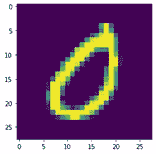

这是一个数字为 0 的图像

每个图像是 28×28 像素图像的 2d 阵列

**对输入数据进行预处理**

```
train_images=train_images.reshape(train_images.shape[0],28,28,1)/255test_images = test_images.reshape(test_images.shape[0],28,28,1)/255
```

这样做是因为 TensorFlow 中的 Conv2D 层接受图像的(高度，重量，1)形状，而不是(高度，宽度)

```
print("Shape of Each Image "+str(train_images[0].shape))'''
Shape of Each Image (28, 28, 1)
'''
```

现在，我们已经成功地改变了形状，并为向模型中发送输入做好了准备。相信我，这是机器学习中最关键的一步，总是验证输入的形状，并检查它是否与模型的输入形状相匹配，否则无论你做了什么，你做了多复杂，如果形状不对，一切都会崩溃

**第二步。制作模型**

```
model = tf.keras.models.Sequential()model.add(tf.keras.layers.Conv2D(filters=32,kernel_size=(3,3),activation='relu',input_shape=(28,28,1)))model.add(tf.keras.layers.MaxPool2D((2,2)))model.add(tf.keras.layers.Dropout(0.3))model.add(tf.keras.layers.Conv2D(filters=64,kernel_size=(3,3),activation='relu',input_shape=(28,28,1)))model.add(tf.keras.layers.MaxPool2D((2,2)))model.add(tf.keras.layers.Dropout(0.3))model.add(tf.keras.layers.Conv2D(filters=128,kernel_size=(3,3),activation='relu',input_shape=(28,28,1)))model.add(tf.keras.layers.MaxPool2D((2,2)))model.add(tf.keras.layers.Dropout(0.3))model.add(tf.keras.layers.Flatten())model.add(tf.keras.layers.Dense(128,activation='relu'))model.add(tf.keras.layers.Dense(10,activation='softmax'))model.summary()
```

Conv2D、MaxPool2D、Dropout、Dense、Flatten 是 TensorFlow [Keras](https://www.tensorflow.org/guide/keras) 实现给我们的基本积木。

# 我们的建筑

```
Model: "sequential"
_________________________________________________________________
Layer (type)                 Output Shape              Param #
=================================================================
conv2d (Conv2D)              (None, 26, 26, 32)        320
_________________________________________________________________
max_pooling2d (MaxPooling2D) (None, 13, 13, 32)        0
_________________________________________________________________
dropout (Dropout)            (None, 13, 13, 32)        0
_________________________________________________________________
conv2d_1 (Conv2D)            (None, 11, 11, 64)        18496
_________________________________________________________________
max_pooling2d_1 (MaxPooling2 (None, 5, 5, 64)          0
_________________________________________________________________
dropout_1 (Dropout)          (None, 5, 5, 64)          0
_________________________________________________________________
conv2d_2 (Conv2D)            (None, 3, 3, 128)         73856
_________________________________________________________________
max_pooling2d_2 (MaxPooling2 (None, 1, 1, 128)         0
_________________________________________________________________
dropout_2 (Dropout)          (None, 1, 1, 128)         0
_________________________________________________________________
flatten (Flatten)            (None, 128)               0
_________________________________________________________________
dense (Dense)                (None, 128)               16512
_________________________________________________________________
dense_1 (Dense)              (None, 10)                1290
=================================================================
Total params: 110,474
Trainable params: 110,474
```

仔细观察输出形状。这是我们模型的架构，不是一个花哨的模型，而是一个体面的模型。我在制作各种模型时了解到，内核的形状和过滤器的数量遵循一种简单的模式，这种模式似乎总是很好，将过滤器的数量增加 2 倍，并将内核大小保持为奇数

**第三步:最激动人心的一步，训练步骤**

```
checkpointer = tf.keras.callbacks.ModelCheckpoint(filepath="best_weights.hdf5",
monitor = 'val_accuracy',verbose=1,save_best_only=True)es=tf.keras.callbacks.EarlyStopping(monitor='val_loss',patience=2)model.compile(optimizer='adam',loss='sparse_categorical_crossentropy',metrics=['accuracy'])history=model.fit(train_images,train_labels,batch_size=128,
   validation_data=(test_images,test_labels),epochs=100,
   callbacks=[checkpointer,es])
```

这里我们使用一些 [**回调函数**](https://www.tensorflow.org/api_docs/python/tf/keras/callbacks) ，这是 TensorFlow 提供的最有用的工具，它帮助你在模型工作时与模型交互，而不是让你失去模型，如果出现任何问题，我使用的回调是 [**提前停止**](https://www.tensorflow.org/api_docs/python/tf/keras/callbacks/EarlyStopping) ，它帮助我在最大 2 个时期内验证损失没有变化时停止，这导致停止训练并避免过度拟合，我使用的另一个回调是 [**检查指针**你甚至可以在没有这个的情况下训练，但是当你对要设置的纪元数量感到困惑时，这个会有所帮助。我已经使用了最常见和最可靠的优化器](https://www.tensorflow.org/guide/checkpoint) [**Adam 优化器**](https://www.tensorflow.org/api_docs/python/tf/keras/optimizers/Adam) 。我故意使用稀疏分类交叉熵，因为我们的输出不是 1–10，它得到 1–10 的实际概率是(1x10)的输出大小，其中每个 no 是得到该数字的概率，例如[0.1，0.1，0.1，0.1，0.1，0.9，0.1，0.1，0.1]

这表明这个数字有 90%的可能性是 **6**

第四步:观看我们的火车模型

a.失败

```
plt.plot(history.history[‘loss’])
plt.plot(history.history[‘val_loss’])
plt.xlabel(‘Epochs’)
plt.ylabel(‘Loss’)
plt.title(‘Loss Graph’)
plt.legend((‘train’,’test’))
```

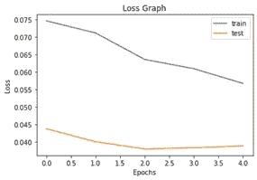

b.准确(性)

```
plt.plot(history.history[‘accuracy’])
plt.plot(history.history['val_accuracy'])
plt.xlabel('Epochs')
plt.ylabel('Loss')
plt.title('Loss Graph')
plt.legend(('train','test'))
```

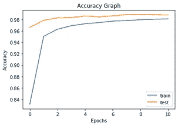

我们观察到，该模型相当不错，训练和测试准确率分别为 98.22 %和 98.9 %。看到损失后，你可能会说，训练和确认损失相差很大，这样够好了吗？但是观察左边的刻度，可以看到测试损失很小，这表明它概括得更好

**第六步:预测**

让我们做这个步骤，实际上是这个算法的任务，预测数字

```
def disp_pred():
 id = random.randint(0,test_images.shape[0])
 img = test_images[id]
 #print(img.shape)
 l = test_labels[id]
 plt.imshow(img.reshape(28,28))
 print("This is image of Number "+str(l))
 print("This is Predicted to be Number    "+str(np.argmax(model.predict(img.reshape(1,28,28,1)))))
disp_pred()'''
This is image of Number 5
This is Predicted to be Number 5
'''
```

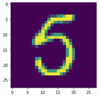

这是数字 5，预计是数字 5

# 现在让我们开始这篇文章所针对的步骤

第一步。我们首先要决定哪一层的激活我们想要可视化，并建立我们的激活模型。

例如，在我的架构中，从[0:8]，即从 conv2d 到 dropout_2d

```
Model: "sequential"
_________________________________________________________________
Layer (type)                 Output Shape              Param #
=================================================================
conv2d (Conv2D)              (None, 26, 26, 32)        320
_________________________________________________________________
max_pooling2d (MaxPooling2D) (None, 13, 13, 32)        0
_________________________________________________________________
dropout (Dropout)            (None, 13, 13, 32)        0
_________________________________________________________________
conv2d_1 (Conv2D)            (None, 11, 11, 64)        18496
_________________________________________________________________
max_pooling2d_1 (MaxPooling2 (None, 5, 5, 64)          0
_________________________________________________________________
dropout_1 (Dropout)          (None, 5, 5, 64)          0
_________________________________________________________________
conv2d_2 (Conv2D)            (None, 3, 3, 128)         73856
_________________________________________________________________
max_pooling2d_2 (MaxPooling2 (None, 1, 1, 128)         0
_________________________________________________________________
dropout_2 (Dropout)          (None, 1, 1, 128)         0
_________________________________________________________________
flatten (Flatten)            (None, 128)               0
_________________________________________________________________
dense (Dense)                (None, 128)               16512
_________________________________________________________________
dense_1 (Dense)              (None, 10)                1290
=================================================================
```

列出我们需要的图层

```
layer_outputs = [layer.output for layer **in** model.layers[0:8]]
activation_model = tf.keras.Model(inputs=model.input,
 outputs=layer_outputs)
```

步骤 2:我们现在从测试数据集中选择一个随机图像，我们将在其上使用我们的激活模型。

```
img = test_images[51].reshape(1,28,28,1)
```

步骤 3:我们现在使用我们的激活模型来输出所选层的激活。

```
activations = activation_model.predict(img)
```

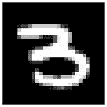

第四步:使用 Matplotlib 可视化每一层

图层的名称，这样您就可以将它们作为绘图的一部分

```
layer_names = []
for layer in model.layers[0:8]:
    layer_names.append(layer.name)
```

显示要素地图

```
images_per_row = 16for layer_name, layer_activation in zip(layer_names, activations):
    n_features = layer_activation.shape[-1]
    size = layer_activation.shape[1]
    n_cols = n_features 
    display_grid = np.zeros((size * n_cols, images_per_row * size)) for col in range(n_cols): 
        for row in range(images_per_row): channel_image = layer_activation[0,:, :,col *   images_per_row + row] channel_image -= channel_image.mean()
           channel_image /= channel_image.std()
           channel_image *= 64
           channel_image += 128
           channel_image = np.clip(channel_image, 0, 255).astype('uint8')
           display_grid[col * size : (col + 1) * size, row * size : (row + 1) * size] = channel_image
     scale = 1\. / size
     plt.figure(figsize=(scale * display_grid.shape[1],
     scale * display_grid.shape[0]))
     plt.title(layer_name)
     plt.grid(False)
     plt.imshow(display_grid, aspect='auto', cmap='viridis')
```

第一层

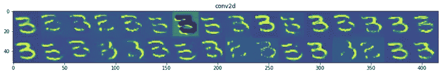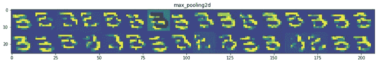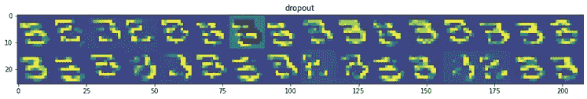

第二层

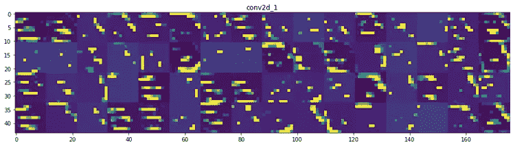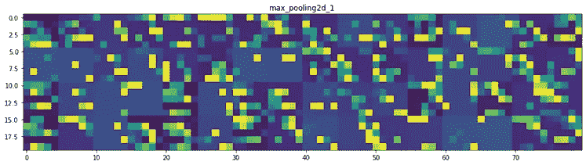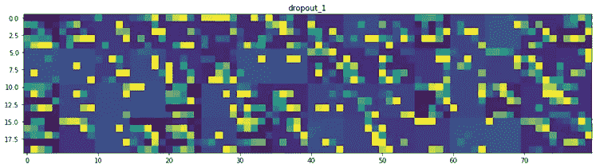

第三层

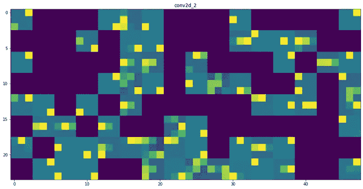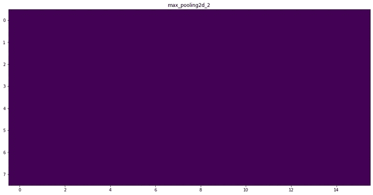

我们观察第 1、2、3 层中的所有滤镜，数量为 32、64、128 个滤镜，以及它们如何对数字 3 的图像做出反应

这实际上有助于可视化深层对图像的反应，以及这些特征实际上如何有助于给出预测

我希望这篇文章能帮助你理解卷积网络

快乐的深度学习