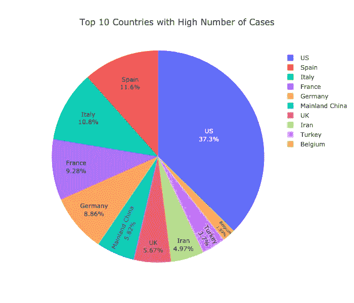

# 用 Plotly 可视化冠状病毒

> 原文：<https://medium.com/analytics-vidhya/visualizing-coronavirus-with-plotly-65ef0344e689?source=collection_archive---------42----------------------->

在本帖中，我们将通过 Plotly library 的不同情节，尝试使用 Kaggle 数据集来了解冠状病毒的传播，该数据集可在此处 找到 [**。**](https://www.kaggle.com/sudalairajkumar/novel-corona-virus-2019-dataset)

照片，Unsplash

我将向你展示我用 Plotly 创建的视觉效果，如 choropleth 图、条形图、饼图和线图。我会在帖子最后分享笔记本的链接。如果等不及，就链接 [**这里**](https://www.kaggle.com/jeandedieunyandwi/covid-19-ploty-visuals) ！ ***我们开始吧！***

# 创建 Choropleth 地图

Choropleth 地图用于可视化按地理区域分组的一些特征。可视化下的特定区域可以被加阴影或着色。使用 Choropleth Map，您可以制作静态和动态地图。现在，让我们看看动画图。这张地图的代码已经整理好，并包含在笔记本中。

很明显，这种病毒开始于一个国家(中国，武汉)，后来扩展到世界其他地方。

**注**:这张 gif 是 Giphy 做的。运行源代码看起来更清楚。

# 创建饼图

饼图是通过显示百分比来快速比较变量的良好视觉效果。在这里，我将使用饼图来显示国家之间的病例数差异。

通过饼图，我们还可以看到病例数最高的前 10 个国家如下。

到目前为止，美国有大量确诊病例。同样通过饼状图，我们可以对 2020 年 2 月至 4 月 12 日受影响较小的国家做同样的事情。

大多数受影响较小的国家都有或有少量病例，如也门有 1 例。大多是 4.35%的国家都有 1 例。您可以在 [**Worldometer**](https://www.worldometers.info/coronavirus/) 上验证更新的案例。

# 通过条形图显示的已确认病例数

我们将使用条形图来查看一段时间内确诊病例、死亡病例和康复病例的增加情况。让我们看看。

很明显，从 2 月 12 日到 15 日，全球确诊病例大幅增加。

看上面的图表，死亡率一直在上升。让我们看看恢复案例的相同情况。

正如我们所看到的，死亡和康复病例都在增加。这就是为什么建议呆在家里，以减少新病例日复一日的激增，因为一些人已经从病毒中完全康复。

# 比较 2020 年 2 月至 4 月 12 日的确诊、死亡和康复病例

线图通常用于比较比例特征的数量。我们可以很快看到一些东西。

现在可以清楚地看到确诊病例、康复病例和死亡病例的数量。同样，恢复的病例比失去生命的无辜者的数量持续增加。

感谢 Plotly 可视化，我们可以一目了然地看到所有这些差异。感谢阅读，源代码在 Kaggle 上 [**这里**](https://www.kaggle.com/jeandedieunyandwi/covid-19-ploty-visuals) 。

再次强调，呆在家里，保持安全，继续学习。我们都可以通过在我们的设备上给 Glen 在 Unsplash 上的这个很好的创造性工作打分来拯救彼此。

照片由 [Glen Carrie](https://unsplash.com/@glencarrie?utm_source=medium&utm_medium=referral) 在 [Unsplash](https://unsplash.com?utm_source=medium&utm_medium=referral) 上拍摄