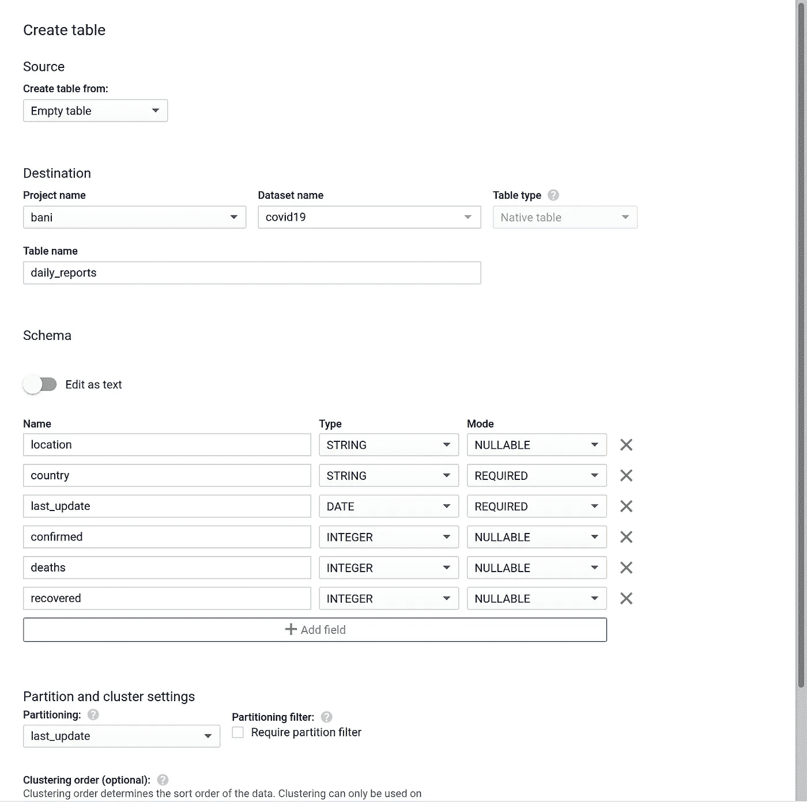
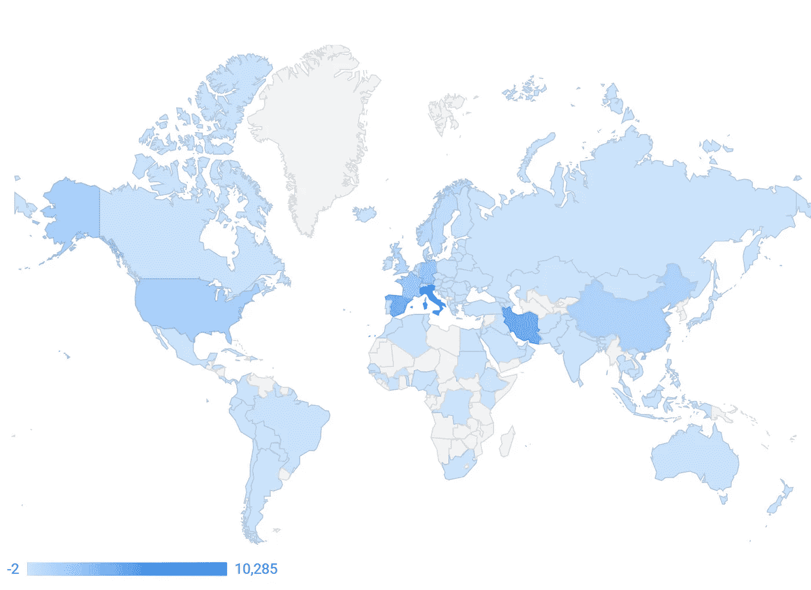

# 使用 BigQuery 和 Data Studio 可视化新冠肺炎数据

> 原文：<https://medium.com/analytics-vidhya/visualizing-covid-19-data-with-bigquery-and-data-studio-6b9f89f70bc2?source=collection_archive---------8----------------------->

你是否有兴趣探索关于冠状病毒的可用数据，搜索模式和关系，或者只是在社交距离遥远的时候开始一个有趣的项目？如果您已经对数据分析技术有所了解，在这篇简短的教程中，我将帮助您开始使用 BigQuery 和 Data Studio。您可以只使用 [GCP 自由层](https://cloud.google.com/free)来遵循这些步骤，并且您甚至不需要将计费帐户与您的项目相关联。

首先，创建一个 Google Cloud 帐户和一个项目。我们将使用来自约翰·霍普金斯大学系统科学与工程中心的数据，该数据可在 [GitHub](https://github.com/CSSEGISandData/COVID-19) 上获得，并遵循三个简单的步骤:

1.  创建一个表来保存我们的数据
2.  将 CSV 上传到 BigQuery
3.  准备要在 Data Studio 中使用的数据

所以让我们开始吧！

*3 月 30 日更新:本文旨在帮助您在公共数据不可用的时候开始使用 BigQuery。现在谷歌已经创建了一个* [*新冠肺炎公共数据集程序*](https://console.cloud.google.com/marketplace/details/bigquery-public-datasets/covid19-public-data-program) *，如果你愿意，你可以直接查询这些数据。*

# 创建表格

您可以查看存储库中的一个 CSV 文件[,以了解我们试图创建的表的结构。在这个例子中，我将跳过纬度和经度，它们在旧文件中不可用，也不需要在 Data Studio 中的地图上放置国家。](https://github.com/CSSEGISandData/COVID-19/blob/d5eab1b3657e70f55b9eb9eb7e475475dac445fb/csse_covid_19_data/csse_covid_19_daily_reports/03-14-2020.csv)

打开[谷歌云控制台](https://console.cloud.google.com/)，从左侧导航菜单的大数据下，选择 BigQuery。BigQuery 中的每个表都需要在一个*数据集*下，而数据集又在一个*项目*下。在左侧栏中选择您的项目名称，然后点击右侧的**创建数据集**。您只需在**数据集 ID** 下输入一个名称。我把我的叫做`covid19`。如果您没有设置计费，您将处于 BigQuery 的沙盒版本，并且在此数据集中创建的任何表都将在 60 天后过期。

当我开始考虑这个项目时，我不确定是否要创建一个[通配符表](https://cloud.google.com/bigquery/docs/querying-wildcard-tables)，因为我的源数据也被分割到单独的文件中，或者我是否要创建一个包含所有数据的单个表。在意识到使用通配符时查询结果不会被缓存后，我决定使用单个表。

选择您新创建的数据集，然后点击**创建表格**。在这里，您通常会从现有文件创建表，例如上传 CSV 或 JSON，但是现在我们将只定义一个空表的结构。给它起一个名字(我用的是`daily_reports`)，输入下面截图中的字段，我建议您在`last_update`上启用分区，当您在查询中使用该过滤器时，这可以真正帮助减少处理的数据量。



在 covid19 数据集下创建表 daily_reports

# 将数据加载到 BigQuery

对于下一步，您需要**激活 Cloud Shell，**位于搜索栏和标题帮助之间的图标。一旦您的会话开始，您应该运行以下命令来设置您的项目(用您的项目名称替换 *project_name* ):

`gcloud config set project *project_name*`

接下来，从 git 存储库下载数据，进入该文件夹，并为我们将用来使数据与 BigQuery 兼容的脚本创建一个新文件:

```
git clone [https://github.com/CSSEGISandData/COVID-19.git](https://github.com/CSSEGISandData/COVID-19.git)
cd COVID-19
touch merge_files.py
```

点击云壳上的**启动编辑器**，找到你新创建的`merge_files.py`。我们将使用该脚本将所有 CSV 文件合并为一个文件，将日期字段格式化为一致的值，并删除一些文件包含的不适合我们的表的额外列。我使用 Python 2.7 语法编写了这个文件，这是云 Shell 中可用的默认解释器。您可以复制并粘贴此[要点](https://gist.github.com/bani/aad9b544d2c61ced2134725422278aff)中的内容:

[完整文件的链接](https://gist.github.com/bani/aad9b544d2c61ced2134725422278aff)

您可以使用命令`python merge_files.py`从 shell 中运行该脚本，这应该会创建一个名为`data.csv`的文件。

现在我们已经准备好填充我们的表了！您将运行以下命令，用您使用的名称替换项目、数据集和表名称:

`bq load --source_format=CSV *project:dataset.table_name* data.csv`

示例:`bq load --source_format=CSV bani:covid19.daily_reports data.csv`

注意，在项目和数据集之间使用冒号(:)，而在数据集和表名之间使用点(。).片刻之后，您的数据就可以被查询了！现在可以关闭云壳了。如果您需要在更多数据可用后重新运行，您可以在命令行中包含`--replace`来覆盖该表。否则，它将追加内容，复制所有现有的数据。

# 准备数据

***更新*** *:从 3 月 22 日开始，美国各州的 CSV 文件中的数据变得更加精细，下面描述的转换不再是删除重复项的正确方法。我建议您仅将它用于该日期之前的数据。*

在您实际创建报告之前，我建议稍微研究一下数据，以了解实际存在的内容。很难找到一个干净易用的数据源，这个也不例外。

例如，乍一看，我以为我可以认为`location`、`country`和`last_update`的每个组合都是唯一的，但是结果发现在 CSV 文件中有许多重复的记录。这很容易用这样的查询来测试，如果我的假设是正确的，它不会返回任何记录:

稍加探究，你会很快注意到其他一些价值观也缺乏一致性。出于本例的目的，我决定修复一些国家名称的问题，并将所有内容聚合到该级别。如果你想做一些不同的事情，相应地调整。在另一个报告中，我查看了加拿大各省的结果，但是在旧的数据中，我在省列中找到了单个城市的名称，所以我不得不一个一个地替换。一些计算出来的指标也是有用的。在原始数据中，我只有累积的数字，这些数字不是完全累加的，所以我创建了新的列来保存每次更新的更改。数据还存在其他问题，如负面变化(即确诊病例总数一天比一天少)，但我认为这可以是一个良好的开端。

让我们用清理后的数据创建一个表。我们将使用数据定义语言，并从查询窗口运行它。复制并粘贴[中的内容，跟随](https://gist.github.com/bani/7a8a5f0f919f902f3537e33132e19c15)、**更新第 1 行和第 16 行**中的完整表格名称。

[完整文件的链接](https://gist.github.com/bani/7a8a5f0f919f902f3537e33132e19c15)

太好了，现在我们准备好报告了！打开[数据工作室](https://datastudio.google.com/)，选择**空白报表**。然后在右下角，点击**创建新的数据源**。在下一个屏幕中，选择 **BigQuery** ，在授权过程(如果需要)之后，您将能够找到您刚刚在项目下创建的表。选中表名，点击右上角的**连接**，然后**添加到报告**。

现在你应该回到报告页面，上面有你的第一个表(如果你想删除它，你可以选择并按 delete 键！).现在是你探索的时候了，但我会带你浏览第一张图表。点击**添加图表**，选择**地理地图**，然后点击您想要添加图表的页面位置。在右侧的**数据**选项卡中，将`country`拖放到**地理尺寸**，将`confirmed_new`拖放到**公制**。然后在**默认日期范围**中选择自定义，并选择开始和结束日期。您应该会得到这样的结果:



新新冠肺炎病例世界地图

现在，请尽情填充您的仪表板吧！分享您在下面的回答中找到的任何数据源或创建的仪表板。

# 承认

在看到 Joao Correia 的仪表板后，我有了探索这些数据的想法，他还向我分享了他的一些数据准备步骤。