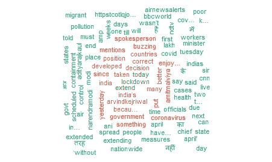
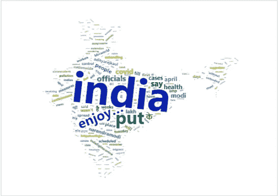
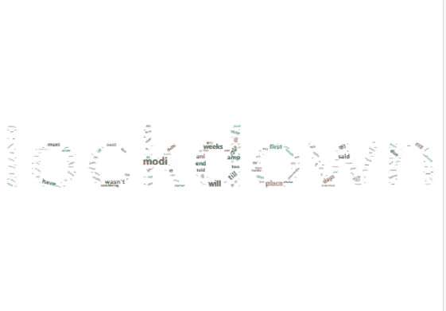

# 在 R 中使用 Wordcloud 可视化数据

> 原文：<https://medium.com/analytics-vidhya/visualizing-data-using-wordcloud-in-r-2f9d100946f4?source=collection_archive---------13----------------------->

在前一篇文章中，我对 twitter 数据进行了情感分析。链接可以在[这里](/@suyash.m20/sentiment-analysis-of-twitter-data-359fa9f86bd6)找到。在这篇文章中，我将使用 R 的“wordcloud”包来为大量的单词生成一个 wordcloud，并根据它们的大小和颜色来理解高频术语。

数据集:

我将使用推特上的数据来创建一个词云。

```
Tweet <- searchTwitteR('lockdown + india' , n=1000)
```

图书馆:

```
library(wordcloud)
library(tm)
library(SnowballC)
library(wordcloud2)
library(dplyr)
```

在安装了库并获取了 tweets 之后，下一步是清理数据集并将其转换成合适的格式。

1.  将 tweets 列表转换成一个向量，并对每个元素应用 getText 函数。
2.  然后，创建这个向量的语料库。

```
cleaned_text <-  sapply(Tweet, function(x) x$getText())
cleaned_text_corpus <- Corpus(VectorSource( cleaned_text))
```

3.删除停用词、标点符号和数字，并将语料库转换为术语-文档矩阵。

```
Tweet_cloud <- TermDocumentMatrix( cleaned_text_corpus,
               control = list(removePunctuation = TRUE, 
                              stopwords = TRUE , 
                              removeNumbers = TRUE))
```

4.为了将上面生成的稀疏矩阵转换成非稀疏矩阵，我们使用:

```
Tweet_cloud<- as.matrix(Tweet_cloud)
Tweet_cloud <- sort(rowSums(Tweet_cloud), decreasing = TRUE)
# high frequency terms appear first
```

5.最后，创建一个数据框架来查看结果。

```
Tweet_cloud.df = data.frame( word = names(Tweet_cloud) ,frequency = Tweet_cloud)
```

你可能需要删除一些无关紧要的词，比如:

```
Tweet_cloud.df <- Tweet_cloud.df %>% filter(!word %in% c("since","taken","buzzing"))
```

现在，要创建一个 wordcloud，调用 wordcloud 函数并传递以下参数:

```
wordcloud(Tweet_cloud.df$word , Tweet_cloud.df$frequency,min.freq=1,  scale = c(0.7,0.7) ,max.words = 500 ,  colors= brewer.pal(8,"Dark2"),random.color=FALSE, random.order=F)
```



出现在中间的单词出现频率更高。随着我们向外移动，频率降低。同样，单词的颜色随着频率的变化而变化。为了增强视觉效果，我们将使用另一个名为“wordcloud2”的软件包。

```
figPath <- "/Users/india.png" 

wordcloud2(Tweet_cloud.df , figPath = figPath  ,size = 1, color = 'random-dark')
```



在印度地图上可视化

具有较大尺寸的单词比具有较小尺寸的单词具有更高的频率。

```
letterCloud(Tweet4_cloud.df , word = "lockdown" , wordSize = 1 )
```



结论:

使用词云的优势在于，它有助于确定搜索词与数据框中出现的各种词之间的关系，从而有针对性地吸引更多受众。

因此，我们能够将过多的词语总结到一个框架中。“一图确实胜过千言万语”！*(本例中为 2k)*