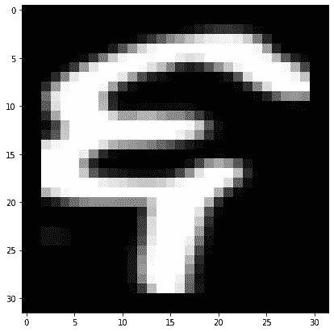
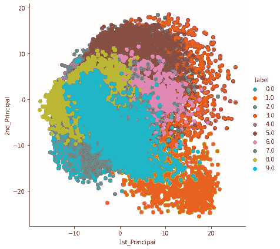

# 使用主成分分析和 TSNE 可视化梵文数字(第 1/2 部分)

> 原文：<https://medium.com/analytics-vidhya/visualizing-devanagari-numerals-using-pca-and-tsne-pt-1-2-df15d343bddf?source=collection_archive---------19----------------------->


凯文·Ku 在 [Unsplash](https://unsplash.com?utm_source=medium&utm_medium=referral) 上的照片

主成分分析(PCA)和 TSNE 是机器学习中最常用的降维技术，后者更有效。

除了用于降低维度，我们还可以利用其强大的功能在 2D 和 3D 中可视化多维数据集。所以事不宜迟，让我们开始吧。

# 数据集概述

该数据集包含由 20000 幅图像[32 x 32 px]组成的梵文数字。

从可视化的角度来看，我们有:

*   1024 个灰度级(0 到 255)像素值的输入特征。
*   对应于数字图像的类别标签。
*   列“字符”代表对应于每个图像的梵文字符名称。

这可能看起来有点吓人，但相信我，我们不会在这里使用任何火箭科学，这都是简单的数学

[](https://www.kaggle.com/dipbazz/devanagari-numerals-datasets) [## 梵文数字数据集

### Kaggle 是世界上最大的数据科学社区，拥有强大的工具和资源来帮助您实现您的数据…

www.kaggle.com](https://www.kaggle.com/dipbazz/devanagari-numerals-datasets) 

# 主成分分析

主成分分析可以被认为是将大维度的数据投射到较小的维度上，使得在这个过程中丢失的信息最少。在我们的例子中，我们将尝试建立一个二维空间，这样在投影这些点时，丢失的信息最少。用数学术语来说，我们必须找出方差最大的向量。

尽管我们可以使用内置的 scikit-learn 库来执行可视化，但让我通过执行幕后发生的所有数学运算来带您了解整个过程。

但是首先让我们加载数据集，并通过使用简单的 python 库来更好地了解它。(*跟着它会很有趣*)

```
import numpy as np
import matplotlib.pyplot as plt
import pandas as pd

data_set=pd.read_csv('./digit_data.csv')  #load the digit datasetprint(data_set.head(5))  #printing out first 5 rows of the dataset
```

这里没有什么特别的，我们刚刚加载了数据集并打印了前五行，因为您会很快注意到我们有 1027 个要素，其中 1024 个是像素值，3 个要素或多或少类似于分类标签，因此我们将使用其中一个要素并删除其余的要素。

```
labels=data_set['labels']  #storing the class labels into labels #drop all other class labels
data=data_set.drop(['labels','devanagari_labels','character'],axis=1)
```

此外，让我们通过绘制灰度图像来查看我们的数字。您可以通过更改“num”的值来绘制不同数字的图像，从而对代码进行修改。(*你可以跳过这一部分，但这有什么好玩的呢)*

```
plt.figure(figsize(7,7))
num=12000
grid_data=data.iloc[x].to_numpy().reshape(32,32)plt.imshow(grid_data,interpolation='none',cmap='gray')plt.show()print(label[num])  # printing the class of digit [0-9]
```



数字 6 的梵文数字

## **栏目标准化**

我们现在将对数据进行列标准化，使平均值和方差变为 0 和 1。列标准化有很多内容，我们不可能在这里介绍！所以，继续前进！

```
from sklearn.preprocessing import StandardScaler
standardized_data=StandardScaler().fit_transform(data)
```

## 救援的特征向量

现在手头的问题是提出方差最大的 2 维空间，即关于数据的最大信息将被保留。

结果是协方差矩阵的特征向量保留了最大方差。保留的信息量取决于本征向量的本征值，即较高的本征值表示较高的信息量。我们将利用这个性质得到我们的二维空间。

```
from scipy.linalg import eigh 
sample_data=standardized_data #calcualting the covariance matrix
covar_matrix=np.matmul(sample_data.T,standardized_data)values,vectors=eigh(covar_matrix,eigvals=(1022,1023))vectors=vectors.T
```

准备好我们的二维空间后，我们将把我们的数据点投影到这个平面上，以获得将用于 PCA 可视化的更新的点。

```
#***projecting onto the 2 dimensional plan***
new_coordinates=np.matmul(vectors,sample_data.T)new_coordinates=np.vstack((new_coordinates,labels)).T
```

瞧吧！我们已经完成了，现在让我们把这些点标出来，想象一下我们的努力。

```
import seaborn as sns#**creating the dataframe from new coordinates**dataframe=pd.DataFrame(data=new_coordinates,columns=("1st_Principal","2nd_Principal","label"))sns.FacetGrid(dataframe,hue='label',height=6).map(plt.scatter,'1st_Principal','2nd_Principal').add_legend()plt.show()
```



梵文数字的 PCA

我们将在下一篇文章中研究 TSNE 可视化，您将会惊讶地看到绘制在 7x7 图表上的信息量。

[](/@shuklapoornendu/visualizing-devanagari-numerals-using-pca-and-tsne-pt-2-2-3359f08dda94) [## 使用主成分分析和 TSNE 可视化梵文数字(第 2/2 部分)

### 在我们开始之前，如果你是第一次看到这篇文章，那么请看看这篇文章的第一部分…

medium.com](/@shuklapoornendu/visualizing-devanagari-numerals-using-pca-and-tsne-pt-2-2-3359f08dda94) 

## 结论

虽然，上面的图看起来有点模糊和随机，但有几件事，人们可以通过看它推断出来:-

*   我们的数据集中的大多数点被分组在一起，即所有的 1 形成一个定义明确的簇，并且对于大多数点也是如此。
*   似乎有数据点在彼此之上的插值，因此我们不能真正区分所有的 2 是否正在形成任何簇。
*   关于代表 7 的数据点的信息几乎可以忽略不计。

PCA 并没有真正考虑到点之间的邻域属性，因此我们无法确定聚类中点的一致性。