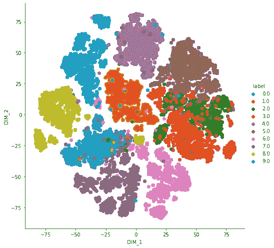

# 使用主成分分析和 TSNE 可视化梵文数字(第 2/2 部分)

> 原文：<https://medium.com/analytics-vidhya/visualizing-devanagari-numerals-using-pca-and-tsne-pt-2-2-3359f08dda94?source=collection_archive---------32----------------------->


弗兰基·查马基在 [Unsplash](https://unsplash.com?utm_source=medium&utm_medium=referral) 上拍摄的照片

在我们开始之前，如果你是第一次看到这篇文章，那么请看看这篇文章的第 1 部分，以便更好地理解。

[](/analytics-vidhya/visualizing-devanagari-numerals-using-pca-and-tsne-pt-1-2-df15d343bddf) [## 使用主成分分析和 TSNE 可视化梵文数字(第 1/2 部分)

### 主成分分析(PCA)和 TSNE 是一些最常用的降维技术在…

medium.com](/analytics-vidhya/visualizing-devanagari-numerals-using-pca-and-tsne-pt-1-2-df15d343bddf) 

# t 分布随机邻居嵌入

TSNE 是另一种惊人的降维技术，其结果相对优于主成分分析。在正式的音调中，t-SNE 算法由两部分组成

*   首先，t-SNE 在一对高维对象上构建概率分布，使得相似的对象被分配较高的概率，而不相似的点被分配非常低的概率。
*   第二，SNE 霸王龙在低维平面(2D/3D)定义了类似的分布，并试图在更低的维度上复制这种行为。

这可能有点让人不知所措，因此让我用简单的话来说。

你可以把它想成类似于点从高维到低维的投影，但是这里我们试图保持点的邻域属性。即几何上较近的点被投影在一起，而较远的点以类似的方式被投影。

在我们的上一篇文章中，通过进行列标准化和其他标准数据清理技术，我们已经完成了总工作量的 80%，因此我们将从我们离开的地方继续。

好吧，那么，因为我们清楚我们的基本知识，所以我们将简单地从 sklearn 导入 t-SNE。

```
from sklearn.manifold import TSNE
data_full=standardized_data[:,:]
model=TSNE(n_component=2,random_state=0)
tsne_data=model.fit_transform(data_full)
tsne_data=np.vstack((tsne_data.T,labels)).T
```

这里，我们从 sklearn 库中导入了 TSNE 模型，并将我们的数据从 1024 维减少到简单的二维坐标。尽管它看起来像是，但它实际上只用了 5 行代码就完成了，我仍然建议您浏览一下所使用的每个函数的文档。 ***(t-SNE 涉及了大量的数学知识，所以我们现在跳过它)***

```
tsne_df=pd.DataFrame(tsne_data,columns=('DIM_1','DIM_2','label'))sns.FacetGrid(tsne_df,hue='label',height=7).map(plt.scatter,'DIM_1','DIM_2').add_legend()plt.show()
```

没有什么奇特的，我们只是形成数据框架，并绘制到我们的二维平面图。



代表梵文数字的 t-SNE

## **结论**

上面的图完全符合预期，这里有几件事情值得注意

*   大多数集群被很好地定义，即几乎没有集群在彼此之上的叠加
*   对应于数字 7 的簇很少散开，并且在簇内形成很少的簇。

由于 TSNE 的工作原理是保持点的一致性，因此上面的图给出了高维空间中实际集群的一个很好的概率表示。