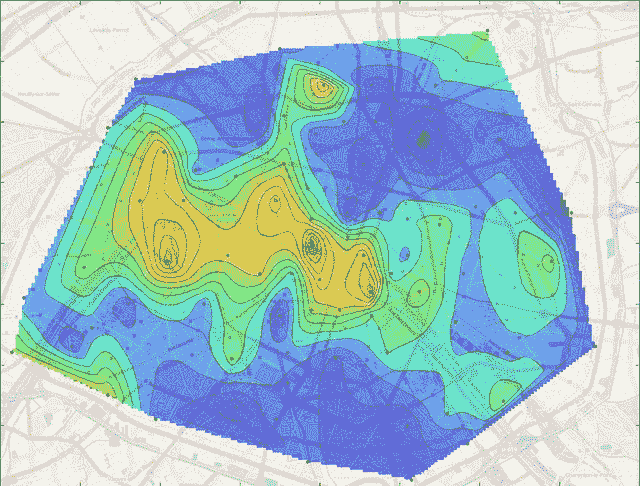
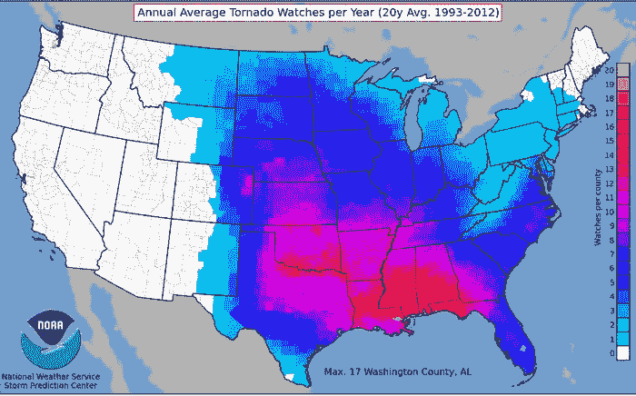
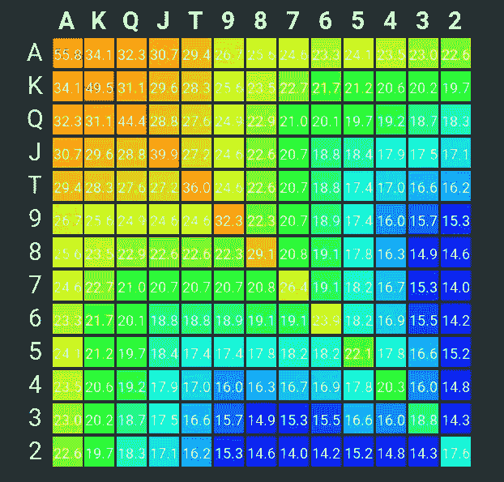
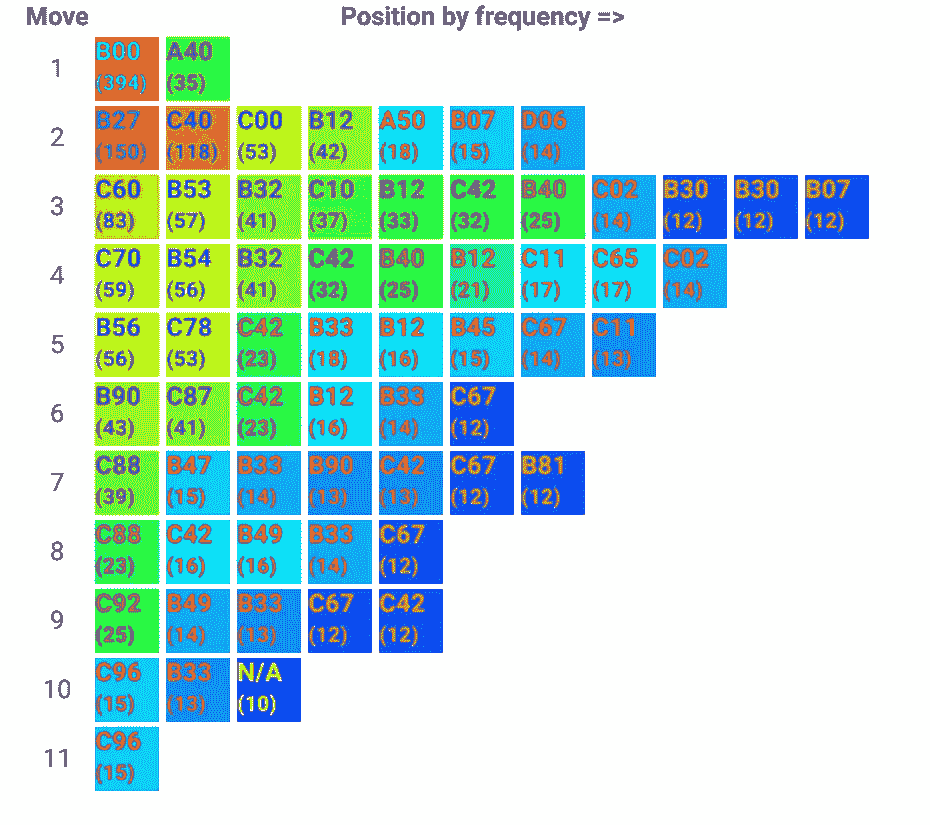
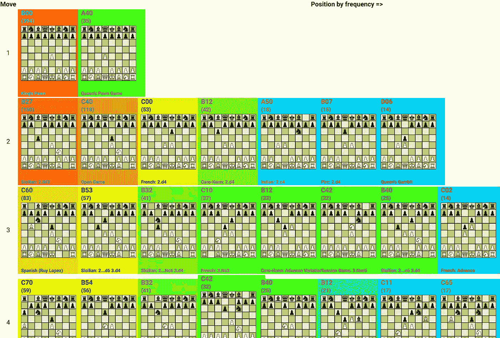
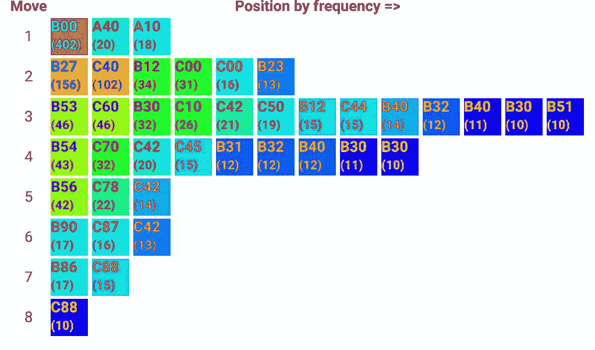
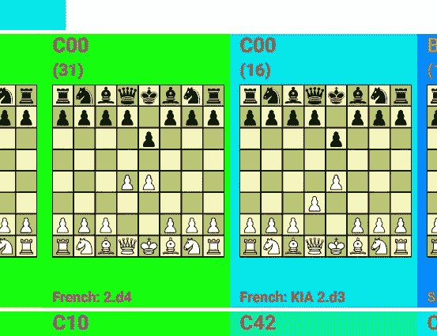
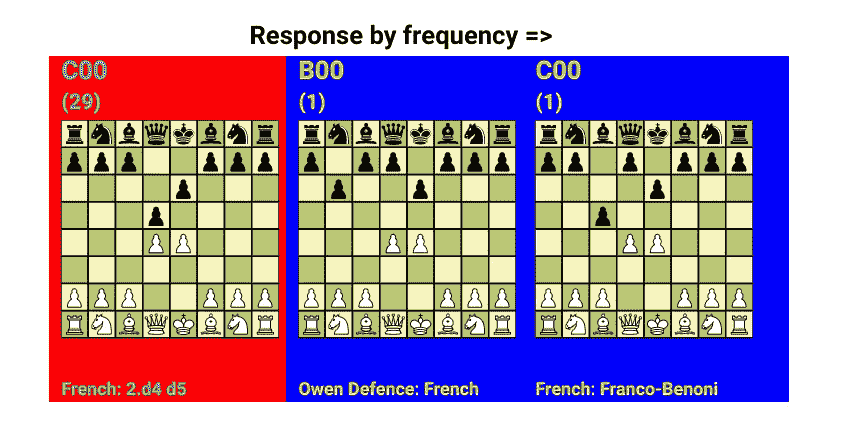
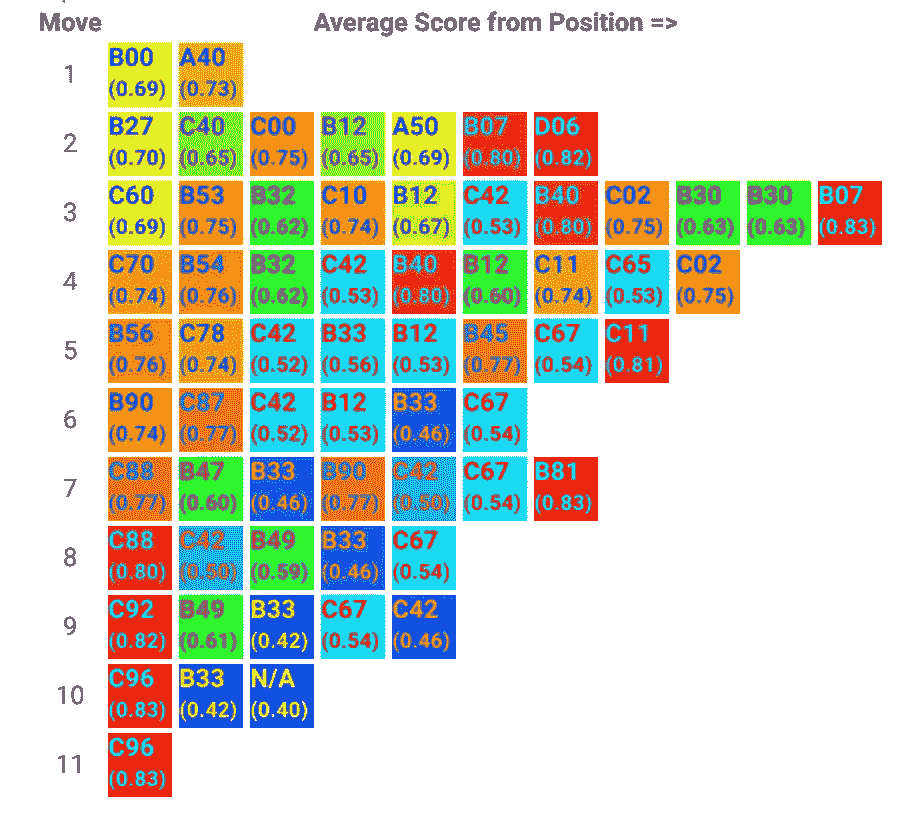

# 可视化特级大师开口

> 原文：<https://medium.com/analytics-vidhya/visualizing-grandmaster-openings-bd2cc3b9cd87?source=collection_archive---------17----------------------->

巴黎照片拍摄地点的热图

# 什么是数据可视化？

任何使用图表来说明数字或其他数据的人都练习过数据可视化。这篇文章将讲述一种被称为[热图](https://www.lexico.com/definition/heat_map)的特定数据可视化技术。

热图使用颜色和位置来表征数据。该数据可能是关于[实际热量](https://www.weathercentral.com/weather/us/maps/current_temperatures.html)(温度)，但是其作为数据可视化工具[的应用不限于](https://www.businessinsider.com/where-tornadoes-strike-the-us-most-often-2014-4)特定类型的数据。

# 示例:扑克赔率热图

我对热图的第一个实际应用是[可视化德州扑克](https://pokermap.netlify.com/)中的扑克赔率。在这种扑克变体中，玩家在牌局开始时会拿到两张牌面朝下的底牌。任何两张底牌最终赢得这手牌的几率有多大？有一些变量会影响赔率，例如玩家人数以及底牌是否是同一花色。有五名玩家和同花底牌，下面是热图形式的赔率:

# 象棋游戏数据的可视化

可以使用热图来可视化与国际象棋相关的数据，例如一位特级大师的开局曲目。为此，我下载了 PGN 的文件并分析了每场比赛的比分。对于第一个 18 步棋，我生成了一个 FEN 字符串，它编码了棋子在移动后的位置。

虽然开局可以被认为是一系列的走法，但在这种情况下，走法之后的每个位置都与开局数据库中的一个开局相关联(如果存在的话)。每场比赛的前 18 个完整动作都要这样做。例如，移动序列:

1.d4 d5 2.c4…

和

1.c4 d5！？2.d4…

会导致相同的位置，这个位置被认为是女王的策略。后面一套招式一开始是英国人也没关系。每一个新的移动都导致一个新的位置，反过来又与一个开仓变动(如果存在的话)相关联。

# 希罗夫和莫罗泽维奇的游戏

测试使用热图来可视化游戏开场的想法不需要大量数据，所以我从两个 pgn 文件开始，这两个文件包含了大师阿列克谢·希罗夫和亚历山大·莫罗泽维奇的游戏，总共大约有 1000 个。这些比赛在 1990 年到 2006 年间举行。对于一本开放的书，我基于一个扩展的 [ECO](https://en.wikipedia.org/wiki/Encyclopaedia_of_Chess_Openings) 编码，称为 [SCID](http://watfordchessclub.org/images/downloads/scid.eco) 。

奥运会和开幕式产生的数据存储在“云中”的数据库中。这些数据被用作我将要展示的热图的基础。

# 映射出现频率

这两位大师在他们的游戏开局中遇到任何位置的几率有多大？早期的头寸会更频繁地出现，后期的头寸也会再次出现。以下热图仅显示了每位特级大师在游戏数据中至少出现 10 次的位置数据。

# 总经理 Shirov 的开场白

玩家可以是白人也可以是黑人。首先，让我们将 Shirov 的空缺映射为白方玩家。

首先要注意的是，这一时期的希洛夫要么演奏 e4 (B00，394 次)，要么演奏次数少得多的 d4 (A40，35 次)。红色表示某个位置出现次数较多，蓝色表示出现次数最少。

# 扩展地图

如果你像我一样，你不记得开放和生态代码指的是什么，所以让我们扩展热图:

这种可视化占据了更多的屏幕空间，但是你不必记住，比如说，C00 是法国的防御。

# 总经理莫罗泽维奇的开场白

通过使用压缩地图，人们可以很容易地比较通用莫罗泽维奇对通用希罗夫的开场曲目；这是莫罗泽维奇的热图:

很快我们就看到莫罗泽维奇通过偶尔插入英语开场白(A10)将它稍微混合了一下。此外，第二行(移动 2)显示两个首席运营官(法国国防)广场，而希洛夫只有一个。怎么回事？嗯，ECO 代码没有那么具体，同一个代码可以包含两种变体。通过展开地图，可以看出不同之处:

啊！莫罗泽维奇偶尔喜欢回应 2.d3 而不是 2.d4，而希罗夫则一直打 2.d4。

# 响应的映射频率

有可能进一步向下钻半层，看看对一个动作的反应。以下是莫罗泽维奇在法网 2.d4 后遇到的对手的回应:

除了两个对手之外，莫罗的所有对手都选择进入法国防守，做出了 2…d5 的回应，但在一个案例中，开场转换为欧文防守，另一个则是法国人的弗朗哥-贝诺尼变化。

# 成功的映射频率

最后一件要检查的事情是，一个开端导致成功结果的频率。再次查看 Shirov 的空缺，我可以切换地图，根据平均分对每个空缺位置进行颜色编码:

起初似乎很奇怪的是，Shirov 的平均得分较高，而他遇到的空位较少(右侧和底部)。这是为什么呢？难道他不想打出一个得分更高的开局吗？

有几种可能的解释。例如，B07 是 Pirc 手牌，可能比 C60(Ruy Lopez)的黑色手牌更难打开。很少出现一个位置也意味着任何一场比赛的结果对平均得分有更大的影响。

# 结论

一些有趣的象棋相关的可视化可以用热图来完成。希望在以后的帖子里探讨更多的思路。