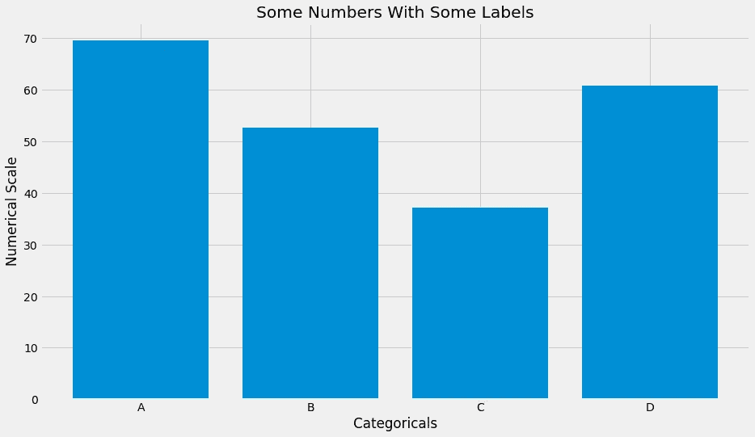
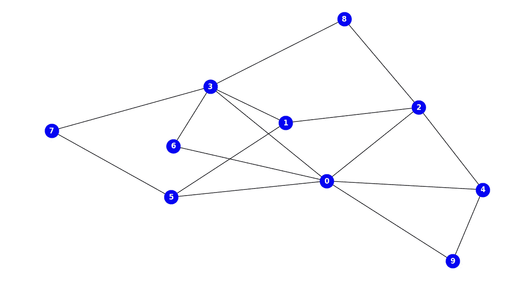
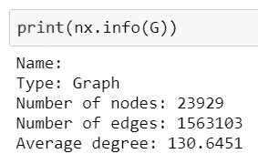
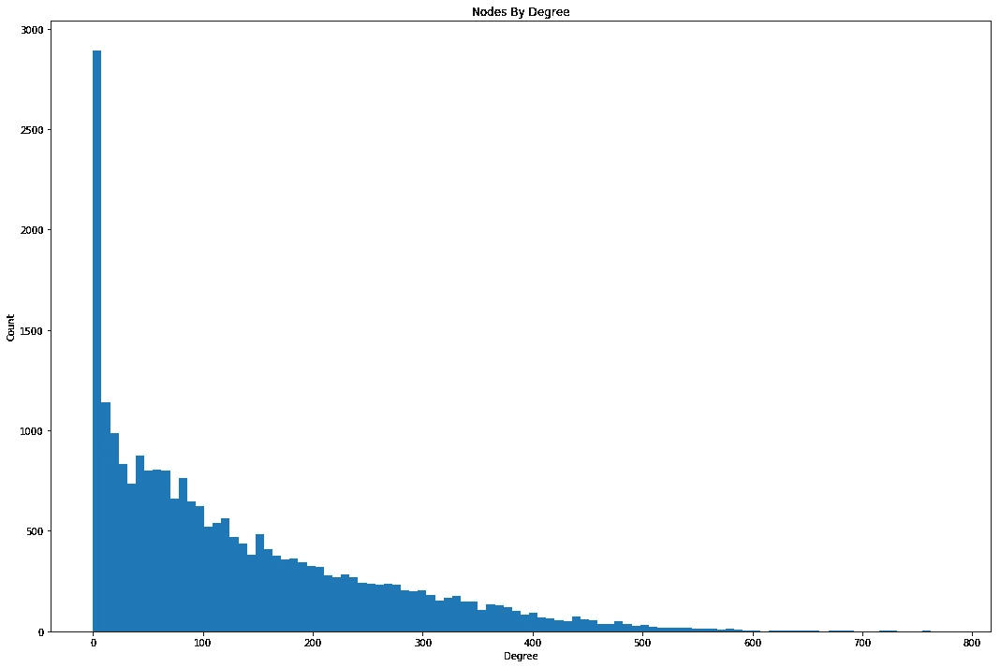
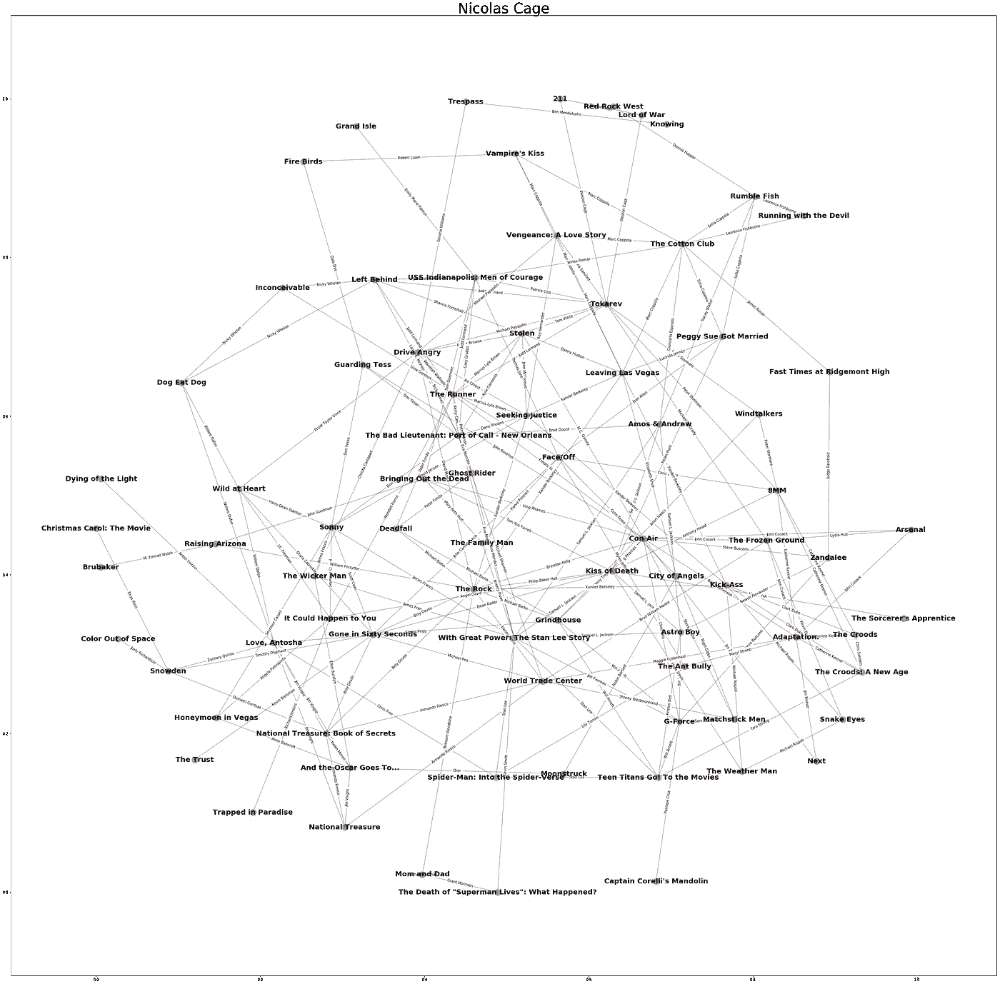
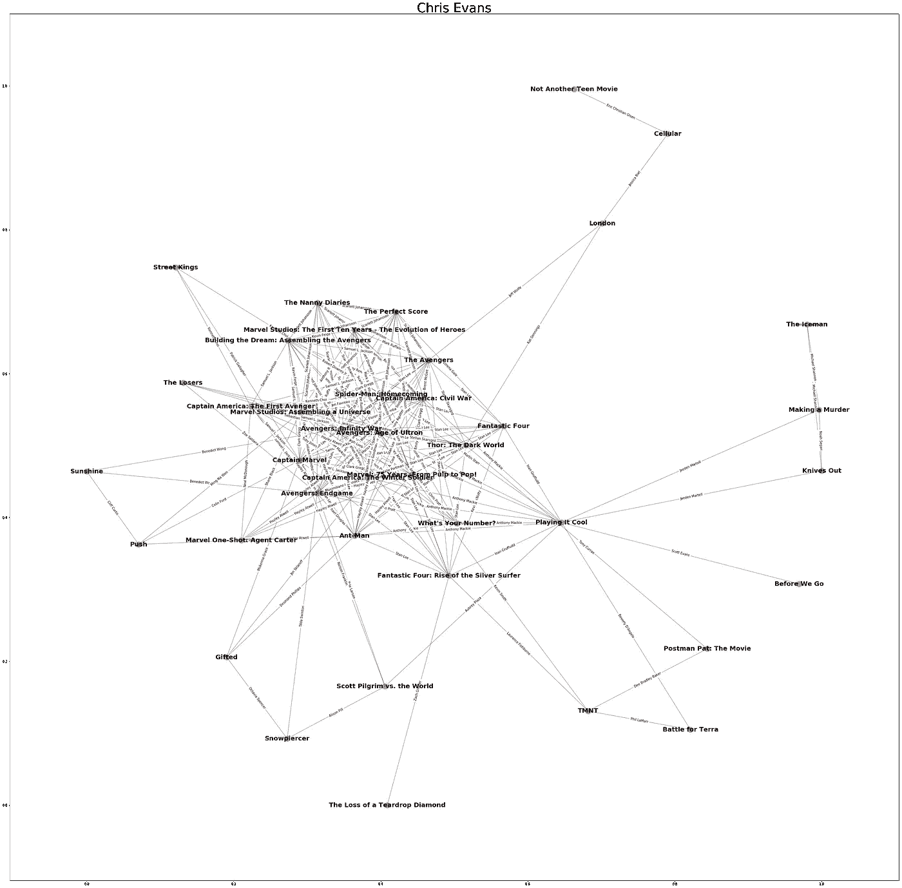
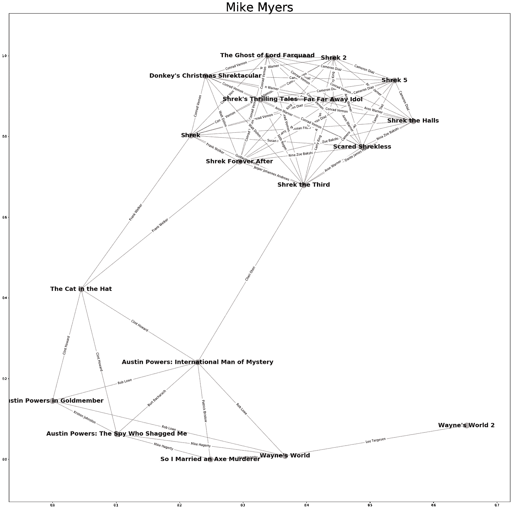
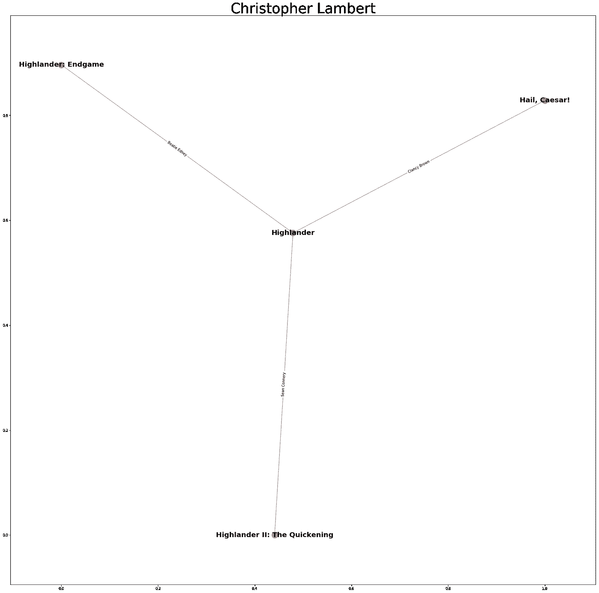

# 可视化好莱坞网络

> 原文：<https://medium.com/analytics-vidhya/visualizing-hollywood-network-with-graphs-5f4bd2f2e49c?source=collection_archive---------21----------------------->

大多数时候，当人们想到图表时，他们会想到这样的东西:



在数据科学的普通术语中，这也是我们的意思，大多数时候，当有人要求“数据图表”时，这就是他们的意思。

但是还有另一个意思，当形象化时，它看起来更像这样:



图中的图。

从这个意义上来说，我们不是在谈论视觉化，而是在谈论我们在上面视觉化的关系。

这里，图被定义为“边”和“节点”的集合。每个节点(上面用蓝色显示)代表某种预先确定的对象，每个边(上面用黑色显示)代表这些对象之间的关系。

在浏览互联网的过程中，您会遇到一些常见的图表示例，包括:

*   **脸书的“社交图”**:每个节点都是一个用户，一条边表示他们是否相连。在脸书的例子中，我们称之为*无向图*，因为两个用户必须是彼此的朋友，关系才能存在。
*   **Twitter 的关注图:**同样，每个节点都是一个用户，但是边代表“关注”。我们称之为有向图，因为用户可以跟踪某人而不会被跟踪回来。例:[比尔盖茨](https://twitter.com/BillGates)有 52.4M 的输入边沿，只有 240 个输出边沿。
*   **谷歌的互联网图:**其中每个节点都是一个网站，每个边都是从一个网站到另一个网站的链接。事实上，正是这个公式让谷歌开发了他们搜索引擎的核心， [PageRank](https://en.wikipedia.org/wiki/PageRank) ，这是网络分析中一个非常有趣的话题。

现在我们已经有了一个简单的介绍，让我们通过一个例子来看看我们可以用图表做什么！由于我无法访问任何这样的大型数据集，我将创建一个好莱坞的图表！也就是一个网络，每个节点就是一部电影，它们之间的边就是它们共有的演员。通过这样做，我们将能够看到不同演员的电影之间的联系，以及使我们能够找到电影之间的联系，你不会想到的。

首先看看我们的图表实际上是什么样子。



你可以看到，我们已经推出了大约 24k 部电影，所有这些电影之间有 160 万个链接。注意:如果两部电影共用多个演员，我们只记录一个链接。

这里的度是指电影之间的联动次数。例如，在我们的用例中，一部电影的等级是原电影中的演员所在的其他电影。学位越高，这部电影就越有可能要么拥有大量的明星力量，要么拥有极其广泛的演员阵容。



度数最高的电影最后[两个都有！凭借约翰·特拉沃尔塔、布鲁斯·威利斯、乌玛·瑟曼、文·雷哈米斯和哈维·凯特尔等演员，难怪《低俗小说》获得第一名。](https://www.themoviedb.org/movie/680-pulp-fiction)

**电影联动**

我们要做的第一件事是经典的[六度凯文·贝肯](https://en.wikipedia.org/wiki/Six_Degrees_of_Kevin_Bacon)的修改版。然而，我们不是找到演员之间的联系，而是找到电影之间的联系。具有反转的边和节点的图的相反公式将容易允许原始公式。

通过查看两个节点之间的最短路径，我们可以列举连接。先说低俗小说，还有另一部大片《星球大战》！

```
Finding link from Pulp Fiction to Star Wars

Link from Pulp Fiction to The Lion King is Phil LaMarr
Link from The Lion King to Star Wars is James Earl Jones
```

用我们看到的随机样本生成另外几个:

```
**Finding link from The Veil to The Grand Budapest Hotel**
Link from The Veil to Little Fockers is Jessica Alba
Link from Little Fockers to The Grand Budapest Hotel is Harvey Keitel**Finding link from Hamilton to Bernie the Dolphin**
Link from Hamilton to Velvet Buzzsaw is Daveed Diggs
Link from Velvet Buzzsaw to Arkansas is John Malkovich
Link from Arkansas to Bernie the Dolphin is Patrick Muldoon**Finding link from Sabotage to RockNRolla** Link from Sabotage to Wrath of the Titans is Sam Worthington
Link from Wrath of the Titans to RockNRolla is Toby Kebbell**Finding link from Saw VI to Dallas Buyers Club**
Link from Saw VI to Highway is Mark Rolston
Link from Highway to Dallas Buyers Club is Jared Leto**Finding link from Mulholland Drive to Joker**
Link from Mulholland Drive to To Die For is Dan Hedaya
Link from To Die For to Joker is Joaquin Phoenix**Finding link from Rogue Warfare to The Time Machine**
Link from Rogue Warfare to Warrior is Fernando Chien
Link from Warrior to Abduction is Denzel Whitaker
Link from Abduction to The Time Machine is Richard Cetrone
```

我们还可以在图中搜索“最长最短路径”，也就是两部相连的电影之间具有最长的最佳链接。原来这是从孟加拉浪漫剧《Kishmish》到马来西亚动作片《Paskal》的链接，13 个链接。不过，最长最短路径的中间值只有 8 个链接，这说明了大多数电影的联系是多么紧密。

```
**Finding link from Kishmish to Paskal** 
Link from Kishmish to Tonic is Dev
Link from Tonic to Maya Kumari is Rajatabha Dutta
Link from Maya Kumari to Bela Shuru is Rituparna Sengupta
Link from Bela Shuru to   is Soumitra Chatterjee
Link from   to Mississippi Masala is Sharmila Tagore
Link from Mississippi Masala to Mimic is Charles S. Dutton
Link from Mimic to Stuber is Mira Sorvino
Link from Stuber to Headshot is Iko Uwais
Link from Headshot to Antoo Fighter is Bront Palarae
Link from Antoo Fighter to Balada Pencinta is Bell Ngasri
Link from Balada Pencinta to Ngorat is Iedil Putra
Link from Ngorat to Operasi X is Aaron Aziz
Link from Operasi X to Paskal is Hairul Azreen
```

**生成演员网络**

现在我们已经有了所有需要的数据，我们还可以创建一些有趣的可视化效果，例如可视化某个特定演员的所有电影之间的联系，例如像尼古拉斯·凯奇这样的演员的古怪性格。请注意缺乏明确定义的集群，这是像凯奇这样以扮演多样化(和“古怪”)角色而闻名的演员的特征。



相比之下，像克里斯·埃文斯这样的网络，一个演员因主演漫威系列电影而成名，但仍然有一些离群值，如“不要另一部青少年电影”，需要更多孤立的链接来连接到他的电影记录的其余部分。



或者像迈克·梅尔斯那样的中间网络，他是一个因几部不同类型的电影而出名的演员，他的成人喜剧，以及他的家庭友好的《怪物史莱克》系列。



它甚至允许说明奇怪的电影有趣的事实，像汉兰达专营权之间绝对疯狂的缺乏联系。



在这篇文章中使用的笔记本在 github 上有[可用，你可以通过在 twitter](https://github.com/Naldershof/MovieGraphAnalysis) 上关注[我来了解一些关于数据的其他想法](https://twitter.com/TooLogitToQuit)