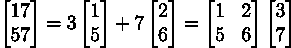

# 以四种不同的方式可视化矩阵乘法

> 原文：<https://medium.com/analytics-vidhya/visualizing-matrix-multiplication-in-four-different-ways-50acd0627717?source=collection_archive---------18----------------------->

图片来源:谷歌

如果你正在从任何一本教科书中学习机器学习理论，我敢打赌你在某个时候已经在矩阵乘法中困惑了。当一个人不理解或不虔诚地执行常规乘法来理解步骤之间的内在逻辑时，感觉非常糟糕。

以下四种方法肯定会帮助你减少学习涉及矩阵乘法的理论的工作量:

遵循的矩阵符号是:

这里 c 代表列，r 代表行

# **1。单独的行/列和矩阵**

AB 的列= A x 的相应列

AB 的行= A x B 的相应行

# 2.矩阵的行/列的线性组合

为了更好地理解，请一次查看 AB 的每一列/行。

AB 的列= A 的列的线性组合，系数作为 B 的对应列

AB 行= B 行的线性组合，系数为 A 的相应行

# 3.矩阵的线性组合

注意， ***a_ci*** 和 ***b_ri*** 的相乘给出了一个形状为 ***(m x s)*** *的矩阵。*

# 4.传统矩阵乘法

# **例如:**

让

然后通过矩阵的线性组合计算 AB

另外，请注意使用前两种方法对 AB 的第一列进行的计算

类似地，可以使用前两种方法计算 AB 的第一行

我希望，这种看待矩阵乘法的新方法能启发对数学证明的理解。

如果你开始喜欢矩阵乘法，请评论！

**检查第 2 部分**

 [## 以四种不同方式可视化矩阵乘法—第 2 部分

### 如何在头脑中进行矩阵乘法运算？可视化矩阵乘法。matrix 背后的直觉是什么…

medium.com](/analytics-vidhya/visualizing-matrix-multiplication-in-four-different-ways-part-2-ed96cea120c1)