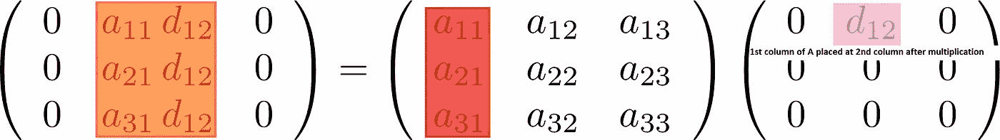
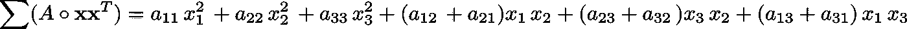

# 以四种不同方式可视化矩阵乘法—第 2 部分

> 原文：<https://medium.com/analytics-vidhya/visualizing-matrix-multiplication-in-four-different-ways-part-2-ed96cea120c1?source=collection_archive---------13----------------------->

在第 1 部分中，我已经直观地解释了执行矩阵乘法的四种方法。最近，我遇到了一些其他的技巧，这些技巧有助于理解机器学习算法的理论，而不需要使用便签簿！你甚至可以通过矩阵相乘的结果来逆向工程这两个矩阵。所以，事不宜迟，让我们开始学习它们吧。

在继续之前，我们将添加一个术语，称为行侧和列侧。当一个矩阵乘到另一个矩阵的左边时，称为行侧乘法，乘到右边时，称为列侧乘法。你可以通过记住矩阵维数的记法顺序来记住它。

**招数 1:用对角矩阵按行或按列分布数值**

如果乘以矩阵的列侧，对角线值将分布到列。

如果乘以矩阵的行侧，对角线值将被分配到行。

如果你发现任何一个矩阵有左边的模式，那么你可以把它分解成矩阵乘法，如右边所示。

**招数二:矩阵只有一个非零值的效果**

这有点棘手。每当你乘单个非零值矩阵时，首先记下非零值的行和列的位置。让我们称它们为 r 和 c。

现在，如果矩阵乘到列侧，则选择对应于位置 r 的列，然后将其放在最终矩阵的 c 位置。(记住:柱侧，柱在 c 位置)

现在，如果矩阵乘到行侧，则选择对应于位置 c 的行，然后将其放在最终矩阵的 r 位置。(要记住:行侧，行在 r 位置)

**招数三:** **矩阵形式的二次多项式**

上述结果是标量，可表示如下:

怎么记？简单，你知道列行相乘对应的矩阵。

现在用 A 执行逐元素乘法，并将所有元素相加。

圆圈代表元素间的乘法

**招数 4:非对角矩阵乘法**

使用技巧 2 可以获得这个结果，但是，很容易以不同的方式来可视化它。

不管非对角矩阵在哪一边，镜像关于列的行侧矩阵和关于行的列侧矩阵，然后执行技巧 2。

希望这四个新招能帮助你在不太潦草的情况下，按照机器学习证明的矩阵乘法进行。

如果你觉得这篇文章有用，请分享你的爱，它激励我为你写更多高质量的内容。

**对于第一部分检查:**

 [## 以四种不同的方式可视化矩阵乘法

### 如果你正在从任何教科书中学习机器学习理论，我敢打赌你在某些时候对矩阵乘法感到困惑…

medium.com](/analytics-vidhya/visualizing-matrix-multiplication-in-four-different-ways-50acd0627717)